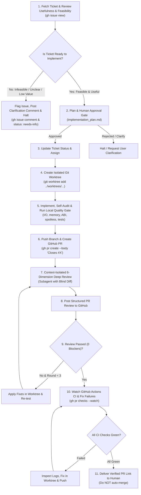

# GitHub Ticket-to-PR Lifecycle Workflow (Konture)

This skill provides an autonomous, human-in-the-loop 10-step engineering workflow for picking up GitHub issues in the **Konture** repository:
1. **Audits ticket usefulness & feasibility** (flags and comments on GitHub if not ready).
2. Develops in an **isolated Git worktree**.
3. Enforces **Pre-PR Self-Audit & Local Quality Gates** (`spotlessApply`, `test`, `checkKotlinAbi`).
4. Conducts **6-Dimension Deep Technical Code Review** with an isolated subagent.
5. **Waits for and fixes all GitHub Actions CI checks** until 100% green.
6. **Delivers the verified PR to humans for final merge (no auto-merge)**.

> [!IMPORTANT]
> **Public Communication Rule**: Never mention the AI/agent name (e.g. "Antigravity", "AI Agent", "Bot", or bot emojis) in public GitHub comments, commit messages, or PR descriptions. All public messages must be written as a professional developer / peer reviewer.

---

## 📋 Prerequisites & Pre-Flight Checks

Before starting the workflow:
1. Verify GitHub CLI authentication: `gh auth status`
2. Ensure local git repository is connected and clean: `git fetch origin main`

---

## 🔄 The 10-Step Workflow



---

### Step 1: Ticket Intake, Usefulness & Feasibility Triage
Fetch the issue metadata and conduct a rigorous triage analysis:
```bash
gh issue view <ISSUE_NUMBER> --json number,title,body,labels,author,milestone
```

#### Evaluation Criteria:
1. **Usefulness & Alignment**:
   - Does this feature/bugfix align with Konture's mission (Kotlin architecture testing, multiplatform/Android/JVM/KMP support, rule authoring, clean diagnostics)?
   - Is it redundant, duplicate, out-of-scope, or an anti-pattern?
2. **Feasibility & Readiness**:
   - Are the requirements and expected outcomes clearly specified?
   - Is there a clear reproduction snippet or failing test case?
   - Is it technically viable without introducing unacceptable architectural debt or breaking backward compatibility unnecessarily?

---

#### 🚨 Handling Issues that are NOT Ready to Implement:
If the ticket is vague, infeasible, missing reproduction details, or questionable in usefulness:

1. **Tag the issue**:
   ```bash
   gh issue edit <ISSUE_NUMBER> --add-label "needs-info"
   ```
2. **Post a professional clarification comment on GitHub** (no agent branding):
   ```bash
   gh issue comment <ISSUE_NUMBER> --body "### Ticket Triage & Review

**Status**: \`Needs Further Clarification\`

#### 1. Alignment & Scope:
<Explanation of alignment or scope observations>

#### 2. Feasibility & Questions:
<Specific questions, missing reproduction code, or architectural constraints>

#### 3. Recommended Next Steps:
<Concrete guidance for the author to clarify before implementation can begin>"
   ```
3. **Notify the human in chat and HALT the workflow** until the maintainer or issue author provides clarification.

---

### Step 2: Solution Planning & Human Approval Gate
*(Only reached if Step 1 evaluates as **Ready to Implement**)*

Generate an `implementation_plan.md` artifact outlining:
- **Root cause & Goal description**
- **Affected modules and files** (e.g. `core/src/...`, `docs/...`)
- **ABI / API compatibility impact** (Does this break public Kotlin ABI?)
- **Verification Strategy** (Unit tests, spotless, binary compatibility, Jekyll doc validation)

> [!IMPORTANT]
> **Approval Gate**: Present the plan to the user and wait for approval before creating worktrees or writing code.

---

### Step 3: Ticket State Transition
Once approved, update the ticket on GitHub:
```bash
gh issue edit <ISSUE_NUMBER> --remove-label "needs-info" --add-label "in-progress"
gh issue comment <ISSUE_NUMBER> --body "Started work on this issue.\n\nBranch: \`fix/issue-<ISSUE_NUMBER>\`"
```

---

### Step 4: Create Isolated Git Worktree & Implement
To ensure zero disruption to the active workspace, create a dedicated Git worktree:

1. Create and setup the worktree:
   ```bash
   BRANCH_NAME="fix/issue-<ISSUE_NUMBER>"
   WORKTREE_PATH="../worktrees/konture-issue-<ISSUE_NUMBER>"

   git fetch origin main
   git worktree add -b "$BRANCH_NAME" "$WORKTREE_PATH" origin/main
   ```

2. Implement the required changes inside `$WORKTREE_PATH`:
   - Follow existing Kotlin conventions and architecture in Konture.
   - Maintain copyright/license headers in source files.
   - Support internationalization (i18n) for user-visible strings/messages.
   - If creating new Markdown documentation in `docs/`, do NOT add YAML front matter directly; register it in `script/add_front_matter.py` under `FRONT_MATTER_MAP`.

---

### Step 5: Implementer Pre-PR Self-Audit & Quality Gate (MANDATORY)
Before pushing or opening a PR, the implementer must execute a **Self-Audit Checklist** on the git diff:

#### Self-Audit Checklist:
- [ ] **No Double Disk I/O**: Files are read once into memory; hashes or AST parses reuse the loaded content rather than re-reading from disk.
- [ ] **No Unbounded Memory in Daemons**: Caches or state maps have bounded size, LRU eviction, or explicit lifecycle disposers for long-running Gradle daemons.
- [ ] **No Unnecessary Hot-Path Allocations**: Byte streams use streaming I/O; hex encodings avoid creating multiple intermediate Strings in loops.
- [ ] **Clean Concurrency**: ThreadLocal state does not accidentally flush or corrupt global singleton caches across parallel test runners.

#### Local Verification Suite:
Inside the worktree directory (`cd "$WORKTREE_PATH"`):
```bash
# 1. Apply formatting and Ktlint rules
./gradlew -q spotlessApply

# 2. Run relevant module tests (or all tests)
./gradlew -q :core:test :library:test :plugin-gradle:test

# 3. Check binary compatibility (ABI dump check)
./gradlew -q checkKotlinAbi

# 4. If docs were added/modified, validate Jekyll metadata
python3 script/add_front_matter.py --validate
```

> [!WARNING]
> Do NOT proceed to Step 6 if any test, ABI check, or linter fails. Fix issues locally inside the worktree first.

---

### Step 6: Create GitHub Pull Request
Inside `$WORKTREE_PATH`:
1. Commit changes using conventional commit style:
   ```bash
   git add .
   git commit -m "fix(issue-<ISSUE_NUMBER>): <concise summary>"
   git push -u origin "$BRANCH_NAME"
   ```
2. Open the GitHub PR linked to the issue:
   ```bash
   gh pr create \
     --title "fix(issue-#<ISSUE_NUMBER>): <Title>" \
     --body "Closes #<ISSUE_NUMBER>

   ## Summary of Changes
   - <Key changes>

   ## Verification
   - [x] \`./gradlew -q spotlessApply\`
   - [x] \`./gradlew -q test\`
   - [x] \`./gradlew -q checkKotlinAbi\`" \
     --base main
   ```
3. Capture the created PR URL and number:
   ```bash
   PR_URL=$(gh pr view --json url -q .url)
   PR_NUMBER=$(gh pr view --json number -q .number)
   ```

---

### Step 7: Context-Isolated 6-Dimension Deep Code Review
To eliminate self-confirmation bias, spawn an isolated reviewer subagent with only the PR diff and specification.

1. Spawn a subagent with `invoke_subagent`:
   - **TypeName**: `research` or `self`
   - **Role**: `Adversarial Senior Code Reviewer`
   - **Prompt**:
     ```markdown
     Perform a strict adversarial code review for PR against Issue #<ISSUE_NUMBER>.

     Issue Description:
     <ISSUE_BODY>

     Git Diff:
     $(git diff origin/main...HEAD)

     Strictly audit the diff against the following 6 Deep Technical Dimensions:

     1. 💾 I/O & Resource Lifecycle:
        - Are files read multiple times from disk on cache misses or during AST parsing? (e.g. hashFile + readText duplicate reads)
        - Are all file streams and readers enclosed in .use { } blocks?

     2. 🧠 Memory & Daemon Lifecycle:
        - Are there unbounded in-memory caches (e.g. ConcurrentHashMap) that will accumulate memory in long-running Gradle daemons or IDE plugins?
        - Is there an eviction policy (LRU / max size) or explicit lifecycle disposal?

     3. ⚡ Allocation & Garbage Collection (GC) Pressure:
        - Are file contents read as UTF-16 Strings and re-encoded back to UTF-8 ByteArrays?
        - Are there intermediate String objects allocated in loops or hashing (e.g. joinToString with "%02x".format(it))?

     4. 🔒 Concurrency & Scope Boundaries:
        - Are global singletons inadvertently reset by thread-local fixtures?
        - Are data structures thread-safe for parallel Gradle test execution?

     5. 🛡️ Public ABI & Architecture Integrity:
        - Does any internal class leak into public API without an ABI dump update?
        - Are Detekt and Ktlint rules respected?
        - If documentation in docs/ was edited, does it adhere to clean Markdown without Jekyll YAML headers?

     6. 🧪 Edge Cases, Nullability & Tests:
        - Are zero-byte files, non-existent files, and empty projects handled gracefully?
        - Are unit tests testing both hit/miss paths and failure modes?

     ---
     OUTPUT FORMAT:
     Categorize all findings into:
     - 🔴 BLOCKER: High severity issues that MUST be resolved (double I/O, memory leaks, concurrency bugs, broken ABI).
     - 🟡 IMPROVEMENT: Performance or architecture optimizations.
     - 🟢 NIT: Minor stylistic suggestions.

     VERDICT: APPROVED (if 0 BLOCKERS) or CHANGES_REQUESTED (if >= 1 BLOCKER)
     SUMMARY: <Executive summary>
     FINDINGS:
     - [<SEVERITY>] <file:line>: <Problem description, concrete impact, and exact code suggestion>
     ```

---

### Step 8: Post Code Review to GitHub PR
Post the reviewer subagent's structured findings to GitHub (no agent branding):

```bash
# If CHANGES_REQUESTED:
gh pr review "$PR_NUMBER" --comment -b "### Code Review (Round <ROUND_NUM>)

**Verdict**: \`CHANGES_REQUESTED\`

<SUMMARY>

#### Findings:
<FINDINGS>"

# If APPROVED:
gh pr review "$PR_NUMBER" --comment -b "### Code Review (Round <ROUND_NUM>)

**Verdict**: \`APPROVED\`

All 6 technical dimensions (I/O, memory, concurrency, allocations, ABI, and test coverage) verified with 0 blockers."
```

---

### Step 9: Address Review Feedback (Convergence Loop)
If changes were requested:
1. The implementer reviews each `🔴 BLOCKER` and `🟡 IMPROVEMENT` finding.
2. Applies concrete refactors inside `$WORKTREE_PATH` (e.g. single-pass reading, stream hashing, LRU bounds).
3. Re-runs Step 5 (`./gradlew -q spotlessApply && ./gradlew -q test && ./gradlew -q checkKotlinAbi`).
4. Commits and pushes updates:
   ```bash
   git add .
   git commit -m "fix(review): address deep technical code review findings"
   git push origin "$BRANCH_NAME"
   ```
5. **Repeat Step 7 & 8** (Max **3 iterations** circuit breaker).
   - *If unresolved after 3 rounds, post `gh pr comment "$PR_NUMBER" --body "Review did not converge after 3 rounds. Escalating to maintainer for manual review."` and halt.*

---

### Step 10: Watch Remote GitHub Actions CI & Auto-Fix Failures
Once the code review is `APPROVED`, actively wait for and fix all remote GitHub Actions CI checks:

1. **Watch CI Execution**:
   ```bash
   gh pr checks "$PR_NUMBER" --watch
   ```
2. **If any CI check fails**:
   - Inspect the failed GitHub Actions run and logs:
     ```bash
     RUN_ID=$(gh run list --branch "$BRANCH_NAME" --limit 1 --json databaseId -q '.[0].databaseId')
     gh run view "$RUN_ID" --log-failed
     ```
   - Diagnose the root cause (e.g. matrix test failure on Linux/macOS/Windows, JDK version incompatibility, missing Detekt check, or stale ABI dump).
   - Apply fixes inside `$WORKTREE_PATH`.
   - Re-run local verification:
     ```bash
     ./gradlew -q spotlessApply
     ./gradlew -q test
     ./gradlew -q checkKotlinAbi
     ```
   - Commit and push fix to the PR branch:
     ```bash
     git add .
     git commit -m "fix(ci): resolve GitHub Actions failures"
     git push origin "$BRANCH_NAME"
     ```
   - **Re-watch CI checks (`gh pr checks "$PR_NUMBER" --watch`) until 100% of the status checks are green.**

---

### Step 11: Deliver Verified PR Link to Human (NO AUTO-MERGE)
When all GitHub Actions checks are green and the code review is approved:
1. Post completion comment on the GitHub PR:
   ```bash
   gh pr comment "$PR_NUMBER" --body "### PR Ready for Review
   - Local tests & ABI compatibility checks passed
   - Deep technical code review approved (0 blockers)
   - All remote GitHub Actions CI checks passed"
   ```
2. Update issue status:
   ```bash
   gh issue comment <ISSUE_NUMBER> --body "PR #$PR_NUMBER is ready for review: $PR_URL (All CI checks passed)"
   ```
3. **Deliver PR directly to the human**: Output a clear summary in chat containing:
   - 🔗 **PR Link**: `$PR_URL`
   - 🟢 **CI Status**: All GitHub Actions checks passed
   - 🧪 **Verification Summary**: Spotless, test results, ABI check status
   - 📂 **Worktree Path**: `$WORKTREE_PATH` (to clean up after manual merge: `git worktree remove $WORKTREE_PATH`)

> [!IMPORTANT]
> **Policy**: Do NOT automatically merge the pull request. Merging is reserved exclusively for the human maintainer.
