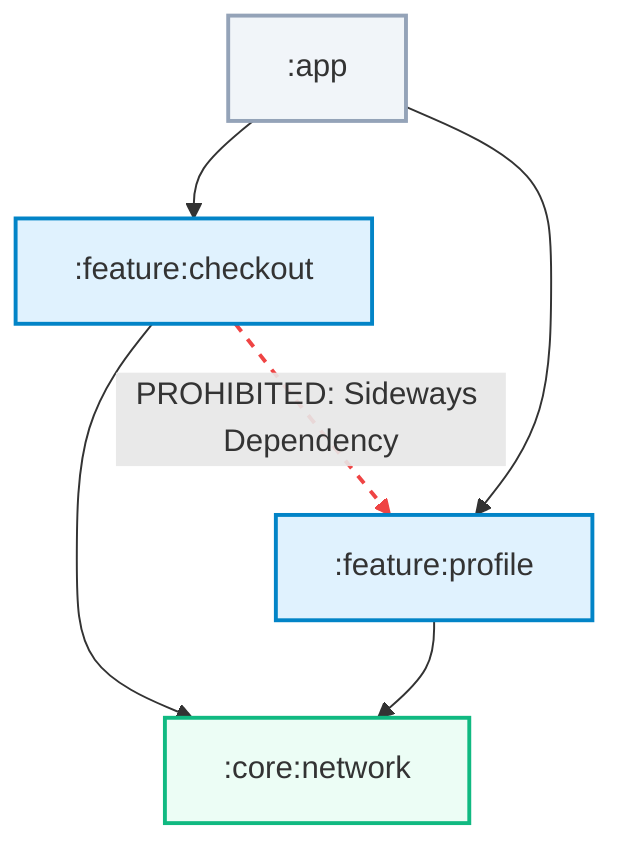

<p align="center">
  
</p>

<h1 align="center">🧬 Konture: Kotlin Architecture Testing Guardrails</h1>

<p align="center">
  <a href="https://baole.github.io/konture/"></a>
  <a href="https://kotlinlang.org/"></a>
  <a href="https://gradle.org/"></a>
</p>

**Konture** is a standalone Kotlin & Gradle architecture testing library. It combines real project structure (captured directly from your applied Gradle build graph) with an AST-based static analysis parser and a premium **Fluent Lambda DSL**.

This allows you to write lightning fast, compilation level architectural guardrails as regular, **test framework agnostic** unit tests—fully compatible with **[JUnit 4](https://junit.org/junit4/), [JUnit 5](https://junit.org/junit5/), [JUnit 6](https://junit.org/), [Kotest](https://kotest.io/), [TestBalloon](https://github.com/infix-de/testBalloon)**, or absolutely **any other test runner** (since it runs as a pure Kotlin/JVM library, the choice of test runner does not matter)—verifying module bounds, package isolation, interface adherence, and naming conventions without the classpath or classloader restrictions of traditional runtime testing tools.

> [!NOTE]
> **🚀 Test Framework Agnostic**
> Konture is built with zero hard dependencies on specific test runners. Whether your codebase uses traditional JUnit, modern assertion engines like Kotest or TestBalloon, or **any other test runner of your choice**, your architectural guardrails can be written and run natively anywhere standard Kotlin test suites are executed. The underlying framework simply does not matter.

> [!TIP]
> **📐 Architecture Agnostic & Flexible**
> Konture does not dictate, restrict, or lock you into any specific architectural style (such as Clean Architecture, Layered, MVVM, Hexagonal, or DDD). It is designed to be completely architecture-agnostic. It serves as a highly adaptable static-analysis toolbox, giving engineers the ultimate flexibility to write rules and constraints that reflexively match and protect whatever specific design patterns their codebase adopts.

> [!IMPORTANT]
> **🤖 AI-Agent Friendly & Automated Guardrails**
> In the era of modern software development, collaborating with AI assistants (like Gemini, Claude, and Cursor) is standard practice. Konture is built from the ground up to be **AI-agent friendly**, offering a comprehensive suite of official prompts and custom skills:
> *   **[🤖 AI Onboarding & Setup Skill](docs/ai-prompts/setup-prompt.md)**: Lets autonomous agents inspect, install, configure, and set up a dedicated test module in any repository with zero manual intervention.
> *   **[✍️ Unified AI Test Writing & Extensible Guardrails Skill](docs/ai-prompts/writing-tests-prompt.md)**: A complete, copy-pasteable master prompt combining extensible, project-specific reasoning with compile-safe DSL API references for AI assistants.

---

## 🛡️ Enforce Boundaries & Prevent Erosion

With multi-module builds, architecture erodes through small shortcuts—such as a feature module declaring a "sideways" dependency on a sibling feature:



Konture analyzes your actual Gradle build graph to enforce physical module isolation, cyclic boundaries, and layer directions directly inside your test suite.

---

## 📖 Explore the Interactive Documentation

For detailed conceptual overviews, advanced recipes, and complete walkthroughs, visit our official **[GitHub Pages Documentation Site](https://baole.github.io/konture/)** or explore the source files directly:

*   **[🚀 Full Onboarding & Setup](docs/installation.md)**
*   **[🤖 AI Prompts & Custom Skills Catalog](docs/ai-prompts/README.md)** (Central index on how to load, open, and feed our official prompts into various AI tools)
*   **[🤖 AI Onboarding Prompt & Custom Skill](docs/ai-prompts/setup-prompt.md)** (Autonomous system prompt to let AI agents install and configure Konture)
*   **[✍️ Unified AI Test Writing & Extensible Guardrails Prompt](docs/ai-prompts/writing-tests-prompt.md)** (Official master prompt & custom skill to easily design, write, and review custom guardrails using AI)
*   **[🧩 Core Architecture Concepts](docs/architecture_test.md)**
*   **[📜 Architectural Recipes](docs/recipes/)** (Layer isolation, naming suffixes, repositories as interfaces, visibility boundaries, etc.)
*   **[🏢 Real-World Showcases](docs/showcases.md)** (Google's Now in Android, KotlinConf App, Ktor-Arrow backend, etc.)

---

## 🚀 1. Installation & Setup

> [!TIP]
> **🤖 Save Time: Let AI Set It Up & Write Tests!**
> Instead of manually copying and editing build configurations, you can use our official, high-context AI prompts and custom skills to let AI assistants (like Gemini, Claude, Cursor) do it for you instantly:
> *   **[🤖 setup-konture Skill / Prompt](docs/ai-prompts/setup-prompt.md)**: Lets autonomous agents or chat assistants inspect, install, configure, and set up a dedicated test module in any repository with zero manual intervention.
> *   **[📐 konture-architecture-tests Skill / Prompt](docs/ai-prompts/writing-tests-prompt.md)**: A complete, copy-pasteable master prompt to easily design, write, and review custom guardrails using AI with compile-safe DSL API references.
> *   See the full **[🤖 AI Prompts & Custom Skills Catalog](docs/ai-prompts/README.md)** for a central index on how to load these.
> 
> *Copy the prompts first to automate your entire onboarding!*

Konture requires applying a Gradle plugin to compile your project's build graph, and adding the assertion library to your test module.

### Option A: Using Gradle Version Catalogs (Recommended)

#### Step 1: Declare inside `gradle/libs.versions.toml`
```toml
[versions]
konture = "0.6.6"

[plugins]
konture = { id = "io.github.baole.konture", version.ref = "konture" }

[libraries]
konture = { group = "io.github.baole", name = "konture", version.ref = "konture" }
```

#### Step 2: Apply the plugin in your root `build.gradle.kts`
```kotlin
plugins {
    alias(libs.plugins.konture) apply true
}
```

#### Step 3: Add the dependency in your test module's `build.gradle.kts`
```kotlin
dependencies {
    testImplementation(libs.konture)
}
```

---

### Option B: Traditional Gradle DSL

#### Step 1: Apply the plugin in your root `build.gradle.kts`
```kotlin
plugins {
    id("io.github.baole.konture") version "0.6.6" apply true
}
```

#### Step 2: Add the dependency in your test module's `build.gradle.kts`
```kotlin
dependencies {
    testImplementation("io.github.baole:konture:0.6.6")
}
```

---

## 📦 2. Best Practice: Dedicated `konture-test` Module

To keep your production codebases pristine and separate from test dependencies, we highly recommend creating a **dedicated, isolated module** (e.g., `:konture-test` or `:architecture-tests`) for running your architectural guards.

### Step 1: Create a new module and register it in `settings.gradle.kts`
```kotlin
include(":konture-test")
```

### Step 2: Configure `konture-test/build.gradle.kts`
Apply the Kotlin JVM plugin, pull in the Konture assertion library, and declare dependencies on the production modules you want to verify (you can use **any** test framework of your choice, such as [JUnit 4](https://junit.org/junit4/), [JUnit 5](https://junit.org/junit5/), [JUnit 6](https://junit.org/), [Kotest](https://kotest.io/), or [TestBalloon](https://github.com/infix-de/testBalloon)):

```kotlin
plugins {
    kotlin("jvm")
}

dependencies {
    // 🧬 Pull in the premium Konture assertion engine
    testImplementation("io.github.baole:konture:0.6.6")

    // 🧪 Test runners (JUnit 5 is used here as a standard example, but any framework works!)
    testImplementation("org.junit.jupiter:junit-jupiter-api:5.11.0")
    testRuntimeOnly("org.junit.jupiter:junit-jupiter-engine:5.11.0")

    // 📂 Declare dependencies on modules to analyze (to make sure they are compiled first)
    testImplementation(project(":core:domain"))
    testImplementation(project(":core:data"))
    testImplementation(project(":feature:bookmarks"))
}

tasks.test {
    useJUnitPlatform()
}
```

---

## ✍️ 3. Write Your First Guardrail

Since Konture is completely architecture-agnostic, you can reflexively write assertions to match whatever target architecture pattern your codebase uses. You have the ultimate freedom to define your own boundaries, conventions, and layer structures.

Create a standard unit test inside `konture-test/src/test/kotlin/` using our premium, ergonomic **Fluent Lambda DSL**:

```kotlin
import io.github.baole.konture.dsl.architecture
import org.junit.jupiter.api.Test

class ArchitectureGuardrails {

    @Test
    fun `domain layer should be completely isolated from data and UI layers`() {
        architecture {
            // 🎯 Select modules inside domain
            modules {
                that().haveNamePath(":core:domain")
                should().notDependOnModule(":core:data")
                andShould().notDependOnModule(":feature:checkout")
            }
        }
    }

    @Test
    fun `repositories inside domain must be declared as interfaces`() {
        architecture {
            // 🎯 Select classes inside domain package
            classes {
                that().resideInAPackage("..domain..")
                that().haveNameEndingWith("Repository")
                should().beInterfaces()
            }
        }
    }
}
```

## 🤝 Contributing

We welcome contributions of all kinds! Please see our **[Contribution Guidelines](docs/contributing.md)** (also available online as an interactive **[Contributing Guide](https://baole.github.io/konture/contributing.html)**) for details on how to set up your local development environment, import the project, run local verification builds, and submit Pull Requests.
