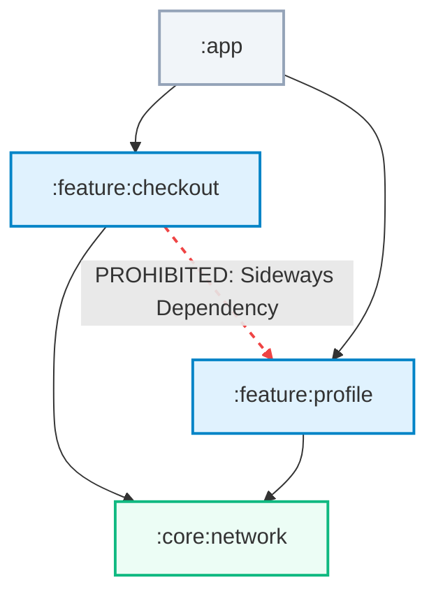

# Konture

> **Define, enforce, and automate architecture rules run as fast Kotlin unit tests against your actual Gradle build graph.**

**Konture** is a modern, lightweight, and compile-time-efficient architecture-testing tool written natively in and for Kotlin. It bridges the gap between high-level build configurations and source-level code constraints by combining an applied **Gradle Plugin** (which extracts accurate project modules, dependencies, and target variant structures) with a declarative, fluent **Assertion Library**.

Unlike traditional tools that rely on fragile file-path convention strings or slow, reflection-based runtime classpath scanning, Konture utilizes AST-level PSI parser analysis of `.kt` source files. This ensures your assertions run with 0% classloading or framework startup overhead.

---

## Core Key Capabilities

### ⚡ Sub-Second Verification
Since Konture analyzes the Kotlin Abstract Syntax Tree (AST) using a fast, isolated PSI parser, your tests are executed as plain Kotlin/JVM unit tests. No frameworks need to boot, no heavy databases need to initialize, and no classloaders are saturated. 

### 📐 Gradle-Aware Boundaries
Because Konture has access to the actual Gradle dependency map (via the `generateArchitectureLayout` task), you can write assertions to enforce module boundaries directly (e.g. `":core" must not depend on ":app"`), preventing sneaky circular module dependencies or leaking of layers before they reach CI.

### 🧬 Architecture Agnostic & Flexible
Konture is completely neutral regarding your codebase's design architecture. Whether you are enforcing Clean Architecture, Ports & Adapters (Hexagonal), layered MVVM, or a custom modular pattern, Konture does not impose a predefined structure on your team. Engineers can write highly reflexive tests that directly copy, target, and protect their project's exact structural blueprint.

### 🧩 Kotlin Multiplatform (KMP) & Compose Native
Verify architectural boundaries on multiplatform structures natively. Query and scope assertions to specific targets (`commonMain`, `androidMain`, `iosMain`, `desktopMain`, etc.) to guarantee codebase clean-architecture rules across JVM, mobile, desktop, and web targets.

### 🧪 Test Framework Agnostic
Konture is designed from the ground up to be independent of any test framework or execution runner. Whether your teams are standardizing on **[JUnit 4](https://junit.org/junit4/)**, **[JUnit 5](https://junit.org/junit5/)**, **[JUnit 6](https://junit.org/)**, or using expressive Kotlin native frameworks like **[Kotest](https://kotest.io/)** or **[TestBalloon](https://github.com/infix-de/testBalloon)**, you can declare and run your Konture guards seamlessly inside **absolutely any test runner**. Since Konture runs as standard, pure Kotlin JVM code, the choice of test runner simply does not matter.

---

## Why Konture?

| Feature | Konture | Konsist | ArchUnit (via JVM Reflection) | Traditional Linters |
| :--- | :--- | :--- | :--- | :--- |
| **Parsing Engine** | High-performance AST-level Kotlin PSI parser | High-performance AST-level Kotlin PSI parser | Full JVM Reflection & Classloader scanning | Simple Regex or file-path globs |
| **Dependency Knowledge** | **Full Gradle Graph Awareness** (reads exact physical module boundaries & dependency targets) | **No Gradle Graph Context** (blind to physical module boundaries; relies purely on package imports) | **No Gradle Graph Context** (blind to Gradle modules & multi-project layouts; scans classpath only) | Blind to build dependency structures |
| **Framework Startup** | **No startup cost**. Runs as plain, lightweight JVM unit tests | **No startup cost**. Runs as plain, lightweight JVM unit tests | Often requires DI/spring container mock setup | No runtime test integration |
| **Kotlin Multiplatform (KMP)** | Natively understands Gradle source-sets (`commonMain`/`androidMain`/`iosMain`) and variant dependencies | Natively understands Kotlin, but blind to physical Gradle source-set layouts or variant configurations | JVM/Java targets only (blind to native/iOS/JS sources) | Limited platform context |
| **Test Frameworks** | **Fully Agnostic** ([JUnit 4](https://junit.org/junit4/)/[5](https://junit.org/junit5/)/[6](https://junit.org/), [Kotest](https://kotest.io/), [TestBalloon](https://github.com/infix-de/testBalloon), or any other runner; the choice does not matter) | Supports JUnit/Kotest assertion wrappers | Primarily JUnit-centric runner extensions | No runtime test integration |
| **Architecture Agnostic** | **100% Agnostic** (Fully supports any design: Clean, Layered, MVVM, Hexagonal, DDD, etc.) | **100% Agnostic** (Enforces any custom rules) | Often assumes specific package topologies | Blind to structural design constructs |
| **Execution Speed** | **Sub-second** (parses source ASTs in-memory, leveraging pre-extracted Gradle graphs) | **Sub-second** (parses source ASTs in-memory) | Several seconds to minutes (due to heavy reflection & class loading overhead) | Variable, typically run as slow pre-push checks |

---

## Explore the Documentation

### 🤖 [AI Prompts & Custom Skills Catalog](ai-prompts/README.md)
Discover our comprehensive, built-in suite of system prompts and skills designed specifically for AI-assisted workflows and autonomous agents:
*   **[AI Onboarding & Setup Skill](ai-prompts/setup-prompt.md)**: Automate Konture installation, test module setup, and CI configurations.
*   **[Unified AI Test Writing & Extensible Guardrails Prompt](ai-prompts/writing-tests-prompt.md)**: Design production-grade architectural quality gates combining extensible, project-specific reasoning and compile-safe DSL API references.

### 📦 [Installation & Setup](installation.md)
Learn how to apply the root Gradle plugin and set up a clean, isolated `:architecture-test` module to keep production dependencies clean.

### 📒 [Architectural Recipes (Receipts)](recipes/)
Browse standard, copy-pasteable architectural assertions for interface declarations, layer boundaries, naming conventions, and cycle-prevention.

### 🚀 [Showcase App Walkthrough](showcases.md)
Walk through the included sample application containing an active multi-module Clean Architecture layout and its corresponding live tests.

### 🧬 [KDoc API Reference](kdoc/)
Examine the detailed, Dokka-compiled public API classes, builders, assertions, and extension functions.

### 👥 [Contributing Guidelines](contributing.md)
Find instructions on setting up your local environment, building composite project tests, and preparing GPG-signed releases.
