# Konture

  
  
  
  
  

> **Define, enforce, and automate architecture rules run as fast Kotlin unit tests against your actual Gradle build graph.**

**Konture** is a stack- and build-tool agnostic Kotlin architecture testing library for Android, Kotlin Multiplatform (KMP), and JVM backend projects. It combines real project structure (captured directly from your project's build graph) with AST-based static analysis and a premium, architecture-agnostic **Fluent Lambda DSL** to enforce boundaries on any test framework.

---

## 🛡️ The problem

In multi-module, multi-layer projects, architecture erodes through small shortcuts. For example, a feature module might declare a "sideways" dependency on a sibling feature.

  

Konture helps developers analyze project structure and enforce architectural rules and boundaries directly inside the test suite.

---

## 🔑 Key Capabilities

*   **📦 Platform & Stack Agnostic**: Works seamlessly across Android, Kotlin Multiplatform (KMP), and Kotlin backend projects (Spring Boot, Ktor, etc.).
*   **📐 Architecture Agnostic**: Set constraints for any design pattern (Clean, Layered, MVVM, Hexagonal, DDD) without layout restrictions.
*   **🛠️ Build Tool Agnostic**: Engineered to support multiple build systems, with deep, native support for **Gradle** and **Maven** environments.
*   **🧪 Test Framework Agnostic**: Runs as a pure JVM library, compatible with [JUnit 4](https://junit.org/junit4/), [JUnit 5](https://junit.org/junit5/), [JUnit 6](https://junit.org/), [Kotest](https://kotest.io/), [TestBalloon](https://github.com/infix-de/testBalloon), or any other runner.
*   **✍️ Fluent Lambda DSL**: Write expressive, readable assertions for module dependencies, package isolation, interface adherence, and naming conventions.
*   **🤖 AI-Agent Friendly**: Includes dedicated prompts and custom skills for autonomous integration and code generation:
    *   **[🤖 AI Onboarding & Integration](ai-prompts/integration-prompt.md)**: Automated Gradle project setup.
    *   **[✍️ AI Test Writing Guide](ai-prompts/writing-tests-prompt.md)**: Context-rich master prompt for writing compile-safe DSL tests.

---

## Why Konture?

| Feature | Konture | Konsist | ArchUnit (via JVM Reflection) | Traditional Linters |
| :--- | :--- | :--- | :--- | :--- |
| **Parsing Engine** | High-performance AST-level Kotlin PSI parser | High-performance AST-level Kotlin PSI parser | Full JVM reflection and classloader scanning | Simple regex or file-path globs |
| **Dependency Knowledge** | **Full Gradle Graph Awareness** (reads exact physical module boundaries & dependency targets) | **No Gradle Graph Context** (blind to physical module boundaries; relies purely on package imports) | **No Gradle Graph Context** (blind to Gradle modules & multi-project layouts; scans classpath only) | Blind to build dependency structures |
| **Framework Startup** | **No startup cost**. Runs as plain, lightweight JVM unit tests | **No startup cost**. Runs as plain, lightweight JVM unit tests | Often requires DI/Spring container mock setup | No runtime test integration |
| **Kotlin Multiplatform (KMP)** | Natively understands Gradle source-sets (`commonMain`/`androidMain`/`iosMain`) and variant dependencies | Natively understands Kotlin, but blind to physical Gradle source-set layouts or variant configurations | JVM/Java targets only (blind to native/iOS/JS sources) | Limited platform context |
| **Test Frameworks** | **Fully Agnostic** ([JUnit 4](https://junit.org/junit4/)/[5](https://junit.org/junit5/)/[6](https://junit.org/), [Kotest](https://kotest.io/), [TestBalloon](https://github.com/infix-de/testBalloon), or any other runner; the choice does not matter) | Supports JUnit/Kotest assertion wrappers | Primarily JUnit-centric runner extensions | No runtime test integration |
| **Architecture Agnostic** | **100% Agnostic** (Fully supports any design: Clean, Layered, MVVM, Hexagonal, DDD, etc.) | **100% Agnostic** (Enforces any custom rules) | Often assumes specific package topologies | Blind to structural design constructs |
| **Execution Speed** | **Sub-second** (parses source ASTs in-memory, leveraging pre-extracted Gradle graphs) | **Sub-second** (parses source ASTs in-memory) | Several seconds to minutes (due to heavy reflection & class loading overhead) | Variable, typically run as slow pre-push checks |
