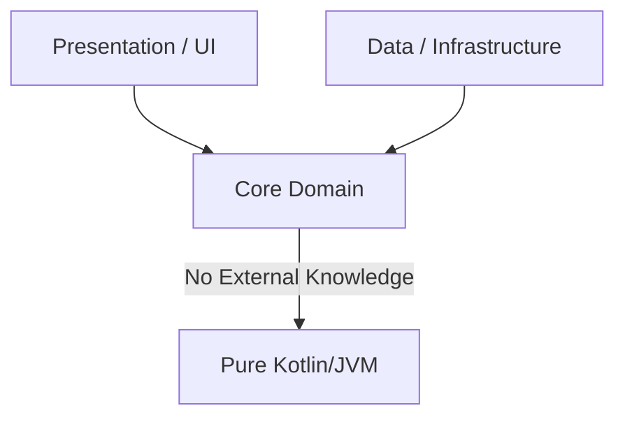
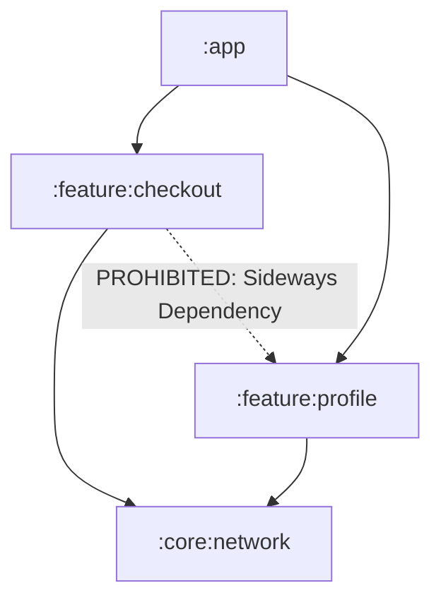

# Beyond the Compiler: Enforcing Software Design with Kotlin Architecture Testing

### Why a successful compilation, green tests, and zero linter warnings are still not enough to keep your codebase clean.

---

> **The Fallacy of the Green Build:**
> "Our build compiles, our unit tests pass, and our linter is happy—therefore, our architecture is clean."
>
> This is one of the most common illusions in software engineering. Compilers check language syntax, type safety, and classpath visibility. Linters check formatting, naming conventions, and simple code smells. Neither of them has a concept of architectural intent, layer isolation, or build-graph hygiene.
{: .important }

In any active software project, codebases naturally decay over time. This architectural erosion is rarely caused by dramatic redesigns; instead, it is the result of hundreds of micro-shortcuts: a domain service importing a database helper, a presentation model leaking into a database schema, or a platform-specific library sneaking into shared multiplatform code.

To turn this challenge into an advantage, Konture is built from the ground up to be **AI-Agent friendly**. By utilizing our official **[AI Onboarding & Integration Skill](ai-prompts/integration-prompt.md)** and **[AI Test Writing & Extensible Guardrails Prompt](ai-prompts/writing-tests-prompt.md)**, you can guide any AI assistant to install, configure, and systematically generate, review, or extend robust, custom-tailored architectural tests for your specific codebase, ensuring no rule-bending shortcuts bypass your system's integrity.

To prevent architectural erosion, teams need a strict, automated, and **test-framework agnostic** **Architecture Quality Gate** that runs as fast as a standard unit test (integrating seamlessly with **[JUnit 4](https://junit.org/junit4/), [JUnit 5](https://junit.org/junit5/), [JUnit 6](https://junit.org/), [Kotest](https://kotest.io/), [TestBalloon](https://github.com/infix-de/testBalloon)**, or absolutely **any other test runner**—since the choice of test runner doesn't matter).

---

## The Quality Gate Matrix

To understand where architecture testing fits, we must examine the limitations of our existing toolchain:

| Dimension | Compiler (e.g., `kotlinc`) | Linters (e.g., `detekt`, `ktlint`) | Architecture Testing (e.g., `Konture`) |
| :--- | :--- | :--- | :--- |
| **Scope of View** | Single file compile-unit | Single file Abstract Syntax Tree (AST) | **Whole-project/whole-graph visibility** |
| **Verification** | Type safety, syntax, classpath | Naming, complexity, code formatting | Layer isolation, dependency flow, type leakage |
| **Enforcement** | Rigid language boundaries | Per-file patterns and rules | Dynamic project topology & architectural policies |
| **Awareness** | Blind to logical layers | Blind to Gradle/Maven module graphs | Deeply aware of build graphs and package boundaries |

---

## 📐 Architecture Agnostic Guardrails: Empowering Flexible Enforcement

One of the most important design philosophies behind Konture is that it is completely **architecture-agnostic**.

Many structural testing tools make implicit assumptions about your package layout or force you into a rigid model. Konture doesn't do that. It recognizes that every project is unique, and that software engineering teams must have the freedom to decide which architectural style—be it **Clean Architecture, MVVM, Ports & Adapters (Hexagonal), Layered, or Domain-Driven Design (DDD)**—best fits their domain and constraints.

With Konture, you are not conforming to a preset standard. Instead, you use the premium Fluent Lambda DSL as an expressive toolbox. **The engineer writing the tests is in full control, flexibly writing assertions that directly mirror, adapt to, and protect their custom target architecture.**

Whether you are:
*   Guarding strict concentric rings of Clean Architecture,
*   Securing feature boundaries in a highly modularized Android codebase,
*   Verifying interface boundaries in a multi-module Spring Boot JVM monolith, or
*   Controlling platform leaks across target modules in Kotlin Multiplatform (KMP),

Konture provides the raw structural awareness (of packages, AST structures, modules, and dependencies) to write quality gates that reflexively fit your target structure perfectly.

---

## Core Foundational Pillars & Custom Guardrails

While architecture testing is fully open-ended and highly project-dependent, an effective starting suite often guards several foundational territories. Below, we break down six of the most common core architectural pillars, analyze why your compiler is blind to them, and look at practical examples across **JVM Backend**, **Android**, and **Kotlin Multiplatform (KMP)**.

---

### 1. Dependency Direction & Layer Isolation

#### The Policy
In layered or Clean Architecture, outer layers depend inward. The domain or core layer is pure; it represents the business logic and must have zero knowledge of database implementations, HTTP frameworks, or UI frameworks.



#### Why Your Compiler Fails
If your database implementation is on the compiler's classpath (as it usually is in a monolithic build or when modules are transitively linked), the compiler has no problem with a domain UseCase importing `org.mongodb.driver` or a Spring `@Service` importing an HTTP controller. As long as the types exist on the classpath, the compiler allows it.

#### Practical Violations
*   **JVM Backend**: A core domain `OrderService` importing `org.springframework.web.bind.annotation.RestController` or a Jackson DTO annotation.
*   **Android**: A domain `GetProfileUseCase` importing `android.content.Context` or `androidx.compose.runtime.Composable`.
*   **KMP**: A shared `commonMain` business logic file importing a platform-specific Ktor client implementation from `androidMain`.

#### The Risk & Strong Argument
When domain purity is compromised, you lose the ability to easily test business logic in isolation. Testing a domain rule suddenly requires mocking databases or UI states. It also couples your business rules to external libraries, making framework upgrades (e.g., Spring Boot 2 to 3, or AGP upgrades) a breaking change for your core business engine.

#### Enforcing with Architecture Tests
```text
Conceptual example (illustrating the rule intent, not literal Konture API):
architecture {
    scope("..domain..") {
        hasZeroDependenciesOn(
            "..data..",
            "..presentation..",
            "..infrastructure..",
            "org.springframework..",
            "android.."
        )
    }
}

```

```kotlin
// Real, compiling Konture alternative (using module boundaries):
architecture {
    modules {
        that().haveNameMatching(":core:domain")
        should().notDependOnModule(
            ":core:data",
            ":core:presentation",
            ":core:infrastructure"
        )
    }
}
```

---

### 2. Module Boundary Enforcement (Build-Graph Hygiene)

#### The Policy
Enforcing structural relationships at the build level. In multi-module projects, feature modules must remain isolated from each other (no sideways dependencies), and shared core modules must never depend on implementation modules.



#### Why Your Compiler Fails
Gradle manages compilation. It prevents you from referencing code from an unlisted module. However, Gradle cannot stop a developer or an AI assistant from editing `build.gradle.kts` and adding `implementation(project(":feature:profile"))` to the checkout module to quickly grab a helper class.

#### KMP-Specific Nuance
In Kotlin Multiplatform, dependency hygiene is even more delicate. A `commonMain` source set must never declare a dependency on a platform-only artifact (like a native iOS library or a JVM-only package). Even if the compiler would eventually catch this during platform-specific compilation, an architecture test catches it instantly at the root Gradle model configuration stage.

#### The Risk & Strong Argument
Uncontrolled module dependencies lead to circular dependencies, massive compilation bottlenecks, and the loss of Gradle's incremental compilation speedups. Furthermore, leaking platform-specific configurations in KMP ruins the portability of the shared codebase, defeating the primary purpose of multiplatform development.

#### Enforcing with Architecture Tests
```text
Conceptual example (illustrating build-graph boundary rules, not literal Konture API):
architecture {
    modules {
        all {
            shouldNotDependOnSidewaysFeatureModules()
            commonMainShouldNotDeclarePlatformOnlyArtifacts()
        }
    }
}

```

```kotlin
// Real, compiling Konture alternative (restricting module-to-module dependencies):
architecture {
    modules {
        that().haveNameMatching(":feature:checkout")
        should().notDependOnModule(":feature:profile")
    }
}
```

---

### 3. Cross-Layer Type Leakage

#### The Policy
Types belonging to one layer must never leak into public API signatures of other layers. Data Transfer Objects (DTOs) from the network or JPA/DB entity models must be mapped to pure domain models before crossing layer boundaries.

```text
[Network DTO] ---> (MAPPED) ---> [Domain Model] ---> [UI Component]
      |                                                    ^
      +----------------- PROHIBITED LEAKAGE ---------------+
```

#### Why Your Compiler Fails
The compiler is designed to pass types around. If a controller returns a database entity directly to the client, the compiler sees a valid type mapping. It cannot evaluate that exposing this type violates the encapsulation of your database schema.

#### Practical Violations
*   **JVM Backend**: A database entity class annotated with Hibernate's `@Entity` being returned directly as a REST response signature from a controller.
*   **Android**: A database model `RoomUserEntity` appearing as a parameter in a Composable screen signature.
*   **KMP**: Types belonging to a platform's target implementation details (e.g., iOS native `UIViewController`) leaking into the public `commonMain` API surface.

#### The Risk & Strong Argument
Type leakage violates the **Stable Dependencies Principle**. If your UI layer relies directly on your database schema or network serialization contracts, any database migration or API schema change will cascade through the entire codebase, breaking the compilation of views, view-models, and services.

#### Enforcing with Architecture Tests
```kotlin
architecture {
    classes {
        that().resideInAPackage("..domain..")
        should().notHaveSignaturesWithTypesAnnotatedWith("jakarta.persistence.Entity")
    }
}
```

For finer control (e.g. checking annotations on members rather than signature types), use `should().satisfy { cls, violations -> ... }`.

---

### 4. Layer-Crossing Call Violations

#### The Policy
Method invocations and call chains must follow sequential paths. Components in the outermost layers (UI/Controllers) must communicate only with their immediate neighbors (ViewModels/Services). Direct calls that skip layers are strictly prohibited.

```text
[Controller] ---> [Service Layer] ---> [Repository / DB]  (Correct)
     |                                      ^
     +------- PROHIBITED: BYPASS SERVICE ---+             (Violation)
```

#### Why Your Compiler Fails
To the compiler, a function call is a function call. As long as a repository interface is visible to a controller, calling `repository.deleteAll()` from an HTTP GET controller method is completely valid Kotlin code.

#### Practical Violations
*   **JVM Backend**: An HTTP Controller calling a Spring Data `JpaRepository` directly, bypassing the transaction-managed and permission-secured business service layer.
*   **Android**: An Activity or Composable function directly invoking a Retrofit network service, skipping the ViewModel or UseCase.

#### The Risk & Strong Argument
Bypassing intermediate layers bypasses vital business logic. Service layers often orchestrate security checks, database transactions, input validation, audit logging, and caching. If outer layers can call data adapters directly, you create a silent security and transactional hazard that is impossible to audit manually.

#### Enforcing with Architecture Tests
```text
Conceptual example (illustrating restricted call-graph package rules, not literal Konture API):
classes()
    .that().resideInAPackage("..controller..")
    .should().onlyCallMethodsInPackages("..service..", "java..", "kotlin..")
```

```kotlin
// Real, compiling Konture dependency enforcement:
architecture {
    classes {
        that().resideInAPackage("..controller..")
        should().onlyDependOnClassesInAnyPackage(
            "..service..",
            "java..",
            "kotlin.."
        )
    }
}
```

---

### 5. DI Graph Resolution & Wiring Correctness

#### The Policy
Ensuring that Dependency Injection (DI) bindings are correctly declared, distinct, and actively used. Feature-level configurations must not silently override core system configurations, and registered bindings must not be left as "dead wiring."

#### Why Your Compiler Fails
Most modern DI frameworks (like Spring, Koin, or Hilt) perform resolution at runtime or during lazy initialization. Your project will compile perfectly, but it will crash immediately upon startup with a `NoSuchBeanDefinitionException` or `CircularDependencyException`.

#### Practical Violations
*   **Overriding Beans**: A bean registered in an isolated feature module unintentionally overriding a core authentication bean due to poor naming or package scanning configurations.
*   **Dead Wiring**: Registering a service binder in Koin or a Hilt `@Provides` module that is never injected into any active constructor or class in the entire project.

#### The Risk & Strong Argument
Silent runtime crashes undermine deployment confidence. Moreover, "dead wiring" accumulates bloat, making it difficult for developers (and AI agents) to understand which classes are active and which are dead, increasing cognitive load and maintenance costs.

#### Enforcing with Architecture Tests
```kotlin
// Conceptual Example (illustrating DI safety rules)
diGraph()
    .shouldBeFullyResolved()
    .shouldHaveNoDeadBindings()
    .shouldPreventFeatureOverridesOfCoreBeans()
```

---

### 6. API Surface & Visibility Boundary Enforcement

#### The Policy
Exposing only deliberate, public contracts across module boundaries. Internal helpers, utility functions, and concrete implementation details must remain marked with Kotlin's `internal` visibility modifier.

```text
[:feature:payment:impl] (internal PaymentProcessor)
         |
  CROSSES MODULE BOUNDARY (Prohibited if public)
         v
[:feature:checkout] (Leaks implementation details!)
```

#### Why Your Compiler Fails
Kotlin classes are `public` by default. If a developer forgets to type `internal` before `class PaymentProcessor`, the compiler happily exposes it to any module that depends on its parent module.

#### The Risk & Strong Argument
Once internal implementation details leak into the public API space, other modules start consuming them. This locks your implementation in place. Refactoring an internal helper class suddenly becomes a breaking change for five other modules, destroying team agility and slowing down feature delivery.

#### Enforcing with Architecture Tests
```kotlin
// Conceptual Example (illustrating visibility bounds)
classes()
    .that().resideInAPackage("..impl..")
    .should().beInternal()

// Real, compiling Konture visibility check:
architecture {
    classes {
        that().resideInAPackage("..impl..")
        should().satisfy { cls, violations ->
            if (cls.visibility != io.github.baole.konture.Visibility.INTERNAL) {
                violations.add("Class ${cls.fqName} is inside an 'impl' package but is not internal.")
            }
        }
    }
}
```

---

## 🚀 Beyond the Core Pillars: Project-Specific Guardrails

Every software project has its own unique set of guidelines, conventions, and legacy migration agreements that go far beyond standard architectural layers. Because Konture exposes a robust, AST-level static analysis engine, you are never locked into pre-defined categories. You can write highly custom tests to enforce absolutely any project-specific constraint:

*   **Naming Conventions & Type Suffixes**: Verify that classes implementing specific interfaces or inheriting from specific classes adhere to strict naming conventions (e.g., all subclasses of `ViewModel` must end with `ViewModel`, or all repositories must end with `Repository`).
*   **Quarantining Legacy Frameworks**: During system migrations, quarantine legacy frameworks or APIs (such as RxJava, Jackson, or legacy network libraries). Write assertions to ensure no newly created packages import or call them, ensuring a clean, progressive transition.
*   **Serialization Audits**: Guarantee that payload objects or DTOs located inside serialization packages are correctly annotated with required markers (such as Kotlinx Serialization's `@Serializable`), catching missing compiler plugins at test time.
*   **Custom Annotations & Experimental APIs**: Track and restrict the usage of custom annotations or experimental internal features (e.g., ensuring `@InternalFeature` or `@ExperimentalPaymentApi` is only accessed within authorized payment modules).
*   **Dependency Injection Constraints**: Assert custom rules on your DI graph, such as ensuring that specific database adapters are never declared as singletons or that certain services are bound as lazy initializers.

### Enforcing Project-Specific Conventions with Konture
```kotlin
// Conceptual Example (illustrating ViewModel naming convention)
classes()
    .that().inheritFrom("androidx.lifecycle.ViewModel")
    .should().haveNameEndingWith("ViewModel")

// Real, compiling Konture naming check:
architecture {
    classes {
        that().satisfy { cls ->
            cls.superTypes.any { it.contains("ViewModel") }
        }
        should().satisfy { cls, violations ->
            if (!cls.name.endsWith("ViewModel")) {
                violations.add("ViewModel ${cls.name} must have a 'ViewModel' suffix.")
            }
        }
    }
}
```

---

## Conclusion: Making Architecture Tests Executable

Architecture is not a static document or a set of guidelines stored in a Wiki—it is a live contract. By integrating automated tools like **Konture**, you can translate your design intent into rapid-execution unit tests that guard your codebase against accidental erosion.

As your team grows and AI assistants continue to write a larger portion of your daily code, these architecture quality gates are the only way to ensure that your system's structural integrity scales alongside your feature velocity.
