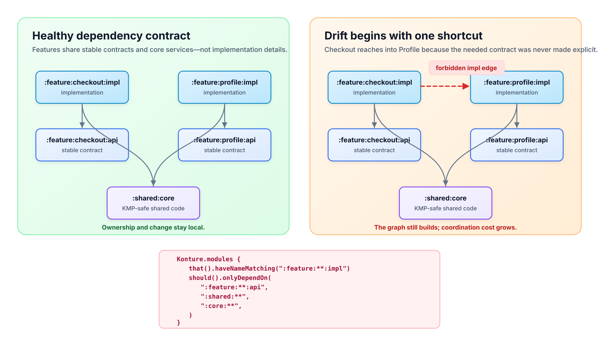

# Architecture Drift in Android & KMP Monorepos: How Big Codebases Rot (and How to Stop It)

_A 40-module Android or Kotlin Multiplatform repository rarely becomes hard to change because somebody chose the wrong top-level architecture. It becomes hard to change because one reasonable shortcut at a time turns boundaries into suggestions._



Imagine a checkout team needs a profile capability: perhaps the customer’s delivery preferences. The fastest implementation is tempting:

```kotlin
// feature/checkout/impl/build.gradle.kts
dependencies {
    implementation(project(":feature:profile:impl"))
}
```

The line compiles. It might even be the right local answer if the alternative is holding a release for an API discussion.

But it changes the system’s operating model. Checkout now knows how Profile is built, not merely what Profile offers. A Profile refactor has a new downstream concern. The next team sees a precedent for crossing the same boundary. Over time, the module graph stops representing independent areas of change and starts representing the history of whatever was expedient.

That is architecture drift.

This article treats drift as a staff- and engineering-manager problem as much as a code problem: a loss of explicit constraints that increases coordination, review scope, and the cost of changing direction. The practical answer is not a larger architecture diagram. It is a small set of executable contracts that make the intended dependency graph harder to violate than to preserve.

## What architecture drift is

Architecture drift is the gap between the boundaries a team believes it has and the dependencies the repository actually permits.

It is not the same thing as a bad abstraction, a long class, or a single poor pull request. Those may be local code-quality concerns. Drift is a system-level condition: the dependency graph gradually stops reflecting ownership, portability, and change boundaries that the organization relies on.

In an Android or KMP monorepo, it commonly appears in three forms.

| Drift type | The shortcut | The system cost later |
| --- | --- | --- |
| **Sideways feature coupling** | `:feature:checkout:impl` depends on `:feature:profile:impl` | Feature work and refactors require more cross-team coordination; a change in one feature can constrain another. |
| **Shared-core inflation** | A feature-specific concern moves into `:shared` because it is convenient to import everywhere | The shared module becomes an unowned integration layer; platform and feature changes gain a larger blast radius. |
| **KMP portability leakage** | Common code reaches a platform-specific module or API | The repository discovers its platform boundary at compile or integration time instead of at the design boundary. |

The key point is that drift has a direction. A deliberate module graph lets code depend through stable APIs and shared foundations. A drifting graph lets implementation detail travel sideways and upward until the original shape is no longer meaningful.

The compiler cannot decide whether the red edge in the diagram is a mistake. The dependency is legal Kotlin and legal Gradle once it is declared. Unit tests cannot decide either; product behavior may remain correct. This is why a repository can look healthy in CI while becoming progressively more expensive to change.

## Why big monorepos rot this way

The first forbidden edge is rarely carelessness. It is a response to a real local pressure: a missing contract, a deadline, an awkward ownership handoff, or a desire to avoid duplicating code.

That is precisely why it accumulates.

### Local speed wins over system shape

The engineer adding the Profile dependency is optimizing for a current task. They can reuse a class that already exists, keep the branch small, and avoid negotiating a new API. A reviewer may correctly conclude that the change works and is contained enough to merge.

The system cost is delayed and distributed:

- The Profile team no longer owns its implementation boundary alone.
- Checkout changes can become sensitive to Profile refactors, dependency upgrades, and release sequencing.
- Reviewers must reconstruct more of the graph to understand the risk of an otherwise small change.
- Build invalidation and cache reuse have more dependency relationships to account for.
- The next cross-feature dependency feels less exceptional because the graph already contains one.

None of these costs appears as a red unit test in the pull request that added the edge. They appear when a later change requires an engineer to understand an accidental relationship before doing their intended work.

### More modules do not automatically create more independence

Module count is not a measure of modularity. A repository with 50 projects and unrestricted implementation-to-implementation dependencies is a distributed monolith: the folders are separate, but the change boundaries are not.

The useful question is simpler:

> Can a team change a feature’s implementation without first discovering which unrelated features have reached into it?

If the answer is routinely no, the graph is carrying hidden organizational coupling. The symptom may be described as slow builds, difficult refactors, fragile tests, or ownership confusion. The underlying problem is the same: the module boundary no longer limits who must coordinate.

### KMP raises the stakes

KMP makes the distinction between a logical boundary and a platform boundary more visible. `commonMain` is a promise that code can be shared across targets. If shared code can freely depend on Android, JVM, iOS, or feature implementation detail, that promise becomes conditional.

The fix is not to make all shared code generic. It is to make the dependency direction intentional. Platform adapters belong at platform edges; feature-specific behavior belongs behind a feature contract; genuinely reusable policy belongs in a deliberately owned core. When those decisions are untested, a platform-specific or feature-specific import can quietly redefine what “shared” means.

## A clear example: the Checkout-to-Profile leak

Start with a simple policy for an app that separates feature APIs from implementations:

```text
:app
:shared:core
:feature:checkout:api
:feature:checkout:impl
:feature:profile:api
:feature:profile:impl
```

The intended dependency direction is:

```text
:app ───────────────→ feature implementations
feature implementations → their API modules and shared core
feature implementations ✕→ sibling feature implementations
```

Checkout needs a display-ready delivery preference. The Profile implementation already has a `DeliveryPreferencesRepository`, so Checkout imports it directly. The immediate work is fast:

```kotlin
// :feature:checkout:impl
class CheckoutViewModel(
    private val deliveryPreferencesRepository: DeliveryPreferencesRepository,
)
```

The dependency is structurally wrong, not because repositories are universally forbidden, but because Checkout now depends on a Profile implementation type. A later Profile redesign has to preserve a type that another feature was never meant to see. A later Checkout test must understand Profile setup. A feature that should have been an internal detail is now an accidental contract.

The repair is to choose an actual relationship instead of preserving the shortcut:

1. If Checkout genuinely needs a stable capability, expose a small contract from `:feature:profile:api`, such as `DeliveryPreferenceReader`.
2. If the policy is cross-feature business logic, move the capability to a deliberately owned shared domain contract rather than a generic dumping-ground module.
3. If the requirement is temporary, treat it as an explicit, dated exception with an owner—not an unmarked implementation dependency.

The important design work is deciding which of those is true. The guardrail comes after that decision.

## How to stop drift: turn the graph into a contract

The goal is not to prohibit every new dependency. It is to force the dependencies that matter to become explicit design choices.

Konture lets that contract run as ordinary Kotlin tests. It can inspect the Gradle module graph and source-level Kotlin relationships, which makes it useful for protecting both physical and logical boundaries.

### 1. Start with the one edge you already know is wrong

Do not begin with a universal architecture framework. Begin with a boundary that the team can explain in one sentence.

```kotlin
import io.github.baole.konture.Konture
import org.junit.jupiter.api.Test

class FeatureBoundaryTest {
    @Test
    fun `checkout implementation must not depend on profile implementation`() {
        Konture.modules {
            that().haveNamePath(":feature:checkout:impl")
            should().notDependOnModule(":feature:profile:impl")
        }
    }
}
```

This rule makes the existing decision visible in code review and CI. It says nothing about how Profile must be implemented. It protects only the ownership boundary: Checkout should not consume Profile’s internal module.

Use a targeted rule first when the repository is legacy-heavy or when a new boundary is still proving its value. Its failure message has a clear repair path, and teams are less likely to work around it with broad exclusions.

### 2. Graduate to a policy when the pattern is stable

Once the team agrees on the allowed shape, replace a growing list of bilateral bans with an allow-list. This turns feature isolation into a policy rather than a memory exercise.

```kotlin
@Test
fun `feature implementations depend only on feature APIs and shared foundations`() {
    Konture.modules {
        that().haveNameMatching(":feature:**:impl")
        should().onlyDependOnModules(
            ":feature:**:api",
            ":shared:**",
            ":core:**",
        )
    }
}
```

An allow-list changes the question a pull request must answer. Instead of “is this one sibling dependency acceptable?”, it becomes “what approved contract should this feature use?” If no contract exists, that is not a tooling failure. It is the design conversation the dependency would otherwise have skipped.

The patterns must match the repository’s real graph. Some applications intentionally allow a feature to depend on a small navigation, analytics, or design-system module. Add those as explicit categories. Do not hide them in a catch-all pattern that makes the policy unreadable.

### 3. Protect slice boundaries where modules are not enough

Not every vertical boundary maps one-to-one to a Gradle project. A shared KMP module may contain multiple feature packages, or a staged migration may keep features in one module while ownership is being established.

Use slices to prohibit sideways feature dependencies in the source model:

```kotlin
@Test
fun `feature package slices do not depend on sibling feature slices`() {
    Konture.slices {
        matching("com.acme.feature.(*)..")
            .should().notDependOnEachOther()
    }
}
```

Here, `(*)` captures each feature name as a slice key. A reference from `com.acme.feature.checkout..` to `com.acme.feature.profile..` becomes a source-level violation even if both packages happen to live in the same Gradle module. References to packages outside the captured feature slices, such as shared core code, are not governed by this particular rule.

Module rules and slice rules answer different questions:

| Rule type | It protects | Example question |
| --- | --- | --- |
| Module rule | The physical Gradle dependency graph | Can Checkout’s implementation project depend on Profile’s implementation project? |
| Slice rule | Logical Kotlin package relationships | Can checkout code reference profile code inside a shared or transitional module? |

Use both where both boundaries matter. Do not use a package convention as a substitute for a Gradle rule, or a clean Gradle graph as proof that source-level contracts are clean.

### 4. Make cycles a non-negotiable invariant

Sideways dependencies are often the first step toward a circular graph. A cycle signals that two modules or slices cannot evolve independently because each has become part of the other’s implementation context.

```kotlin
@Test
fun `the production module graph must remain acyclic`() {
    Konture.assertNoCycles()
}
```

Cycle detection is intentionally blunt. It does not tell the team how to redesign the relationship. It gives them an early, unambiguous signal that the graph has stopped being a directed dependency structure.

### 5. Treat exceptions as design work

An architecture test that blocks a legitimate change is not evidence that tests are bureaucratic. It is evidence that the rule, the dependency, or the exception process needs an explicit owner.

For each exception, record four things in the pull request or architecture decision record:

- The capability being shared.
- Why an existing API or shared boundary cannot represent it.
- The owning team or engineer.
- A removal condition or review date.

This keeps a temporary bypass from becoming permanent anonymous coupling. Engineering managers can make this practical by measuring exception age and repeated boundary violations, not by asking teams to report on “architecture health” in the abstract.

## A rollout that does not freeze feature work

Most established monorepos already have violations. Failing every existing dependency on day one turns architecture testing into a migration freeze, which is how valuable guardrails get abandoned.

Use a progressive rollout instead:

1. **Map the current graph.** Identify the highest-cost edges: sibling implementation dependencies, cycles, platform leakage into shared code, and modules that have no clear owner.
2. **Choose one policy per boundary.** Start with a rule that answers a real recurring review comment, such as “feature implementations never depend on sibling implementations.”
3. **Freeze the boundary.** Make the rule blocking for new violations. If existing debt must remain temporarily, baseline it or scope the first rule so the team can prevent regression while planning repairs.
4. **Repair by contract, not by relocation.** Moving a class to `:shared` only improves the design if it has a shared owner, stable semantics, and a reason to be portable. Otherwise, expose the narrow API that the consumer actually needs.
5. **Review the rule as the organization changes.** New platform targets, feature ownership changes, and extracted services can justify a new allowed dependency. Update the contract deliberately; do not let a one-off bypass redefine it silently.

This makes the rollout an operating discipline rather than a cleanup campaign. The aim is not architectural purity. It is to stop the dependency graph from making future delivery require more people, more context, and more rebuild scope than the work actually needs.

## What staff engineers and engineering managers should watch

Architecture drift is often visible before it becomes a large refactor:

- The same module-boundary review comment appears repeatedly.
- Teams ask who owns a type that is imported across multiple features.
- A “shared” module collects feature-specific behavior because it is easy to depend on.
- A change request expands from one feature to several simply because implementation details are connected.
- KMP code becomes difficult to reuse because platform or application dependencies have crept into the shared path.

These are not reasons to centralize all design decisions in one architecture group. They are signals that the repository lacks a shared, executable answer to a recurring question.

The effective model is federated:

- A platform or staff-level group owns the small number of cross-team dependency contracts.
- Feature teams own their local implementation choices inside those contracts.
- Architecture tests enforce stable decisions automatically.
- Human review handles the unusual cases, new contracts, and trade-offs that have not yet become stable policy.

That division preserves autonomy where it is cheap and reserves coordination for the decisions that truly affect the whole monorepo.

## The goal is cheaper change, not a prettier graph

A module graph is valuable only when it helps the organization change software safely and independently. If it is a diagram that engineers can route around, it becomes documentation of an aspiration. If it is a small set of testable contracts, it becomes part of how the system protects its own change boundaries.

The Checkout-to-Profile edge matters because it is a decision about future coordination, not because a rule engine dislikes an import. Make that decision explicit. Put the intended boundary in a test. Then let the repository catch the next shortcut while it is still one line in one pull request.
