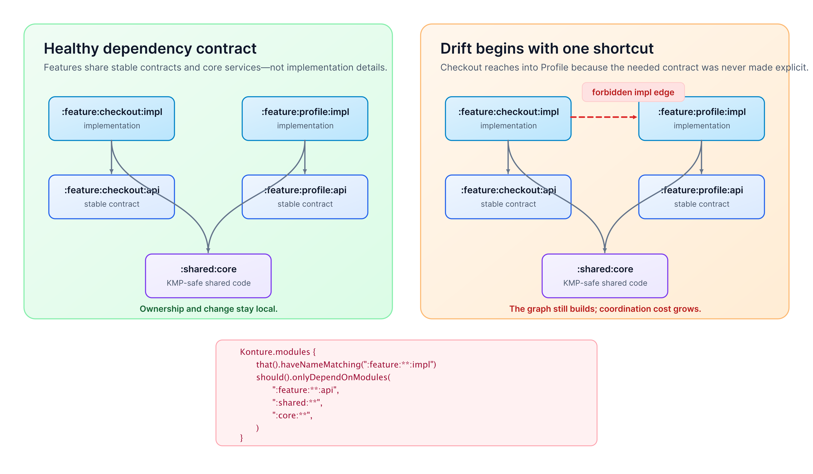

# Architecture Drift in Android & KMP Monorepos: How Big Codebases Rot and How to Stop It

_A 50-module Android or Kotlin Multiplatform repository rarely becomes unmaintainable because of a flawed high-level diagram. It rots because dozens of pragmatic local shortcuts quietly break build isolation, destroy parallel compilation, and turn boundaries into suggestions._



When a checkout team needs a customer's delivery preferences, the fastest path to green is tempting:

```kotlin
// feature/checkout/impl/build.gradle.kts
dependencies {
    implementation(project(":feature:profile:impl"))
}
```

This single line compiles instantly, but it rewires the physics of your monorepo. Checkout no longer consumes what Profile *offers*; it is bound to how Profile is *built*.

When Profile tweaks an internal layout or helper, Checkout is forced to recompile, re-DEX, and re-test. Remote build cache hits plummet, CI pipelines bottleneck, and PR approvals require cross-team coordination. That is **architecture drift**: the gap between intended boundaries and the physical graph the repository permits.

---

## The 4 Hard Technical Penalties of Architecture Drift

Drift is not a stylistic flaw—it is an economic and build-system tax driven by four concrete mechanics:

### 1. Gradle ABI Shielding Breakdown & Cache Invalidation

Gradle uses **ABI (Application Binary Interface) shielding** to optimize incremental builds. When `:checkout:impl` depends on `:profile:api`, changes to private logic inside `:profile:impl` do **not** alter `:profile:api`'s ABI fingerprint. Gradle skips recompiling Checkout entirely.

```text
With API Shielding (Fast Incremental Build):

[ :profile:impl Edit ]
         │
         ▼
Recompiles :profile:impl
         │
         ✕ (ABI Unchanged)
         ▼
  [ :profile:api ]
         │
         ▼
  SKIP :checkout:impl
```

Directly importing `:profile:impl` breaks this shielding. Any internal edit in Profile alters `:profile:impl`'s bytecode fingerprint, forcing downstream recompilation and re-DEXing:

```text
Direct Implementation Coupling (Broken Shielding):

[ :profile:impl Edit ]
         │
         ▼
Recompiles :profile:impl
         │
         ▼ (Direct Dependency)
FORCED Recompilation & re-DEXing of :checkout:impl!
```

> [!WARNING]
> **Cache Invalidation Impact:**
> In a 100-module monorepo with 40 developers, dropping remote cache efficiency from 85% to 25% due to sideways `:impl` coupling adds 3–6 minutes per incremental build—wasting **30 to 60 engineering hours daily**.

### 2. DAG Parallelism Destruction & Critical Path Bottlenecks

16-core CI runners compile independent modules concurrently across worker threads. A clean `:api`/`:impl` structure creates a wide, shallow DAG (Directed Acyclic Graph) for maximum CPU utilization.

```text
Parallel DAG (Fast — High Multi-Core CPU Utilization):

                  ┌──> :feature:checkout:impl (Worker 1)
:feature:*:api ───┼──> :feature:profile:impl  (Worker 2)
                  └──> :feature:search:impl   (Worker 3)
```

Sideways `:impl` dependencies serialize the graph into a deep execution chain where workers sit idle:

```text
Serialized Execution Chain (Slow — Workers 2–16 Idle):

:feature:profile:impl
         │
         ▼
:feature:checkout:impl
         │
         ▼
:feature:cart:impl
         │
         ▼
:app
```

This serialization forces multi-core runners onto a single execution thread, inflating CI pipeline queues from 2 to 15 minutes.

### 3. Testing Isolation Collapse

Testing `:checkout:impl` against a clean `:profile:api` interface requires a lightweight JVM fake:

```kotlin
// Fast, isolated JVM test setup (~2ms execution)
val fakeProfileReader = FakeDeliveryPreferenceReader()
val viewModel = CheckoutViewModel(deliveryPreferenceReader = fakeProfileReader)
```

Coupling Checkout to `:profile:impl` forces unit tests to instantiate Profile's Room/SQLDelight database, network engine, and DI graph. Test initialization time jumps from **2ms to 500ms+**, turning unit tests brittle whenever Profile refactors an internal constructor.

### 4. Binary Bloat & KMP Target Graph Asymmetry

Direct implementation ties leak heavy transitive libraries (biometrics, camera SDKs, PDF renderers) into consuming features, swelling APK/IPA sizes and breaking Android Dynamic Feature Module (DFM) split contracts.

In Kotlin Multiplatform, target-specific source sets compound drift when dependencies compile on one target but bypass clean APIs:

```kotlin
// :feature:checkout:shared/build.gradle.kts
kotlin {
    sourceSets {
        androidMain.dependencies {
            // Leaks profile implementation ONLY into the Android target graph!
            implementation(project(":feature:profile:impl"))
        }
    }
}
```

The iOS build (`iosMain`) still compiles via an API module, but the product now runs **two completely different dependency graphs**. Android Checkout carries Profile's internal dependencies and crash surface while iOS remains lean, making cross-platform bug investigation exceptionally difficult.

---

## Anatomy of a Leak: The Checkout-to-Profile Failure

In a modular monorepo (`:app`, `:feature:checkout:api`, `:feature:checkout:impl`, `:feature:profile:api`, `:feature:profile:impl`), Checkout needs delivery preferences. Instead of requesting an API extension, Checkout imports Profile's internal repository:

```kotlin
// :feature:checkout:impl
import io.github.acme.profile.internal.data.DeliveryPreferencesRepository // 🚨 Illegal Leak!

class CheckoutViewModel(
    private val deliveryPreferencesRepository: DeliveryPreferencesRepository,
) : ViewModel()
```

### The 3 Architectural Repairs

| Repair Path | Action | Best Used When |
| --- | --- | --- |
| **1. Expose Stable API** | Add `DeliveryPreferenceReader` interface to `:feature:profile:api`. | Capabilities are owned by a specific feature. |
| **2. Promote to Core Domain** | Extract contract to a shared domain module (e.g., `:shared:domain:delivery`). | Capability is a core domain concept shared by many features. |
| **3. Bounded Exception** | Record a dated, owned exception in the build graph with a removal ticket. | Short-term release trade-off requiring explicit tracking. |

---

## Executable Architecture Guardrails with Konture

[Konture](https://github.com/baol/konture) enforces architectural rules as standard Kotlin unit tests, intercepting structural drift directly in CI.

### 1. Guard Targeted Boundaries

Block specific illegal edges that cause immediate team friction:

```kotlin
@Test
fun `checkout implementation must not depend on profile implementation`() {
    Konture.modules {
        that().haveNamePath(":feature:checkout:impl")
        should().notDependOnModule(":feature:profile:impl")
    }
}
```

### 2. Enforce Category Allow-Lists

Shift PR discussions from *"Can we take this shortcut?"* to *"Which approved API contract should we use?"*:

```kotlin
@Test
fun `feature implementations must only depend on approved APIs and core`() {
    Konture.modules {
        that().haveNameMatching(":feature:**:impl")
        should().onlyDependOnModules(
            ":feature:**:api",
            ":shared:**",
            ":core:**",
        )
    }
}
```

### 3. Protect Package Slices Within Modules

Prevent sideways package coupling inside shared or multi-feature modules:

```kotlin
@Test
fun `feature package slices must remain strictly isolated`() {
    Konture.slices {
        matching("com.acme.feature.(*)..")
            .should().notDependOnEachOther()
    }
}
```

`(*)` extracts each feature package name as a slice key, flagging cross-feature imports even if both packages reside in the same Gradle project.

### 4. Ban Circular Dependencies

Act as an automated circuit breaker to prevent circular module chains:

```kotlin
@Test
fun `the module graph must remain completely acyclic`() {
    Konture.assertNoCycles()
}
```

---

## Pragmatic Rollout & Leadership Metrics

To enforce architectural rules without freezing feature delivery, follow a 4-step progressive rollout:

```text
Step 1: Map Graph & Identify High-Cost Edges
                   │
                   ▼
Step 2: Baseline Legacy Debt
                   │
                   ▼
Step 3: Block New PR Violations in CI
                   │
                   ▼
Step 4: Refactor via Explicit API Contracts
```

### Key Engineering Leadership Metrics

| Metric | Target | What It Indicates |
| --- | --- | --- |
| **Remote Cache Hit Rate** | **>80%** | Low values signal sideways `:impl` leaks triggering cache invalidation. |
| **DAG Critical Path Length** | **Shallow Depth** | Increasing depth signals task serialization and CI worker starvation. |
| **Cross-Team PR Approvals** | **1 Team / PR** | Multi-team PR requirements reveal domain coupling. |
| **Exception Ticket Age** | **<30 Days** | Prevents temporary architectural bypasses from becoming permanent debt. |

### Conclusion

A whiteboard diagram has no operational value if engineers can bypass it in `build.gradle.kts`. By converting boundaries into automated Kotlin tests with Konture, you protect build cache efficiency, maintain parallel compilation, and ensure teams ship code independently at scale.
