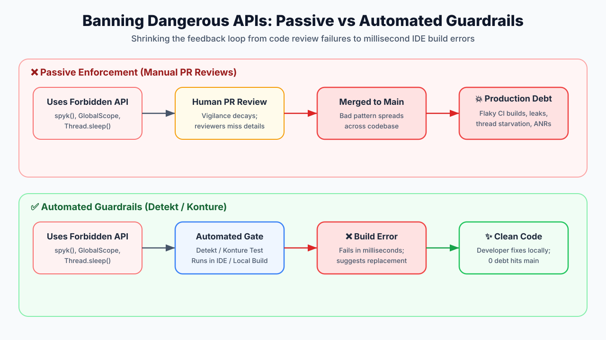

# How to Ban a Class or Method in Code (And Why You Should)

### Turn code guidelines into automated guardrails to prevent footguns and fragile tests.

---



Every growing codebase accumulates "dangerous" APIs: methods that are easy to misuse, cause flaky tests, or break architecture boundaries.

Initially, teams rely on PR reviews or wiki pages: *"Don't use `spyk` in tests,"* or *"Use custom scopes instead of `GlobalScope`."*

Eventually, human vigilance fails. Guidelines get ignored, code reviewers miss things, and dangerous patterns spread across pull requests.

The fix? **Stop relying on memory. Automate the ban.**

---

## What Does "Banning an API" Mean?

Banning an API means setting up **automated static checks or compiler rules** that trigger build errors or linter failures whenever forbidden classes, functions, or imports appear in source code.

Instead of catching bad patterns during manual code review, or worse, after an outage or flaky test run in production: the feedback loop shrinks to milliseconds inside the developer's IDE or local build.

---

## Why Should You Ban APIs?

1. **Code Reviews Don't Scale**: As engineering teams grow and PR velocity increases, human reviewers cannot reliably catch every forbidden import or anti-pattern. Banning APIs shifts enforcement from subjective human vigilance to deterministic build checks.
2. **Eliminate Subtle Footguns**: Certain methods are design anti-patterns by nature (`spyk()`, `GlobalScope`). Banning them prevents developers from shooting themselves in the foot before code even reaches CI.
3. **Prevent Test Flakiness & Runtime Leaks**: Unsafe concurrency calls or blocking sleeps introduce non-deterministic race conditions and thread starvation that waste hours of debugging time.
4. **Enforce Architectural Boundaries**: Banning cross-layer imports prevents domain modules from referencing implementation details or framework dependencies, stopping architecture drift before it starts.

---

## 3 Real-World APIs You Should Ban

### 1. MockK’s `spyk` (The Partial Mock Footgun)
`spyk()` creates a partial mock where un-stubbed methods execute real code.

* **Why ban it?** Spies obscure tight coupling and introduce fragile, non-deterministic test failures when internal class logic changes.
* **Use instead:** Pure mocks (`mockk<T>()`), fakes, or dependency injection.

### 2. `GlobalScope` & `runBlocking` (The Concurrency Traps)
`GlobalScope` launches top-level coroutines that bypass structured concurrency, while `runBlocking` blocks execution threads.

* **Why ban them?** `GlobalScope` causes memory and coroutine leaks. `runBlocking` starves threads and triggers UI freezes or ANRs.
* **Use instead:** Inject a lifecycle-managed `CoroutineScope` or use `coroutineScope {}`.

### 3. `Thread.sleep()` (The Flaky Test Anti-Pattern)
`Thread.sleep(1000)` is often used to hack around async test race conditions.

* **Why ban it?** It slows down CI pipelines and creates hardware-dependent, flaky tests.
* **Use instead:** Coroutine testing utilities (`runTest`, `advanceUntilIdle()`) or explicit await conditions.

---

## How to Enforce the Ban: 3 Automated Approaches

### Approach 1: Static Analysis ([Detekt](https://detekt.dev/))
Configure built-in linter rules in `detekt.yml` using [Detekt](https://detekt.dev/):

```yaml
style:
  ForbiddenMethodCall:
    active: true
    methods:
      - value: 'io.mockk.spyk'
        reason: 'Use pure mocks (mockk) or fakes instead of spyk.'
      - value: 'java.lang.Thread.sleep'
        reason: 'Use coroutine delay() or virtual time in tests.'
  ForbiddenImport:
    active: true
    imports:
      - value: 'kotlinx.coroutines.GlobalScope'
        reason: 'Inject a scoped CoroutineScope instead.'
```

### Approach 2: Architecture Unit Tests ([Konture](https://github.com/baole/konture))
Write executable architecture rules in standard Kotlin unit tests using [Konture](https://github.com/baole/konture). By default, Konture inspects production code, but you can explicitly specify `sourceSets = SourceSets.tests()` when banning APIs inside test code:

```kotlin
class ForbiddenApiTest {

    @Test
    fun `test code should not use MockK spyk`() {
        Konture.files(sourceSets = SourceSets.tests()) {
            should().notCall("io.mockk.spyk")
        }
    }

    @Test
    fun `production code should not use GlobalScope`() {
        Konture.files {
            should().notContainImport("kotlinx.coroutines.GlobalScope")
        }
    }
}
```

### Approach 3: Kotlin `@Deprecated` with `ERROR` Level
For internal methods in your own modules, enforce compiler-level errors:

```kotlin
@Deprecated(
    message = "spyk is banned. Use mockk() or a Fake instead.",
    replaceWith = ReplaceWith("mockk<T>()"),
    level = DeprecationLevel.ERROR // Fails compilation!
)
fun <T : Any> spyk(obj: T): T = error("Forbidden")
```

---

## Summary

Code reviews shouldn't be spent playing "API police." Automate your rules with linters like [Detekt](https://detekt.dev/), architecture tests with [Konture](https://github.com/baole/konture), or compiler errors to keep your codebase clean and deterministic.
