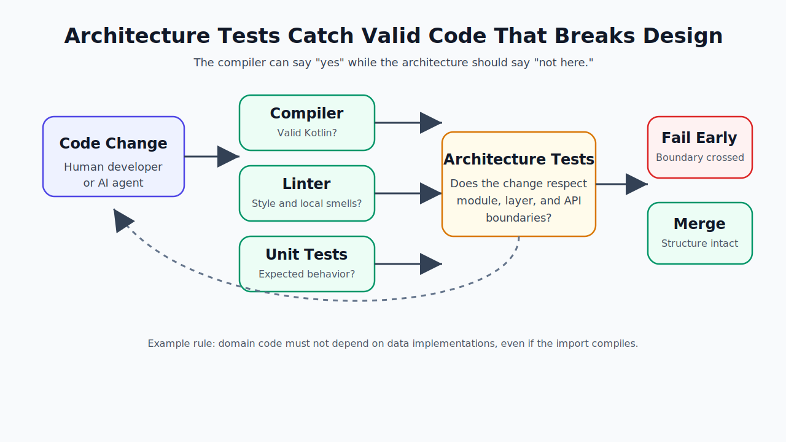
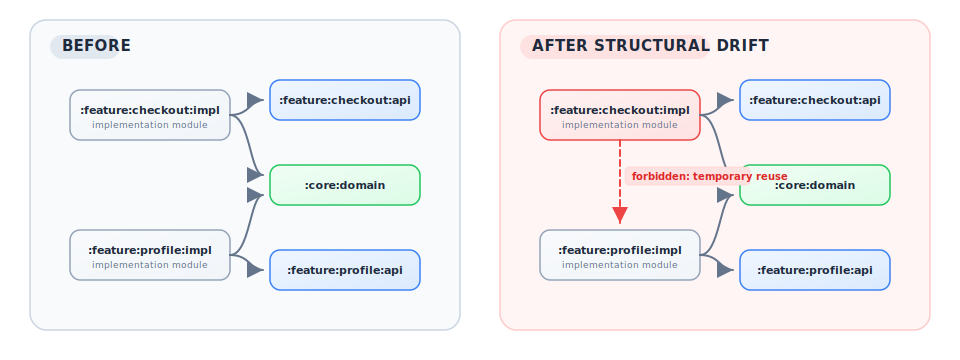
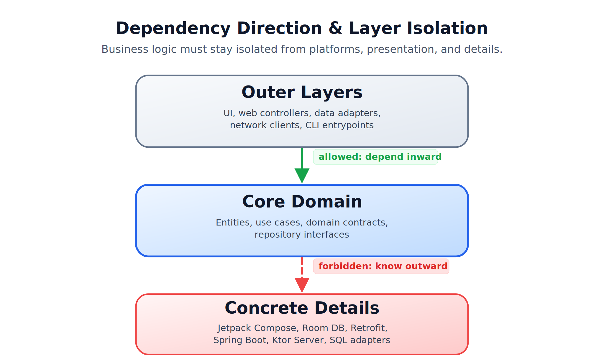
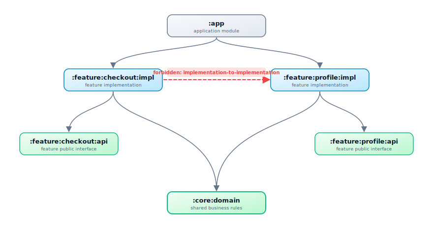
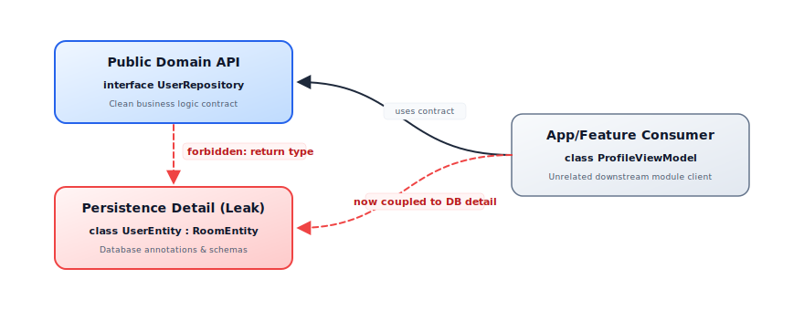

# Kotlin Architecture Tests: What They Are and Why They Matter

_A Kotlin project can compile, pass its unit tests, satisfy its linter, and still become structurally harder to change. Architecture tests exist for that gap._



Most verification tools answer local questions.

The compiler asks whether the code is valid Kotlin. A linter asks whether a file follows local style and quality rules. Unit tests ask whether a function or component behaves as expected.

Those checks are necessary. They are not the same as asking whether the system still has the shape the team depends on.

Consider a domain use case that starts depending on a data-layer implementation:

```kotlin
package com.acme.domain

import com.acme.data.SqlUserRepository

class GetUserUseCase(
    private val repository: SqlUserRepository,
)
```

This code can compile. The unit tests can pass. `ktlint` may have nothing useful to say.

The problem is structural: the domain layer now knows about a persistence detail. A boundary that was supposed to preserve changeability has become a convention people have to remember.

Architecture tests turn that convention into an executable rule:

```kotlin
Konture.classes {
    that().resideInAPackage("..domain..")
    should().onlyDependOnClassesInAnyPackage(
        "..domain..",
        "kotlin..",
        "java..",
    )
}
```

That is the core idea. Architecture tests do not prove the software is correct. They prove that specific structural decisions are still true.

## The Green Build Illusion

A green build tells you the repository satisfied the checks you asked it to run.

It does not tell you that the intended architecture survived the change.

The compiler will accept a forbidden dependency if the symbol is on the classpath. Gradle will build a module graph that violates your design if someone declares the dependency. A unit test will not fail because a feature module imported another feature module's implementation detail unless the tested behavior changes.

That is why architecture violations often look ordinary in review:

- A controller calls a repository directly because it was faster than adding an application service.
- A domain model accepts a network DTO because the DTO already has the right fields.
- A feature implementation module imports another feature implementation module because the API module does not expose the needed contract yet.
- A Kotlin class in an `impl` package stays public by default and becomes convenient for other modules to reuse.
- An AI coding assistant adds a Gradle dependency because it makes the current file compile.

None of those changes has to be malicious or careless. Most structural drift comes from small local optimizations that are rational in the moment and expensive in aggregate.

Architecture tests are a way to make the aggregate cost visible early.

## Structural Drift Has a Shape

Most architecture drift is not dramatic. It usually starts as one edge that looks reasonable in a pull request.



The second graph may still compile. The product behavior may still be correct. The damage appears later:

- A profile refactor now needs checkout context,
- Unrelated feature changes invalidate more build work,
- Reviewers have to reason about a wider blast radius,
- The next shortcut feels less unusual because the first one already exists.

The right metrics are project-specific, but the useful ones are concrete: number of forbidden module edges, number of rule violations per month, module fan-in and fan-out, rebuild scope after a feature change, and repeated review comments about the same boundary. Architecture tests become persuasive when they turn those observations into a failing example instead of a style argument.

## What Architecture Tests Check

Good architecture tests protect decisions that affect change velocity, module independence, public API shape, and review load. They usually fall into a few categories.

### 1. Dependency Direction and Layer Isolation

Layered systems depend on direction. In Clean Architecture, ports and adapters, and many domain-centered designs, outer layers may depend inward, but the core should not depend on UI, databases, transport frameworks, or platform APIs.



Typical rules:

- Domain packages must not import persistence, transport, Android, Compose, Spring, or Ktor server APIs.
- Application services may depend on domain contracts, not directly on web controllers.
- UI modules should consume presentation state, not database or network entities.

The compiler sees valid types. Architecture tests encode which valid types are unacceptable in a given layer.

### 2. Gradle Module Boundaries

In a modular Kotlin project, Gradle project dependencies are part of the architecture.



Typical rules:

- `:core:domain` must not depend on `:core:data` or `:app`.
- Feature implementation modules must not depend on sibling feature implementation modules.
- API modules may be depended on broadly; implementation modules should remain behind their API.
- The Gradle project graph should not contain cycles.

This category matters for design and for build performance. Unnecessary module edges expand recompilation scope, reduce cache usefulness, and make local changes affect unrelated features.

### 3. Public API and Type Leakage

Some architecture failures are not about imports in a private implementation. They are about what a module exposes.



Typical rules:

- Public domain APIs should not expose database entities or network DTOs.
- Public feature API packages should expose contracts and stable models, not implementation classes.
- Persistence or framework annotations should not leak into clean business interfaces.
- Library modules should keep implementation packages `internal` unless they are intentionally public.

Kotlin's default `public` visibility makes this easy to get wrong. Once another module starts depending on an accidental public type, removing it becomes a breaking change.

### 4. Layer-Crossing Calls

Some systems rely on an intermediate layer for validation, authorization, transactions, logging, or orchestration. A direct call can bypass the place where those policies live.

Typical rules:

- Controllers call application services, not repositories directly.
- Composables call ViewModels or presenters, not Retrofit services.
- Route handlers call use cases, not SQL adapters.
- UI modules do not call infrastructure modules.

These rules should be used carefully. They are valuable when the intermediate layer has a real responsibility. They are bureaucracy when the layer exists only because a diagram says so.

### 5. Dependency Injection and Wiring Conventions

DI configuration is architecture in executable form. It decides which implementation backs which contract.

Some wiring policies belong in integration tests. Others can be checked structurally:

- DI modules live in approved packages.
- Feature modules do not override core bindings.
- Adapter implementations are bound to domain interfaces rather than consumed directly.
- Test-only bindings do not leak into production source sets.

The useful rule is the one that catches a real class of production or maintenance failures, not the one that merely mirrors a preference.

### 6. File and Source Hygiene

Not every structural test needs to be profound. Some rules keep navigation predictable and reduce review noise:

- One primary class per file.
- File names match primary class names.
- No wildcard imports.
- Generated or migration packages are explicitly excluded.

These rules should not duplicate what a formatter or linter already handles well. Architecture tests are most valuable when they need whole-project context.

## What Architecture Tests Should Not Check

Architecture tests become brittle when they try to govern everything.

They should not replace:

- The compiler for type safety.
- A formatter for whitespace and style.
- A linter for ordinary single-file smells.
- Unit tests for behavior.
- Integration tests for real wiring and runtime behavior.
- Code review for judgment, naming, and design intent that is not stable enough to encode.

A bad architecture test freezes an implementation detail and calls it design. A good one protects a boundary that multiple engineers already rely on.

## How Architecture Tests Become Harmful

Architecture tests are governance. Bad governance is worse than no governance because it teaches people to route around the system.

Common failure modes:

- **Brittle rules**: a test encodes today's folder layout rather than a durable boundary.
- **False security**: a passing suite is treated as proof that the architecture is good.
- **Team friction**: a rule blocks legitimate feature work, but nobody knows who owns the exception process.
- **Over-testing generated code**: Room, KSP, Compose, serialization, or DI-generated sources create noise that authored-code rules were never meant to judge.
- **Broad package bans**: a rule blocks too much, so engineers add exclusions until the rule no longer means anything.
- **No negative proof**: the suite has never been seen failing against an intentional violation.

The antidote is not a larger suite. It is a smaller, more explicit suite. Each rule should name the decision it protects, the cost of breaking it, and the intended repair path.

## When Not to Use Them

Architecture tests are not automatically worth it.

They are often premature for a tiny codebase where everyone can still hold the structure in their head. They can be noisy in early-stage products where module and package boundaries are being discovered weekly. They may be a poor fit for highly dynamic or reflective code where the meaningful dependency is runtime wiring rather than visible source structure. They can also slow a monolith with heavy churn if the first suite tries to enforce the target architecture instead of the architecture the team is actually migrating toward.

In those cases, lighter tools may be enough:

- A short architecture decision record,
- A module ownership note,
- A review checklist for the next few changes,
- A non-blocking report that counts violations before enforcing them.

Use architecture tests when the boundary is stable enough to enforce and expensive enough to break.

## Living Documentation That Fails

Architecture diagrams, READMEs, onboarding docs, and review checklists all help. None of them fails CI.

An architecture test gives a rule a durable form:

```kotlin
@Test
fun `domain must not depend on data or app modules`() {
    Konture.modules {
        that().haveNamePath(":domain")
        should().notDependOnModule(":data")
        should().notDependOnModule(":app")
    }
}
```

The test name documents the rule. The assertion defines the rule. The failure output tells the developer where the rule was broken.

That changes the review conversation. Instead of asking a reviewer to remember every boundary under time pressure, the repository can report:

```text
Architecture violation(s) detected:
Module :domain should not depend on :data, but a dependency was found.
```

The team still decides whether the rule is right. The test removes the need to rediscover the same violation by hand.

## Organizational Impact

The technical effect is boundary enforcement. The organizational effect is shared memory.

For new engineers, architecture tests compress onboarding. They show which dependencies are allowed, which APIs are intentionally public, and where exceptions live. For experienced engineers, they reduce repetitive review comments so code review can focus on design judgment instead of policing the same imports.

For teams, the trade-off is autonomy versus consistency. A platform or architecture group should not use tests to centralize every local decision. The better pattern is to encode a small set of cross-team contracts and let feature teams own the rest. When a rule changes, treat that change like an architecture decision: update the test, update the ADR or docs if one exists, and make the migration path explicit.

At scale, architecture tests work best as part of governance, not as a substitute for it:

- ADRs explain why a boundary exists.
- Architecture tests check whether the boundary still holds.
- CI reports where the boundary was crossed.
- Reviewers decide whether the boundary or the code should change.

## A Concrete Example From the Showcases

The Konture repository includes a small Gradle showcase that uses the same shape as the examples above: `:app`, `:domain`, `:data`, and a dedicated `:konture-test` module.

Its architecture suite does not only check one happy-path rule. It combines several structural checks:

- The module graph has no cycles.
- `:domain` does not depend on `:data` or `:app`.
- `:data` only depends on `:domain`.
- Classes in `..domain..` only depend on domain, Kotlin, or Java packages.
- Repository declarations in domain are interfaces.
- Use case signatures do not leak `.data.` or `.app.` types.

One test deliberately proves that a bad module rule throws an `AssertionError`. The intentionally wrong assertion says `:data` should only depend on `:app`; the sample project has `:data` depending on `:domain`, so the rule fails with the same shape as a real architectural regression:

```text
Architecture violation(s) detected:
Module :data depends on :domain, which is not allowed by pattern(s): :app
```

That matters. A structural rule that has never failed may not be checking the thing the team thinks it is checking.

The sample suite is executable:

```bash
./gradlew -p showcases/sample-gradle :konture-test:test
```

On this repository, that command runs the architecture-test module successfully and generates the layout and dependency metadata Konture uses to evaluate module-aware rules.

## Why This Matters With AI-Assisted Development

AI coding assistants are good at local completion. They can import a visible class, add a missing dependency, and make a narrow test pass.

Architecture is usually global context.

Instructions such as this help:

```text
Keep domain independent from data.
Do not add sideways feature dependencies.
Map network DTOs before they reach UI state.
```

But prompt instructions are not enforcement. They are guidance.

Architecture tests give both humans and agents the same feedback loop:

1. A change crosses a boundary.
2. The test fails with a concrete module, file, import, or type.
3. The developer or agent repairs the design by using the intended abstraction.

This is not magic, and it is not a substitute for review. It is a way to make structural rules visible to the tools already changing the code.

## Future Pressure on Kotlin Architecture

The need for structural feedback is likely to increase, not decrease.

Compose Multiplatform makes UI code portable, but it also creates new questions about which UI abstractions belong in shared code and which stay platform-specific. Kotlin 2.x and compiler-plugin-heavy stacks continue to blur the line between authored source and generated or transformed code. AI agents can produce large, locally plausible patches faster than a reviewer can inspect every module edge by hand.

That does not mean every team needs more rules. It means the important rules need to be executable, narrow, and easy to repair. The future-friendly architecture suite is not the biggest one. It is the one that catches the boundaries humans and agents are most likely to cross accidentally.

## When a Rule Deserves CI Enforcement

Not every good idea should block a build. A rule is a good candidate for CI when most of these are true:

- The team can explain the cost of breaking it.
- The rule is stable across normal feature work.
- Violations are usually mistakes, not legitimate design choices.
- The failure message points to an actionable fix.
- Exceptions are rare and can be named explicitly.
- The rule catches something the compiler, linter, or unit tests do not.

If a rule fails constantly during normal development, it may be too broad. If a rule needs many quiet exclusions, it may be pretending the architecture is cleaner than it is. If nobody can explain why it exists, it should not block delivery.

Start with rules that protect known pain: module cycles, domain-to-data dependencies, feature implementation coupling, public API leakage, and platform APIs leaking into shared KMP code.

## The Practical Payoff

Architecture tests help teams preserve the structure that makes future changes cheaper:

- They keep domain logic independent from frameworks and persistence.
- They prevent accidental Gradle edges that widen recompilation.
- They protect API modules from leaking implementation detail.
- They make public visibility intentional.
- They turn repeated review comments into checks that fail with specific modules, files, imports, or types.

The goal is not rigid architecture. The goal is explicit architecture.

Once a team has chosen a structure, the build should help protect it.

The next article focuses on the part this primer has only hinted at: why a source-only rule misses Gradle dependency drift, why a Gradle-only rule misses source-level type leakage, and why Kotlin architecture tests need both views at once.

---

## Continue the Series

- [Kotlin Architecture Tests: Why Konture Exists](kotlin-architecture-tests-why-konture-exists.md)
- [Kotlin Architecture Tests with Konture: A Practical Guide](kotlin-architecture-tests-with-konture.md)
