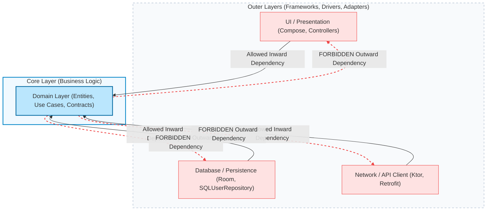
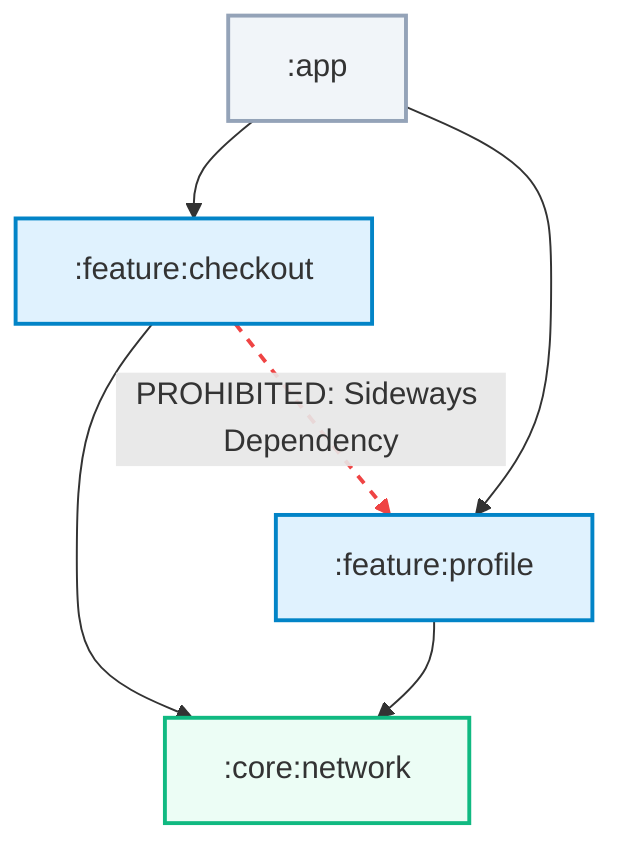
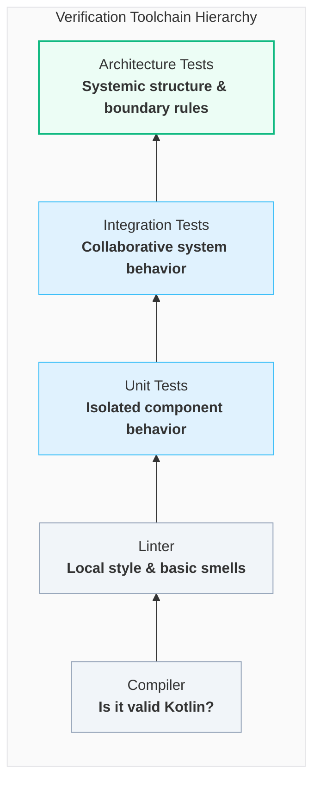

# Kotlin Architecture Tests: What They Are and Why They Matter

_Your Kotlin project can compile, pass every unit test, satisfy every linter, and still violate the architecture your team depends on, especially when humans and AI agents are both moving fast._


Most teams already have several quality gates.

The compiler checks whether the code is valid Kotlin. The linter checks style and local code smells. Unit tests check expected behavior.

Architecture tests add a different gate:

> Does this change still respect the structure of the system?

That question matters because architecture violations often look like normal code. A human developer or AI agent can make a change that compiles, passes tests, and still crosses a boundary the team depends on.

For example, a Kotlin use case might import a database implementation.

```kotlin
package com.acme.checkout.domain

import com.acme.checkout.data.SqlUserRepository

class GetUserUseCase(
    private val repository: SqlUserRepository,
)
```

The code compiles. The unit tests may still pass. `ktlint` probably has nothing to say.

And yet, something important just broke: the domain layer now knows about a data-layer implementation. A boundary that was supposed to protect the business logic has become a suggestion.

That is the space architecture tests are meant to cover.

They are not a replacement for the compiler, unit tests, integration tests, or linters. They answer a different question:

> Does this code still respect the structure we said the system should have?

For Kotlin teams, that question matters more every year. Projects are larger. Android and Kotlin Multiplatform applications are more modular. Backend systems are often split into domain, application, infrastructure, and adapter modules. AI coding assistants can generate working code quickly, but they sometimes choose the shortest compiling path: import the available class, add the missing Gradle dependency, or reuse a nearby implementation detail. Those choices can be locally correct and architecturally wrong.

Architecture tests turn those boundaries into executable checks.

## The Green Build Illusion

A green build is necessary. It is not sufficient.

The compiler checks whether the code is legal Kotlin. It checks syntax, type safety, visibility rules, and whether referenced symbols are available on the classpath.

Linters check local code quality. They catch formatting issues, naming conventions, complexity thresholds, unused imports, and many single-file smells.

Unit tests check behavior. They tell you whether a function, class, or use case does what a test expects it to do.

None of those tools knows your architectural intent.

The compiler does not know that `:domain` should not depend on `:data`. If the dependency exists in Gradle, the compiler accepts the import.

A linter does not know that `commonMain` should not reference platform-specific code. It mostly sees files and syntax.

A unit test does not fail because a feature module depends on a sibling feature module. It fails only if the behavior under test breaks.

Architecture violations are often valid code. That is why they slip through.

## Architecture Erodes Through Small Changes

Most architecture problems do not arrive as a big redesign.

They arrive as tiny shortcuts:

- a controller calls a repository directly because it was faster than adding a service method;
- a domain model starts referencing a network DTO;
- a feature implementation module imports another feature implementation module;
- an `impl` class is left `public` and becomes someone else's dependency;
- shared KMP code imports a platform API;
- an AI agent adds a forbidden module dependency because it makes the current task compile;
- a legacy package gains one more consumer because the migration is already messy.

Each change is easy to justify locally. The code works. The feature ships.

The cost appears later.

Refactoring becomes harder because internal details have become public contracts. Build times get worse because modules depend on each other in unnecessary directions. Tests become heavier because domain code now knows about frameworks. AI-generated patches become risky when the repository has no executable way to say, "this boundary is real."

Architecture tests are a way to make those rules visible to the build early, before a shortcut becomes a pattern other code starts to copy.

## What Architecture Tests Check

Good architecture tests usually protect six kinds of decisions.

### 1. Dependency Direction and Layer Isolation

In Clean Architecture, layered architecture, or ports and adapters, outer layers can depend inward. The domain or core layer should not depend outward on UI, database, network, framework, or infrastructure details.



Typical policies:

- domain must not depend on data;
- domain must not import Spring, Android, Compose, Room, SQLDelight, or Ktor server APIs;
- application services may depend on domain, but not directly on web controllers.

The compiler cannot infer "domain purity." If the type is visible, the compiler allows it.

### 2. Module Boundary Enforcement

In a multi-module Kotlin project, Gradle modules are part of the architecture.



Typical policies:

- `:feature:checkout` must not depend on `:feature:profile`;
- `:core:domain` must not depend on `:app`;
- implementation modules must stay behind API modules;
- the build graph must remain acyclic.

Gradle can enforce missing dependencies. It cannot stop someone from adding a new dependency that violates the intended design.

### 3. Cross-Layer Type Leakage

Types from one layer should not leak into another layer's public API.

Typical policies:

- database entities should not be returned from REST controllers;
- Room entities should not appear in Composable or ViewModel signatures;
- network DTOs should not appear in domain use cases;
- platform-specific types should not appear in shared KMP APIs.

The compiler is happy to pass valid types around. It does not know which types represent persistence, transport, UI, or domain concepts.

### 4. Layer-Crossing Calls

Architecture often says that components should move through layers in order.

Typical policies:

- controllers call services, not repositories directly;
- Composables call ViewModels, not Retrofit services;
- route handlers call application services, not SQL adapters;
- UI modules do not call infrastructure modules.

The compiler sees a callable function. It does not know the call skipped the layer where validation, authorization, transactions, or logging live.

### 5. Dependency Injection and Wiring Conventions

Some structural failures appear only at runtime.

Typical policies:

- feature modules should not override core DI bindings;
- modules should not register unused or duplicate bindings;
- DI modules should live in approved packages;
- adapter implementations should be bound to domain interfaces, not consumed directly.

Some of these checks belong in DI-specific integration tests. Some can be expressed as source or module rules. The important point is that wiring is architectural, not only behavioral.

### 6. API Surface and Visibility

Kotlin classes are `public` by default. That makes accidental API expansion easy.

Typical policies:

- classes in `..impl..` packages must be `internal`;
- public API packages must contain documented interfaces or DTOs only;
- implementation classes must not be exposed across module boundaries;
- public types must not contain `Impl`, `Internal`, or persistence-specific names.

Once another module starts using an accidental public class, removing it becomes a breaking change.

## Architecture Tests Are Living Documentation

Architecture diagrams are useful. README files are useful. Onboarding docs are useful.

But none of them fails CI.

An architecture test gives a rule an executable form:

```kotlin
Konture.modules {
    that().haveNamePath(":domain")
    should().notDependOnModule(":data")
    should().notDependOnModule(":app")
}
```

The test name becomes documentation:

```kotlin
@Test
fun `domain must not depend on data or app modules`() {
    // rule here
}
```

When the test fails, the architecture is no longer an opinion in a code review. It is a broken contract.

That changes the conversation.

Instead of saying:

> Please do not import data from domain.

The repository says:

> This import violates the domain boundary. Here is the file that crossed it.

That is better feedback for humans. It is also much better feedback for AI coding agents.

## Why This Matters More with AI-Generated Code

AI coding tools are good at local completion. They can find an available class, import it, make a test pass, and move on.

Architecture is often global context.

An agent may not know that a repository implementation is forbidden in the domain layer. It may not know that feature modules should communicate through API modules. It may not know that `commonMain` must stay platform-neutral. Even when the instruction is present somewhere in the repository, the agent may miss it, overfit to the immediate failing test, or make a dependency change that looks harmless in isolation.

Prompt instructions help:

```text
Keep domain independent from data.
Do not add sideways feature dependencies.
Do not introduce Android APIs into shared code.
```

But prompt instructions are not quality gates.

An architecture test is.

If AI-generated code crosses a boundary, the same build that checks human-written code catches it early. The agent gets concrete feedback and can repair the patch while the change is still small. The team does not have to rely on memory, review fatigue, or increasingly long instruction files.

## What Makes a Good Architecture Test

A good architecture test is specific.

Bad:

```text
The project should follow clean architecture.
```

Good:

```text
Classes in packages matching ..domain.. may depend only on ..domain.., kotlin.., and java...
```

A good architecture test has a clear owner.

If the team cannot explain why a rule exists, it probably should not block CI.

A good architecture test is scoped.

Generated code, legacy migration areas, test fixtures, and intentionally unstable packages may need explicit exclusions. That is fine, as long as the exception is deliberate and visible.

A good architecture test fails for one reason.

Do not bundle ten unrelated policies into one test. A red architecture test should tell the developer which design decision was broken.

## Where Architecture Tests Fit in the Toolchain

Architecture tests sit beside the tools you already use.



| Tool | Main question |
| --- | --- |
| Compiler | Is this valid Kotlin? |
| Linter | Does this file follow local code style and simple quality rules? |
| Unit test | Does this unit behave correctly? |
| Integration test | Do these components work together? |
| Architecture test | Does this code still respect the intended structure? |

That final question is the missing one in many Kotlin projects.

## The Practical Payoff

Architecture tests help teams:

- catch dependency drift early;
- keep domain logic framework-independent;
- protect Gradle module boundaries;
- prevent DTO and entity leakage;
- keep KMP shared code portable;
- make public APIs intentional;
- give AI coding agents executable feedback;
- turn architectural decisions into CI-enforced contracts.

The point is not to make architecture rigid.

The point is to make architecture explicit.

Once a team has chosen its structure, the build should help protect it.

In the next article, we will look at why existing options do not fully cover this problem for Kotlin projects, and why Konture was built around a specific idea: architecture tests should understand both the Gradle build graph and the Kotlin source code developers actually write.

---
