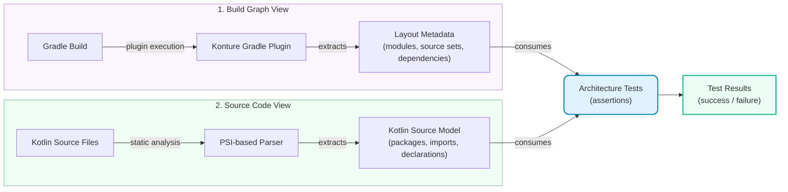
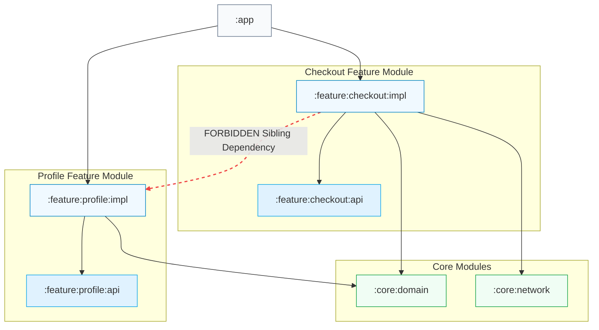

# Kotlin Architecture Tests: Why Konture Exists

_Kotlin architecture rules often live in two worlds at once: the Gradle module graph and the Kotlin source tree. Konture was built to test both._

Consider this rule:

```text
The domain layer must not depend on the data layer.
```

In a Kotlin project, that rule can be broken in at least two different ways.

First, at the build level:

```kotlin
// domain/build.gradle.kts
dependencies {
    implementation(project(":data"))
}
```

Second, at the source level:

```kotlin
package com.acme.domain

import com.acme.data.UserRepositoryImpl
```

Those are related problems, but they are not the same problem.

One is about the real Gradle module graph. The other is about Kotlin files, packages, imports, declarations, and references.

This is the main reason Konture exists: Kotlin architecture is not only bytecode, not only source files, and not only Gradle modules. It is the relationship between all of them.

## The Gap in Existing Solutions

Existing tools are useful. Konture is not trying to erase them.

But Kotlin teams often hit gaps when they need architecture tests that understand both the build structure and the source code.

### ArchUnit Is Strong for JVM Bytecode

ArchUnit is a mature and proven tool, especially in Java and JVM backend systems.

It works well when your architecture question can be answered from compiled classes.

That is also its limitation for Kotlin projects. Kotlin developers write source-level constructs that do not always map cleanly to the shape of JVM bytecode. A rule may be easier to express against the Kotlin declaration the developer wrote, rather than the compiled form produced later.

ArchUnit also does not naturally start from Gradle's project graph. It can reason about class dependencies, but `:domain`, `:data`, `:feature:checkout:api`, and `:feature:checkout:impl` are build concepts. In a large Gradle build, those concepts matter.

### Source-Scanning Tools Are Good at Kotlin Declarations

Source-oriented tools are valuable for package conventions, names, modifiers, annotations, constructor shape, and other Kotlin-level rules.

That solves a different part of the problem.

A source scan can find files. It can inspect packages. It can inspect classes. But a folder scan is not the same as asking Gradle which modules exist, which source sets are production source sets, and which project dependencies are declared.

That distinction becomes important in Android and Kotlin Multiplatform projects.

A Kotlin project may contain:

```text
:app
:core:domain
:core:data
:feature:checkout:api
:feature:checkout:impl
:shared
:androidApp
:iosApp
```

It may also contain source sets such as:

```text
commonMain
androidMain
iosMain
desktopMain
```

Folder names alone are not enough. The build already knows what those things mean. Architecture tests should be able to use that knowledge.

### Linters Are Not Architecture Testers

`detekt` and `ktlint` are excellent at what they are designed to do.

But most architecture rules require whole-project context.

A linter can inspect a file. It usually cannot answer questions like:

- does this Gradle module depend on a forbidden sibling module?
- did a feature implementation module become visible to another feature implementation?
- does the project dependency graph contain a cycle?
- does this public API expose a type owned by another architectural layer?

Those are architectural questions, not formatting questions.

## Why Konture Takes a Two-View Approach

Konture combines two views of a Kotlin project.

The first view is the build graph:

- Gradle modules;
- source sets;
- production Kotlin source directories;
- declared project dependencies;
- applied plugin context.

The second view is the Kotlin source model:

- files;
- packages;
- classes and interfaces;
- imports;
- annotations;
- visibility;
- functions and properties;
- references between project classes.

The Gradle plugin captures the build view. The assertion library uses that captured layout and parses Kotlin source with a PSI-based static analysis model.

At a high level, the flow is:



That means you can write module rules and source rules in the same test suite.

```kotlin
Konture.architecture {
    modules {
        that().haveNamePath(":domain")
        should().notDependOnModule(":data")
    }

    classes {
        that().resideInAPackage("..domain..")
        should().onlyDependOnClassesInAnyPackage(
            "..domain..",
            "kotlin..",
            "java..",
        )
    }
}
```

The first rule checks the physical dependency declared in the build.

The second rule checks source-level references inside Kotlin code.

Together, they protect the boundary more completely than either view alone.

## What Konture Is

Konture is a standalone Kotlin and Gradle architecture testing library.

It has two main parts:

- a Gradle plugin that extracts the project layout and module dependency graph;
- a Kotlin assertion library that lets you write architecture rules as ordinary tests.

Those tests can run in the test framework you already use, because Konture is not tied to a custom runner.

You can use it with JUnit, Kotest, TestBalloon, or another Kotlin/JVM test runner. The architecture rules are just test code.

## What Konture Is Not

Konture is not a style guide.

It does not force Clean Architecture, MVVM, hexagonal architecture, DDD, feature-sliced architecture, or any other pattern.

Konture is architecture-agnostic. It gives you a way to encode the architecture your team already chose.

That distinction matters.

An Android team might protect feature API and implementation modules.

A backend team might protect ports and adapters.

A KMP team might protect shared code from platform app dependencies.

A library team might protect public API packages from leaking implementation classes.

Konture does not decide those policies. It makes them executable.

## What Konture Addresses

Konture is aimed at the architecture problems that ordinary compilation and linting do not catch well.

### Module Boundaries

```kotlin
Konture.modules {
    that().haveNamePath(":core:domain")
    should().notDependOnModule(":core:data")
    should().notDependOnModule(":app")
}
```

This checks the real project dependency graph.

### Cycles

```kotlin
Konture.assertNoCycles()
```

This protects the build graph from circular dependencies.

### Layer Isolation

```kotlin
Konture.layered {
    val presentation = layer("presentation") definedBy "..presentation.."
    val domain = layer("domain") definedBy "..domain.."
    val data = layer("data") definedBy "..data.."

    where(presentation) {
        mayOnlyAccessLayers(domain)
    }

    where(data) {
        mayOnlyAccessLayers(domain)
    }

    where(domain) {
        mayOnlyAccessLayers()
    }
}
```

This models a layered dependency direction directly in code.

### Source-Level Conventions

```kotlin
Konture.classes {
    that().resideInAPackage("..domain..")
    that().haveNameEndingWith("Repository")
    should().beInterfaces()
}
```

This catches a common domain convention: repositories are contracts, not concrete data implementations.

### Type Leakage

```kotlin
Konture.classes {
    that().resideInAPackage("..domain..")
    should().notHaveSignaturesWithTypesAnnotatedWith("jakarta.persistence.Entity")
}
```

This keeps persistence types from leaking into domain APIs.

### Visibility Boundaries

```kotlin
Konture.classes {
    that().resideInAPackage("..impl..")
    should().beInternal()
}
```

This prevents implementation packages from becoming accidental public API.

### File Hygiene

```kotlin
Konture.files {
    should().notHaveWildcardImports()
    should().haveOnlyOneClassPerFile()
    should().haveNameMatchingClassName()
}
```

This lets teams encode conventions that reduce review noise and keep source structure predictable.

## Why Gradle Awareness Matters

Kotlin teams often design systems around modules.

For example:



The architecture policy might be:

```text
Feature implementation modules must not depend on other feature implementation modules.
```

That policy is not only about packages. It is about Gradle project dependencies.

If a developer adds:

```kotlin
implementation(project(":feature:profile:impl"))
```

to `:feature:checkout:impl`, the compiler will accept it. Gradle will build it. The shortcut may even solve the immediate feature request.

But the architecture has drifted.

A Gradle-aware architecture test can fail immediately.

```kotlin
Konture.modules {
    that().haveNameMatching(":feature:**:impl")
    should().onlyDependOnModules(
        ":feature:**:api",
        ":core:**",
        ":shared",
    )
}
```

The important part is that the test is checking modules as modules, not pretending they are just directories.

## Why Kotlin Source Awareness Matters

Module boundaries are not enough.

You can have a valid module graph and still leak the wrong concepts inside source code.

For example, `:data` may correctly depend on `:domain`, but a domain package might still reference an implementation detail because it is available somewhere in the test or application classpath.

Source rules catch those issues:

```kotlin
Konture.classes {
    that().resideInAPackage("..domain..")
    should().onlyDependOnClassesInAnyPackage(
        "..domain..",
        "kotlin..",
        "java..",
    )
}
```

For external framework imports, a team can write a custom predicate:

```kotlin
Konture.scopeFromPackage("com.acme.domain")
    .assertTrue("Domain must not import framework or persistence APIs") { cls ->
        cls.imports.none { fqName ->
            fqName.startsWith("org.springframework.") ||
                fqName.startsWith("android.") ||
                fqName.startsWith("androidx.compose.") ||
                fqName.startsWith("jakarta.persistence.")
        }
    }
```

That gives the team a concrete rule: domain code can use domain types and standard Kotlin or Java types, but not framework-specific APIs.

## Why It Works for AI-Assisted Development

AI-generated code often fails in predictable architectural ways.

It imports the concrete thing because the concrete thing is visible.

It adds a Gradle dependency because that makes the reference compile.

It uses a DTO as a shortcut instead of mapping to a domain model.

It places a new class near a similar class without understanding the package boundary.

Konture gives the repository an executable response.

Instead of relying only on a prompt like:

```text
Follow the project architecture.
```

the project can run:

```bash
./gradlew :konture-test:test
```

and tell the agent exactly which rule broke.

That is the difference between guidance and enforcement.

## Konture Features at a Glance

Konture focuses on practical architecture checks for Kotlin projects:

- Gradle-aware module dependency rules;
- source-level Kotlin PSI analysis;
- architecture-agnostic rule authoring;
- support for JVM, Android, and Kotlin Multiplatform layouts;
- ordinary test execution with common Kotlin test frameworks;
- module, class, file, function, and property assertions;
- layered architecture DSL;
- custom predicates for project-specific guardrails;
- dedicated architecture-test module setup;
- AI-friendly prompts and skills for setup and rule writing.

The result is a lightweight quality gate that lives with the codebase.

## When Konture Is a Good Fit

Konture is useful when your architecture rules mention:

- Gradle modules;
- Kotlin packages;
- source sets;
- domain, data, UI, adapter, or infrastructure layers;
- feature module isolation;
- API and implementation module boundaries;
- Kotlin visibility;
- public API shape;
- KMP shared-code portability;
- project-specific coding conventions that require whole-project context.

It is less useful for rules that a compiler or linter already handles well. If the issue is formatting, use a formatter. If the issue is a simple local smell, use a linter. If the issue is behavior, write a unit or integration test.

Konture earns its place when the question is structural.

## The Core Idea

Architecture tests should not depend on memory.

They should not depend on a reviewer noticing every boundary violation.

They should not depend on an AI assistant fully absorbing a long prompt.

They should run.

Konture exists to make Kotlin architecture rules executable against the two things Kotlin teams actually use to structure their systems: the Gradle build graph and the Kotlin source code.

In the next article, we will set up Konture and write a practical starter suite of architecture tests.

---
