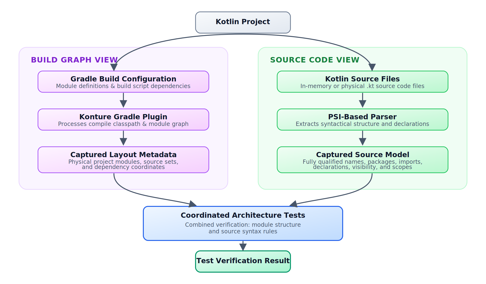
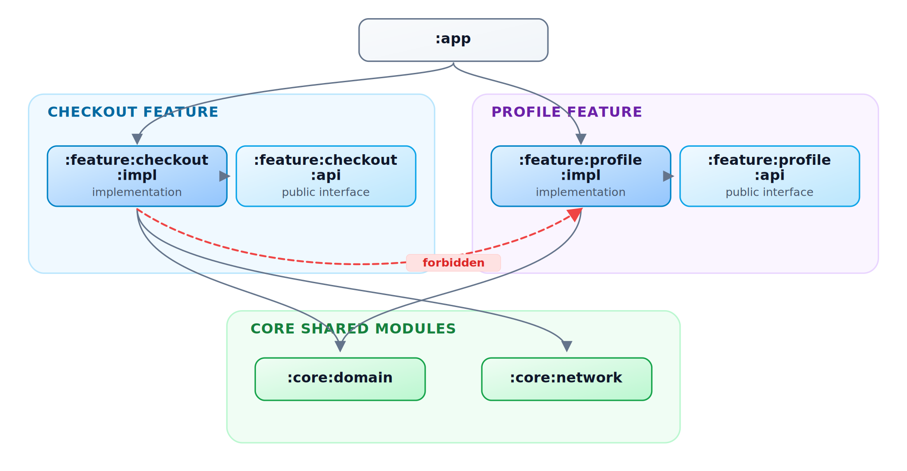

# Kotlin Architecture Tests: Why Konture Exists

_Kotlin architecture has two views of the same architecture: the Gradle graph that decides what can link, and the Kotlin source model that decides what the code actually says. Konture exists to test both._

Consider a rule from a Kotlin Multiplatform project:

> Shared `commonMain` code must not depend on Android UI APIs.

That rule can fail in two different places.

It can fail in the build graph when the shared module is wired to a platform implementation module:

```kotlin
// shared/build.gradle.kts
dependencies {
    implementation(project(":androidApp"))
}
```

It can also fail in source:

```kotlin
package com.acme.shared

import android.view.View
```

Those failures are related, but they are not identical. The first is a physical Gradle module dependency. The second is a source-level import. A serious architecture-testing tool for Kotlin has to understand both, because multiplatform systems are governed by both.

That is the reason Konture exists.

## The Incomplete Views

Existing tools are useful. Konture is not trying to replace the compiler, the linter, the test runner, or every architecture-testing library. The issue is that each view of a Kotlin project leaves something out.

| View | What it sees well | What it misses |
| --- | --- | --- |
| JVM bytecode | Compiled classes and class dependencies | Kotlin source intent, source sets, Gradle project boundaries, some compiler-plugin effects |
| Kotlin source scan | Packages, imports, declarations, modifiers, annotations | The real Gradle module graph and project dependency policy |
| Gradle graph inspection | Modules, source sets, declared project dependencies | Source-level imports, public signatures, visibility, and type leakage |
| Linters | Local style and single-file quality | Whole-project structure and architectural ownership |

Kotlin architecture sits across those views.

You can see that in the checked-in showcases. The Now in Android showcase includes 36 Gradle projects in `settings.gradle.kts`, including API/implementation feature splits and a dedicated `:konture-test` project. The KotlinConf KMP showcase includes 9 Gradle projects spanning shared core, backend, Android, desktop, web, admin, and architecture tests. A single-view tool can still be useful in those projects, but it will not naturally see every boundary the project uses.

## Tooling Comparison

The practical question is not "Which tool is best?" It is "Which tool owns which kind of rule?"

| Tooling option | Strong at | Weak at | Use it when | Combine with Konture when |
| --- | --- | --- | --- | --- |
| ArchUnit | Mature JVM bytecode rules and class dependency checks | Gradle project graph, KMP source sets, source-level Kotlin intent | The system is primarily JVM and the rule is visible in compiled classes | You also need module dependency policy, Kotlin visibility, or KMP/platform boundaries |
| detekt custom rules | Kotlin PSI, style, naming, local declaration rules | Gradle module graph and cross-module dependency policy | The rule is close to lint: naming, annotations, local source conventions | A lint finding needs to line up with module ownership or public API boundaries |
| Gradle Doctor or module-graph plugins | Build health, project graph visibility, dependency reports | Source imports, signatures, class visibility, API leakage | You need graph insight, build performance reports, or dependency hygiene | A graph edge is only half the story and source-level leakage also matters |
| Custom PSI tools | Highly specific Kotlin source rules | Maintenance cost, build integration, graph awareness | You have a narrow organization-specific rule and the team can own the tool | The custom rule should run next to build-graph contracts |
| Runtime or UI testing tools such as Kakao | User flows and Android UI behavior | Static architecture | You are validating behavior, screens, and interaction flows | Structural boundaries should fail before they become runtime behavior defects |
| Plain review checklists | Judgment, nuance, exceptions | Consistency under time pressure | The rule is still evolving or depends on human design trade-offs | The checklist item becomes stable enough to execute in CI |

Konture's bet is narrow: Kotlin architecture needs a single test surface that can talk about Gradle modules and Kotlin source declarations together.

## The Failure Modes That Motivated It

The most expensive architecture failures rarely start as "bad architecture." They start as reasonable local fixes:

- A feature implementation imports another feature implementation because the API module does not expose one missing contract yet.
- A shared KMP module accepts one Android import during a deadline, then discovers later that desktop or iOS can no longer reuse the code cleanly.
- A public repository interface returns a database entity because the entity already has the needed fields.
- A backend route calls a repository directly because the service layer felt like ceremony for one endpoint.

Each failure creates a debt with interest. The next refactor has to pay down hidden coupling before it can make the intended change. The next platform target has to separate APIs that were supposed to be portable. The next reviewer has to reconstruct an architectural decision from scattered imports and build files.

Konture was designed for that class of failure: a rule that is not purely source-level and not purely build-level, but architectural because it sits between the two.

### Bytecode Is Valuable, But It Is Not the Whole Kotlin Program

[ArchUnit](https://www.archunit.org) is mature and proven for JVM systems. If your architectural rule can be answered from compiled classes, bytecode analysis is often a strong fit.

Modern Kotlin projects often need more context than that.

Kotlin source constructs do not always map neatly to the source-level design a team wants to protect. Top-level functions and extension functions compile into generated holder classes. Inline functions move bodies into call sites. `object`, delegated properties, and compiler plugins can introduce generated structures that are important to the runtime but noisy for a source-level design rule.

That does not make bytecode analysis wrong. It means bytecode is the wrong primary lens for rules such as:

- Does `:feature:checkout:impl` depend on a sibling implementation module?
- Does `commonMain` import an Android API?
- Does a public domain signature expose a persistence type?
- Does an `impl` package remain internal in source?

Those are Kotlin and Gradle architecture questions, not only JVM class questions.

### Source Scanning Is Useful, But Folders Are Not the Build

Kotlin-first source scanners are good at declarations, imports, naming, annotations, and visibility. They can express many rules that bytecode tools make awkward.

But a source directory is not a Gradle project. A package name is not a module dependency. A folder named `api` is not the same thing as a module that other projects depend on through `api` or `implementation`.

That distinction matters in Android and Kotlin Multiplatform projects:

```text
:app
:core:domain
:core:data
:feature:checkout:api
:feature:checkout:impl
:feature:profile:api
:feature:profile:impl
:shared
:androidApp
:iosApp
```

The build already knows which modules exist, which source sets are production source sets, and which project dependencies are declared. Architecture tests should use that information instead of reconstructing it from naming conventions alone.

### Linters Are Not Architecture Testers

`detekt` and `ktlint` are excellent at local checks. They are not designed to answer whole-system questions:

- Does this module depend on a forbidden sibling module?
- Did a feature implementation become visible to another implementation?
- Does the project graph contain a cycle?
- Does a public API expose a type owned by another layer?

Those are not formatting problems. They are ownership and dependency problems.

## Konture's Two-View Model

Konture combines the build view and the source view.

The build view includes:

- Gradle modules.
- Source sets.
- Production Kotlin source directories.
- Declared project dependencies.
- Applied plugin context.

The source view includes:

- Files, packages, and imports.
- Classes, interfaces, functions, and properties.
- Visibility and annotations.
- References between project classes.



Konture supports both focused standalone assertions, such as `Konture.modules { ... }`, and grouped assertion blocks. Use `Konture.architecture { ... }` when related module and source rules should run as one architecture contract:

```kotlin
Konture.architecture {
    modules {
        that().haveNamePath(":shared")
        should().notDependOnModule(":androidApp")
    }

    classes {
        that().resideInAPackage("..shared..")
        should().onlyDependOnClassesInAnyPackage(
            "..shared..",
            "kotlin..",
            "java..",
        )
    }
}
```

The module rule catches the physical build dependency. The source rule catches the source-level reference pattern. Used together, they cover a boundary that neither build inspection nor source inspection can fully own alone.

## What Konture Is

Konture is a Kotlin architecture-testing library with two coordinated parts:

- A Gradle plugin that captures project layout, source sets, and module dependencies.
- An assertion library that lets teams write architecture rules as ordinary Kotlin tests.

It does not require a custom test runner. Architecture tests can run under JUnit, Kotest, TestBalloon, or another Kotlin/JVM runner your project already uses.

Konture is also architecture-agnostic. It does not prescribe Clean Architecture, MVVM, hexagonal architecture, feature slicing, or DDD. Those are design choices. Konture's job is to make the chosen design executable.

That distinction matters. An Android team may protect feature API and implementation modules. A backend team may protect ports and adapters. A KMP team may keep shared code free of platform APIs. A library team may prevent implementation types from leaking into public packages.

Konture should encode the team's policy, not invent one.

## API Design Philosophy

The DSL is intentionally close to ordinary tests:

- `Konture.modules { ... }` is for Gradle project and source-set policy.
- `Konture.classes { ... }`, `Konture.files { ... }`, `Konture.functions { ... }`, and `Konture.properties { ... }` are for source declarations.
- `Konture.layered { ... }` is for readable directional package rules.
- `Konture.architecture { ... }` groups related module and source rules into one contract.
- Functional scopes such as `scopeFromPackage` and `scopeFromModule` are escape hatches for custom predicates.

That shape is deliberate. Architecture rules are reviewed by engineers who may not work on the architecture tooling. A rule should read like a test, fail like a test, and live beside the rest of the verification suite.

The extension point is the predicate. When the fluent DSL is too high-level, a team can inspect imports, annotations, visibility, supertypes, file paths, source sets, or module dependencies directly and write a focused assertion. That keeps uncommon policy in project code instead of forcing Konture to grow a keyword for every organization's architecture.

## The Three Structural Jobs

Architecture tests are most valuable when they protect decisions that are expensive to repair later. In Kotlin systems, those decisions usually cluster into three jobs.

| Job | Threat | Build-level rule | Source-level rule |
| --- | --- | --- | --- |
| Logical isolation | Layers or modules depend in forbidden directions | `:domain` does not depend on `:data`; feature implementations do not depend on sibling implementations | Domain packages do not import data, UI, framework, or platform packages |
| API hermeticity | Implementation detail becomes public contract | API modules stay separate from implementation modules | Public signatures do not expose persistence, transport, or framework types |
| Mechanical hygiene | Structure becomes harder to navigate and build | Module graph has no cycles | Files avoid wildcard imports, class/file mismatch, or uncontrolled generated-code zones |

The point is not to create a large rule set. The point is to protect the small number of structural choices that keep the codebase changeable.

## Gradle Awareness Is Platform Engineering

Kotlin teams often use modules to manage ownership, compile scope, and feature independence. That makes the Gradle graph a platform concern, not merely a build-file detail.

Consider this common policy:

> Feature implementation modules must not depend on other feature implementation modules.



If `:feature:checkout:impl` adds this dependency:

```kotlin
implementation(project(":feature:profile:impl"))
```

the build may still pass. The immediate feature may even ship faster. But the module graph now says checkout is coupled to profile internals.

That has practical consequences:

- A profile implementation change can force more downstream work than necessary.
- Build cache reuse becomes less effective because internal changes cross feature boundaries.
- Refactoring profile internals becomes harder because another feature can now depend on them.
- Reviewers have to notice build-file drift manually.

A Gradle-aware rule makes the boundary executable:

```kotlin
Konture.modules {
    that().haveNameMatching(":feature:**:impl")
    should().onlyDependOnModules(
        ":feature:**:api",
        ":core:**",
        ":shared",
    )
}
```

This is not only "clean architecture." It is build health and ownership encoded as a test.

## Source Awareness Protects Semantic Boundaries

A clean Gradle graph does not prove clean source semantics.

For example, `:data` may correctly depend on `:domain` so it can implement domain interfaces. But a developer can still leak a persistence model into a domain-facing API:

```kotlin
package com.acme.domain

import com.acme.data.UserEntity

interface UserRepository {
    fun getUser(id: UserId): UserEntity
}
```

The build graph alone may not tell you this is wrong. The source model can.

Architecture tests can inspect imports, packages, declarations, visibility, and signatures:

```kotlin
Konture.classes {
    that().resideInAPackage("..domain..")
    should().onlyDependOnClassesInAnyPackage(
        "..domain..",
        "kotlin..",
        "java..",
    )
}
```

For external frameworks, a custom import predicate can make the policy explicit:

```kotlin
Konture.scopeFromPackage("com.acme.domain")
    .assertTrue("Domain must not import framework or persistence APIs") { cls ->
        cls.imports.none { fqName ->
            fqName.startsWith("android.") ||
                fqName.startsWith("androidx.compose.") ||
                fqName.startsWith("org.springframework.") ||
                fqName.startsWith("jakarta.persistence.")
        }
    }
```

`scopeFromPackage("com.acme.domain")` selects a concrete package prefix for custom assertions. By contrast, `resideInAPackage("..domain..")` uses Konture's wildcard package matching inside fluent class rules.

That is the source-level half of architecture governance: not just which modules can link, but which concepts are allowed to appear in which parts of the code.

## Tradeoffs and Failure Modes

Architecture tests deserve the same skepticism as any other production guardrail. Bad rules create drag.

Common failure modes:

- **Overbroad rules**: Banning `kotlinx..` from domain may accidentally block legitimate use of coroutines or serialization.
- **Hidden exceptions**: Excluding large legacy packages can make the rule look stronger than it is.
- **Generated code noise**: Generated sources may need explicit treatment so the rule protects authored code.
- **KMP complexity**: `commonMain`, `androidMain`, and `iosMain` often need different policies.
- **Mixed Java/Kotlin projects**: A Kotlin source rule may not cover Java code unless the project deliberately accounts for it.
- **Rule maintenance**: Architecture evolves. Tests must evolve with deliberate architecture decisions, not block them by accident.

These trade-offs do not weaken the case for architecture tests. They define the bar for using them responsibly.

For example, a tempting KMP rule is:

```text
Shared code must not import kotlinx..
```

That is usually too broad. `kotlinx.coroutines` may be a legitimate shared-code dependency, while an Android framework import is not. The better rule is narrower: ban the platform or framework packages that actually violate portability, and allow the cross-platform libraries the architecture intentionally uses.

Start with stable, high-signal rules. Make exceptions visible. Prove every rule can fail. Treat rule changes as architecture changes, not as a way to get CI green.

## Evidence From the Showcase Suites

The repository includes showcase suites that exercise Konture at different levels of complexity.

The smallest Gradle showcase models a classic `:app`, `:domain`, and `:data` project. Its standard architecture suite contains 14 tests covering the module graph, source package boundaries, repository contracts, use case placement, type-leakage rules, and access rules. It also includes a negative test that asserts a deliberately wrong module rule throws an `AssertionError`, which is a useful pattern for proving a rule can actually fail.

The larger showcases are more representative of staff-level platform concerns:

- The inspected Now in Android architecture files contain 13 tests checking that feature modules do not depend on `:app`, do not bypass repositories to reach database or network modules, keep feature API modules independent from feature implementation modules, prevent feature implementation-to-implementation coupling, and keep ViewModels away from Android framework imports.
- The inspected KotlinConf KMP boundary/backend files contain 8 tests checking that the shared `:core` module stays a leaf dependency, client app modules do not depend on backend implementation, backend code does not depend on frontend client modules, and backend routes do not directly import repositories or database schemas.

Those are not toy style rules. They are executable versions of ownership and platform constraints: feature decoupling, shared-model purity, backend/frontend separation, route-service boundaries, and API surface control.

The lightweight Gradle showcase can be run directly:

```bash
./gradlew -p showcases/sample-gradle :konture-test:test
```

In this repository, that command completes successfully and runs the dedicated architecture-test module after generating Konture's layout and dependency metadata.

## Performance and Scale

Architecture tests should be cheap enough that teams keep them in the feedback loop.

Konture's Gradle plugin generates layout metadata from the build, and the assertion library runs inside the normal test task. That has a few practical consequences for large projects:

- Keep architecture tests in a dedicated module so production modules do not inherit test-only dependencies.
- Scope rules to the modules and packages they actually govern instead of scanning the whole project for every assertion.
- Prefer a small number of high-signal contracts over dozens of overlapping style rules.
- Let Gradle handle task inputs and cacheability for generated layout metadata rather than re-discovering the project graph in each test.
- Track architecture-test task duration in CI like any other verification task.

For 100+ module projects, the important design question is not only "Can the tool scan the repository?" It is "Can the team understand the failure and repair it quickly?" A fast rule with a vague violation still wastes review time. A slightly slower rule that identifies the forbidden module edge, import, or public signature is usually the better platform investment.

## Two-View Feedback for AI-Assisted Changes

AI coding assistants tend to optimize for local progress: import the visible class, add the missing dependency, satisfy the immediate test. Konture's two-view model gives them more precise repair signals. A build-graph failure says "you added or relied on the wrong module edge"; a source-model failure says "this file imported or exposed the wrong concept." Those are different fixes, and the test output should make that distinction visible.

## When Konture Is a Good Fit

Konture is a good fit when the rules you care about span Kotlin source and Gradle structure:

- Gradle module boundaries and acyclic project graphs.
- Feature `:api` and `:impl` separation.
- Domain or shared KMP code staying independent from frameworks and platform APIs.
- Public API signatures avoiding persistence, transport, or UI types.
- Kotlin visibility conventions such as keeping implementation packages `internal`.
- File and package conventions that require project-wide context.

It is less useful for formatting, ordinary style, and checks a standard linter already handles well. Use the cheapest tool that can enforce the rule accurately.

## Current Limits and Roadmap Pressure

Konture should be explicit about what it is not.

It is not a replacement for the Kotlin compiler, bytecode analysis, runtime integration tests, or dependency vulnerability scanning. It is not the right place to verify behavior hidden behind reflection or runtime DI containers. Mixed Java/Kotlin projects need deliberate coverage because Kotlin source analysis does not automatically make Java architecture visible. Generated sources and compiler-plugin output may need exclusions or separate rules so the suite focuses on authored architecture.

Build tool evolution also matters. Android Gradle Plugin, Kotlin Multiplatform source-set modeling, Kotlin compiler changes, and new generated-code patterns can all change what "the project structure" means. Konture's long-term value depends on staying honest about those inputs: Gradle metadata, Kotlin source parsing, source-set/platform awareness, and failure messages that help teams fix the design instead of fighting the tool.

The roadmap pressure is therefore practical:

- deeper KMP source-set and platform-aware examples,
- clearer treatment of generated code,
- stronger public API leakage checks,
- better diagnostics for large rule suites,
- smoother integration with build cache and CI reporting.

## The Core Idea

Architecture should not rely on memory.

If a boundary matters enough to protect in every review, it is a candidate for an executable test. If breaking it slows builds, leaks APIs, couples teams, or makes AI-assisted changes riskier, the repository should be able to say so.

Konture exists because Kotlin architecture is not only in bytecode, not only in source files, and not only in Gradle build files. It lives in the relationship between them.

---

## Continue the Series

- [Kotlin Architecture Tests: What They Are and Why They Matter](kotlin-architecture-tests-what-and-why.md)
- [Kotlin Architecture Tests with Konture: A Practical Guide](kotlin-architecture-tests-with-konture.md)
