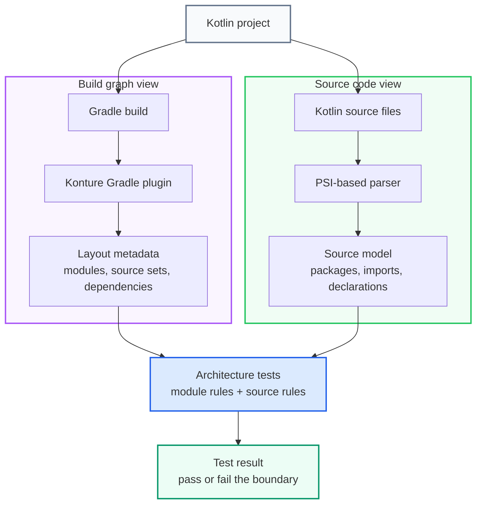
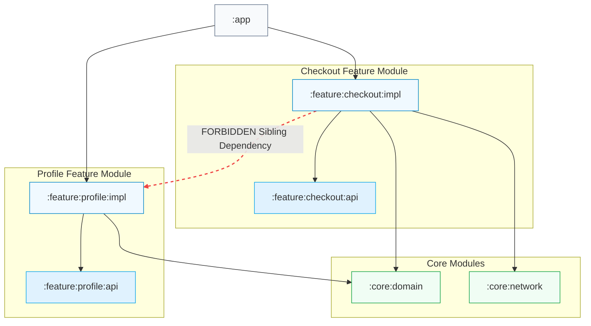

# Kotlin Architecture Tests: Why Konture Exists

_Kotlin architecture rules often live in two worlds at once: the Gradle module graph and the Kotlin source tree. Konture was built to test both._

Consider this rule:

```text
The domain layer must not depend on the data layer.
```

In a Kotlin project, that rule can be broken in at least two different ways.

First, at the build level:

```kotlin
// domain/build.gradle.kts
dependencies {
    implementation(project(":data"))
}
```

Second, at the source level:

```kotlin
package com.acme.domain

import com.acme.data.UserRepositoryImpl
```

Those are related problems, but they are not the same problem.

One is about the real Gradle module graph. The other is about Kotlin files, packages, imports, declarations, and references.

This is the main reason Konture exists: Kotlin architecture is not only bytecode, not only source files, and not only Gradle modules. It is the relationship between all of them.

## The Gap in Existing Solutions

Existing tools are useful. Konture is not trying to erase them.

But Kotlin teams often hit gaps when they need architecture tests that understand both the build structure and the source code.

### ArchUnit Is Strong for JVM Bytecode

ArchUnit is a mature, robust, and proven tool, especially for standard Java and JVM backend systems. It works exceptionally well when your architectural boundaries can be fully answered from compiled bytecode classes.

However, that bytecode focus creates a significant **Compiled Desugaring Gap** for modern Kotlin projects:

- **Synthetic Bytecode Generation**: Kotlin developers write elegant, high-level source constructs that compile into complex, synthetic JVM representation.
  - *Inline and Reified Functions*: The body of inline functions is directly injected at call sites, and reified type checks are erased and substituted with bytecode casting. A bytecode scanner sees the inlined calls rather than the clean, logical source-level architecture.
  - *Extension Functions*: Extension functions compile to static JVM helper classes (e.g., `FileKt`). A rule verifying that a class doesn't reference a forbidden package can be easily bypassed or misidentified because the static class calls aren't linked cleanly in bytecode.
  - *Property Delegates and Singletons*: Constructs like `by lazy` or `object` singletons are desugared into backing synthetic fields and initialization check blocks, which obscure simple structural relationships.
- **Compiler Plugins**: Features like **Jetpack Compose** (recomposition, stable wrappers) and **Kotlinx Serialization** (synthetic serializer fields/methods) alter the generated class bytecode extensively. Writing bytecode rules for these systems becomes extremely fragile.
- **Gradle Concept Blindness**: ArchUnit does not naturally parse or start from Gradle's project structure. It can inspect class dependencies, but concepts like `:domain`, `:data`, `:feature:checkout:api`, or source sets (like `commonMain` vs `androidMain`) are build-level configurations. Attempting to deduce module boundaries solely from bytecode package hierarchies is a leaky abstraction that breaks as projects scale.

### Source-Scanning Tools Are Good at Kotlin Declarations

Source-oriented tools are valuable for package conventions, names, modifiers, annotations, constructor shape, and other Kotlin-level rules.

That solves a different part of the problem.

A source scan can find files. It can inspect packages. It can inspect classes. But a folder scan is not the same as asking Gradle which modules exist, which source sets are production source sets, and which project dependencies are declared.

That distinction becomes important in Android and Kotlin Multiplatform projects.

A Kotlin project may contain:

```text
:app
:core:domain
:core:data
:feature:checkout:api
:feature:checkout:impl
:shared
:androidApp
:iosApp
```

It may also contain source sets such as:

```text
commonMain
androidMain
iosMain
desktopMain
```

Folder names alone are not enough. The build already knows what those things mean. Architecture tests should be able to use that knowledge.

### Linters Are Not Architecture Testers

`detekt` and `ktlint` are excellent at what they are designed to do.

But most architecture rules require whole-project context.

A linter can inspect a file. It usually cannot answer questions like:

- Does this Gradle module depend on a forbidden sibling module?
- Did a feature implementation module become visible to another feature implementation?
- Does the project dependency graph contain a cycle?
- Does this public API expose a type owned by another architectural layer?

Those are architectural questions, not formatting questions.

## Why Konture Takes a Two-View Approach

Konture combines two views of a Kotlin project.

The first view is the build graph:

- Gradle modules.
- Source sets.
- Production Kotlin source directories.
- Declared project dependencies.
- Applied plugin context.

The second view is the Kotlin source model:

- Files.
- Packages.
- Classes and interfaces.
- Imports.
- Annotations.
- Visibility.
- Functions and properties.
- References between project classes.

The Gradle plugin captures the build view. The assertion library uses that captured layout and parses Kotlin source with a PSI-based static analysis model.

At a high level, the flow is:



That means you can write module rules and source rules in the same test suite.

```kotlin
Konture.architecture {
    modules {
        that().haveNamePath(":domain")
        should().notDependOnModule(":data")
    }

    classes {
        that().resideInAPackage("..domain..")
        should().onlyDependOnClassesInAnyPackage(
            "..domain..",
            "kotlin..",
            "java..",
        )
    }
}
```

The first rule checks the physical dependency declared in the build.

The second rule checks source-level references inside Kotlin code.

Together, they protect the boundary more completely than either view alone.

## What Konture Is

Konture is a standalone Kotlin and Gradle architecture testing library.

It has two main parts:

- A Gradle plugin that extracts the project layout and module dependency graph.
- A Kotlin assertion library that lets you write architecture rules as ordinary tests.

Those tests can run in the test framework you already use, because Konture is not tied to a custom runner.

You can use it with JUnit, Kotest, TestBalloon, or another Kotlin/JVM test runner. The architecture rules are just test code.

## What Konture Is Not

Konture is not a style guide.

It does not force Clean Architecture, MVVM, hexagonal architecture, DDD, feature-sliced architecture, or any other pattern.

Konture is architecture-agnostic. It gives you a way to encode the architecture your team already chose.

That distinction matters.

An Android team might protect feature API and implementation modules.

A backend team might protect ports and adapters.

A KMP team might protect shared code from platform app dependencies.

A library team might protect public API packages from leaking implementation classes.

Konture does not decide those policies. It makes them executable.

## The Three Pillars of Structural Quality

A linter focuses on lines; a compiler focuses on files. Konture focuses on the larger system design. It addresses the architectural problems that ordinary compilation and style checks do not catch, organizing system verification into **Three Pillars of Structural Quality**:

| Structural Pillar | Target Threat / Architectural Drift | Build-Level Protection (Macro) | Source-Level Protection (Micro) |
| :--- | :--- | :--- | :--- |
| **1. Logical Isolation** | Layer-crossing dependencies, forbidden module leaks, and architecture boundary breaches | Gradle dependency graph validation (e.g., verifying feature-to-feature implementation separation) | AST-based import analysis (e.g., ensuring domain classes do not reference framework or database layers) |
| **2. Semantic Hermeticity** | Encapsulation bypass, public API bloat, and conceptual type pollution | Module export visibility boundaries (`api` vs `implementation` separation) | Kotlin visibility checks (e.g., validating impl packages are marked `internal`) and public signature type assertions |
| **3. Mechanical Hygiene** | Compilation cycle chains, project layout drift, and file structure entropy | Module cycle checks (`assertNoCycles` to prevent coupling) | File layout assertions (e.g., ensuring file names match primary class names, preventing wildcard imports) |

---

### Pillar 1: Logical Isolation (Layers & Modules)

Logical Isolation ensures that high-level abstract modules (such as domain layers or core API contracts) do not compile against or depend on concrete implementation layers (such as database caches or framework-heavy UI modules). 

Konture allows teams to protect these boundaries at both the build and source levels in the same unified DSL:

```kotlin
Konture.architecture {
    // Macro-Boundary: Verifying physical Gradle module dependencies
    modules {
        that().haveNamePath(":core:domain")
        should().notDependOnModule(":core:data", ":app")
    }

    // Micro-Boundary: Restricting dependencies across package structures
    layered {
        val presentation = layer("presentation") definedBy "..presentation.."
        val domain = layer("domain") definedBy "..domain.."
        val data = layer("data") definedBy "..data.."

        where(presentation) { mayOnlyAccessLayers(domain) }
        where(data) { mayOnlyAccessLayers(domain) }
        where(domain) { mayOnlyAccessLayers() }
    }
}
```

---

### Pillar 2: Semantic & API Hermeticity (Visibility & Leakage)

API Hermeticity protects encapsulation. In multi-module environments, Kotlin's default `public` modifier makes it exceptionally easy to leak implementation details across modules. Semantic Hermeticity ensures that modules only expose clean, abstract contracts and do not leak internal annotations or persistence models into public signatures.

```kotlin
Konture.classes {
    // Enforcing strict Kotlin encapsulation across packages
    that().resideInAPackage("..impl..")
    should().beInternal()

    // Preventing structural persistence leakage (e.g. Hibernate/Jakarta entities) into the clean Domain layer
    that().resideInAPackage("..domain..")
    should().notHaveSignaturesWithTypesAnnotatedWith("jakarta.persistence.Entity")
}
```

---

### Pillar 3: Mechanical Hygiene (Cycles & Layout)

Mechanical Hygiene governs the structural health of the build graph and the cleanliness of individual source directories. It prevents long-term maintenance decay, compilation cycle chains, and review-noise patterns like wildcard imports or multiple unrelated class declarations in a single file.

```kotlin
// Protecting the overall Gradle graph from compile-time dependency loops
Konture.assertNoCycles()

// Standardizing physical class and file layouts for predictable navigation
Konture.files {
    should().notHaveWildcardImports()
    should().haveOnlyOneClassPerFile()
    should().haveNameMatchingClassName()
}
```


This lets teams encode conventions that reduce review noise and keep source structure predictable.

## Why Gradle Awareness Matters

Kotlin teams often design systems around modules.

For example:



The architecture policy might be:

```text
Feature implementation modules must not depend on other feature implementation modules.
```

That policy is not only about packages. It is about Gradle project dependencies.

If a developer adds:

```kotlin
implementation(project(":feature:profile:impl"))
```

to `:feature:checkout:impl`, the compiler will accept it. Gradle will build it. The shortcut may even solve the immediate feature request.

But the architecture has drifted. And more importantly, **build velocity is about to degrade**.

### The Business Case: Architecture as a Build Performance Engine

Tight coupling across module implementations doesn't just make code harder to read—it actively slows down the development cycle by disrupting Gradle’s optimization features:

- **Incremental Compilation Collapse**: Gradle compiles code incrementally by checking which files have changed and only recompiling upstream code. If `:feature:checkout:impl` has a direct dependency on `:feature:profile:impl`, any local, internal implementation edit inside profile triggers a massive **compilation cascade wave** that recompiles checkout as well. 
- **Build Cache Invalidation**: Remote and local Gradle build caching allows developers to download compiled outputs of unchanged modules. Direct coupling across implementation modules ruins build caching boundaries, resulting in massive, unnecessary cache-miss cascades.
- **The API/Implementation Shield**: By forcing modules to only depend on abstract, lightweight `:feature:profile:api` modules, the implementation details are encapsulated. An implementation file change inside `:feature:profile:impl` has **zero** downstream dependency impact because other modules only link against the stable, unchanged `:api` module.

A Gradle-aware architecture test blocks these leaks before they can slow down the team:

```kotlin
Konture.modules {
    that().haveNameMatching(":feature:**:impl")
    should().onlyDependOnModules(
        ":feature:**:api",
        ":core:**",
        ":shared",
    )
}
```

The important part is that the test is checking modules as real modules, not pretending they are just directories. By treating architecture enforcement as a **build performance optimizer**, teams can directly justify its adoption as an investment in developer productivity.

## Why Kotlin Source Awareness Matters: API Hermeticity & Semantic Isolation

While the Gradle build graph governs **physical linkability** (macro-boundaries), Kotlin source code governs **semantic expression** (micro-boundaries). You can easily have a perfectly legal build dependency graph on paper, while completely violating architectural isolation in source code.

For instance, your `:data` module might correctly depend on `:domain` to implement interfaces. However, what happens when a developer accidentally exposes a database model inside a public signature of a domain boundary class? The project will compile, Gradle is happy, but **the boundary has leaked conceptually**.

This is why true architectural integrity requires **Semantic Isolation**:

- **Bytecode Blindspots**: Classpath sharing means that deep internal dependencies (like third-party libraries or internal implementation details) might leak into abstract modules because they are transitively visible during compilation.
- **API Surface Pollution**: Standard linters cannot verify the return types of functions or class constructor parameters across an entire project. Only an AST (Abstract Syntax Tree) analyzer that maps Kotlin imports and class hierarchies can enforce strict signature purity.

With Konture, you can declare strict package-level semantic contracts:

```kotlin
Konture.classes {
    // Ensuring domain logic depends strictly on contracts, not concrete implementations
    that().resideInAPackage("..domain..")
    should().onlyDependOnClassesInAnyPackage(
        "..domain..",
        "kotlin..",
        "java..",
    )
}
```

For external frameworks or third-party dependency pollution, you can easily compose lightweight AST-based assertions to verify import cleanliness:

```kotlin
Konture.scopeFromPackage("com.acme.domain")
    .assertTrue("Domain layer must remain database and framework agnostic") { classModel ->
        classModel.imports.none { fqName ->
            fqName.startsWith("org.springframework.") ||
                fqName.startsWith("android.") ||
                fqName.startsWith("jakarta.persistence.")
        }
    }
```

This guarantees **API Hermeticity**: your domain layer remains a pure representation of your business logic, entirely isolated from frameworks, databases, and platform-specific code.

## Why It Works for AI-Assisted Development: The Self-Healing Loop

AI coding assistants are highly optimized for **local success**: making the current file compile, passing the immediate unit test, and completing the requested feature as quickly as possible. However, because they lack whole-project structural context, they often make locally logical but architecturally disastrous trade-offs:

- **Adding Accidental Dependencies**: Adding a physical dependency in a Gradle build file just to make an import compile.
- **Leaking Concrete Models**: Importing a concrete database or API model directly into a clean, abstract domain class because it is visible on the classpath.
- **Violating Encapsulation**: Overriding visibility modifiers or placing a class in an implementation package without understanding package conventions.

Vague prompt instructions like *"Follow the project architecture"* are rarely enough.

By running architecture tests locally or in CI, Konture provides AI agents with a **deterministic, compiler-like feedback loop**:

1. **Detection**: An AI agent makes a change that violates a boundary or imports a forbidden type.
2. **Deterministic Failure**: The architecture test suite fails instantly, printing a clear, human-readable stdout log specifying exactly which files, imports, or modules violated which rule.
3. **Autonomous Self-Correction**: The AI agent parses the test failure stdout, understands the structural constraint, and automatically refactors its code to use the correct abstraction (such as introducing a domain interface or removing an illegal module dependency).

This transforms architecture tests from a passive quality gate into an **active, self-healing developer loop**. It allows teams to securely leverage high-speed AI development without worrying about gradual codebase erosion.

---

## Konture Features at a Glance

Konture is designed to provide lightweight, comprehensive, and high-performance quality gates for Kotlin software systems:

- **Gradle-Aware Module Verification**: Enforce architectural boundaries directly on physical Gradle projects and dependencies.
- **Source-Level Kotlin AST Analysis**: Inspect packages, imports, classes, functions, and properties using PSI-based static analysis.
- **Architecture-Agnostic DSL**: Model Clean Architecture, hexagonal adapters, feature-API boundaries, or custom design conventions easily.
- **KMP and Android Compatibility**: Test multiplatform source sets (`commonMain`, `androidMain`, `iosMain`) and Android module structures natively.
- **Zero-Overhead Test Execution**: Run your architecture test suite inside standard runners like JUnit or Kotest with no custom runner dependencies.
- **Granular Assertion Scopes**: Assert structural rules from high-level Gradle modules down to package declarations, file hygiene, and visibility modifiers.
- **Declarative Layered DSL**: Configure directional access constraints between layers (such as presentation, domain, and data) in a single DSL block.
- **Custom Extensible Predicates**: Write tailored AST matching logic to capture unique coding patterns or prevent forbidden framework libraries.
- **Decoupled Architecture-Test Setup**: Keep your architectural rules completely isolated in a dedicated test module, keeping production dependencies clean.
- **AI-Agent Alignment**: Produce clear, structured, and deterministic stdout errors that help human reviewers and AI assistants self-correct instantly.

---

## When Konture Is a Good Fit

Konture is a highly effective tool when your architectural guidelines or growth pain points involve:

- **Gradle Module Boundaries**: Preventing feature implementation modules from directly referencing sibling implementation modules.
- **API and Implementation Isolation**: Enforcing strict `:api` and `:impl` module separations to optimize compilation performance.
- **Kotlin Package and Directory Layering**: Restricting reference directions between presentation, domain, database, and infrastructure layers.
- **API Surface Purity**: Validating that public-facing signatures do not leak internal annotations or database-specific entities.
- **Kotlin Visibility Compliance**: Guaranteeing that internal helper packages or implementations are explicitly declared as `internal`.
- **KMP Platform Portability**: Checking that code in platform-independent directories does not accidentally import platform-specific APIs.
- **Predictable Structural Conventions**: Requiring single class declarations per file, preventing wildcard imports, or ensuring file names match class names.

*Note: Konture is less useful for rules that a standard compiler or simple style linter already handles well. If the issue is code formatting, use a formatter. If the issue is local styling, use a linter. Konture is built for structural, high-level system boundaries.*

---

## The Core Idea

Architecture guidelines should never rely on memory. 

They should not depend on a developer remembering every boundary, a reviewer catching every micro-leak under review fatigue, or an AI assistant fully absorbing a complex prompt template.

**They should simply run.**

Konture bridges the gap between system design and build-time reality, giving Kotlin teams a unified, fast, and compiler-level quality gate that protects both the Gradle build graph and the Kotlin source code in a single executable test loop.

---

## Continue the Series

- [Kotlin Architecture Tests: What They Are and Why They Matter](kotlin-architecture-tests-what-and-why.md)
- [Kotlin Architecture Tests with Konture: A Practical Guide](kotlin-architecture-tests-with-konture.md)
