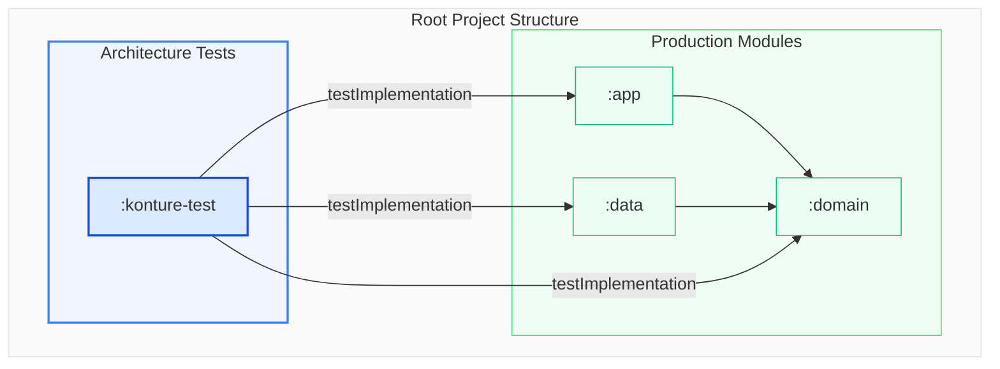
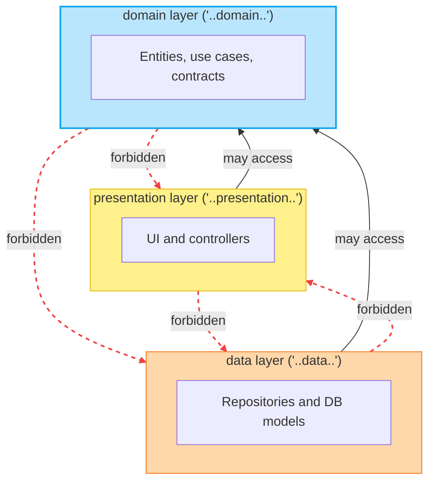

# Kotlin Architecture Tests with Konture: A Practical Guide

_Set up a dedicated architecture-test module, add Konture, and grow a small suite of structural rules that protects the boundaries your Kotlin project actually depends on._

The best first architecture test is usually not clever.

It is a rule the team already believes:

```text
The domain module must not depend on the data module.
```

That rule is concrete. It is easy to explain. It is painful when broken. It also exercises the right habit: encode a real architectural decision, not an idealized diagram.

This guide uses Gradle Kotlin DSL and JUnit 5. Konture itself is test-runner agnostic, so the same rules can run from JUnit, Kotest, TestBalloon, or another Kotlin/JVM runner.

## Target Setup

Use a dedicated architecture-test module.



A separate module gives the architecture suite a project-level view without adding architecture-test dependencies to production modules. It also makes CI wiring straightforward: run one task when you want structural checks.

In a larger project, the inspected modules may look like this:

```text
:app
:core:domain
:core:data
:feature:checkout:api
:feature:checkout:impl
:feature:profile:api
:feature:profile:impl
:shared
:androidApp
:iosApp
```

The names do not matter. The policy does. Use your real modules and packages in every rule.

## Step 1: Add Konture

Declare the version in your version catalog:

```toml
[versions]
konture = "0.6.8"

[plugins]
konture = { id = "io.github.baole.konture", version.ref = "konture" }

[libraries]
konture = { group = "io.github.baole", name = "konture", version.ref = "konture" }
```

Apply the plugin in the root build:

```kotlin
plugins {
    alias(libs.plugins.konture) apply true
}
```

The plugin generates the layout metadata Konture needs for module-aware rules.

## Step 2: Create the Architecture-Test Module

Register the module in `settings.gradle.kts`:

```kotlin
include(":konture-test")
```

Create `konture-test/build.gradle.kts`:

```kotlin
plugins {
    kotlin("jvm")
    alias(libs.plugins.konture)
}

dependencies {
    testImplementation(libs.konture)

    testImplementation("org.junit.jupiter:junit-jupiter-api:5.11.0")
    testRuntimeOnly("org.junit.jupiter:junit-jupiter-engine:5.11.0")

    testImplementation(project(":domain"))
    testImplementation(project(":data"))
    testImplementation(project(":app"))
}

tasks.test {
    useJUnitPlatform()
}
```

Replace the sample dependencies with the modules your rules inspect:

```kotlin
dependencies {
    testImplementation(libs.konture)

    testImplementation(project(":core:domain"))
    testImplementation(project(":core:data"))
    testImplementation(project(":feature:checkout:api"))
    testImplementation(project(":feature:checkout:impl"))
    testImplementation(project(":feature:profile:api"))
    testImplementation(project(":feature:profile:impl"))
}
```

The architecture-test module should see the code and build metadata it checks.

## Step 3: Start With One Build-Graph Rule

Create `konture-test/src/test/kotlin/com/acme/ArchitectureGuardrailsTest.kt`.

```kotlin
package com.acme

import io.github.baole.konture.Konture
import org.junit.jupiter.api.Test

class ArchitectureGuardrailsTest {

    @Test
    fun `domain must not depend on data or app modules`() {
        Konture.modules {
            that().haveNamePath(":domain")
            should().notDependOnModule(":data")
            should().notDependOnModule(":app")
        }
    }
}
```

This rule checks the Gradle project graph. If someone adds `implementation(project(":data"))` to `:domain`, the architecture test fails.

For a nested module layout, use the real paths:

```kotlin
Konture.modules {
    that().haveNamePath(":core:domain")
    should().notDependOnModule(":core:data")
    should().notDependOnModule(":app")
}
```

Do not ship placeholder names. Architecture tests are contracts; contracts need concrete targets.

## Step 4: Add a Cycle Check

Circular module dependencies slow builds and weaken ownership boundaries.

```kotlin
@Test
fun `module graph must not contain cycles`() {
    Konture.assertNoCycles()
}
```

This is a useful default for multi-module projects because cycles tend to make every future boundary decision harder.

## Step 5: Protect Domain Source Code

A clean module graph does not guarantee clean source references. Add a source-level package rule:

```kotlin
@Test
fun `domain classes must only depend on domain and standard library types`() {
    Konture.classes {
        that().resideInAPackage("..domain..")
        should().onlyDependOnClassesInAnyPackage(
            "..domain..",
            "kotlin..",
            "java..",
        )
    }
}
```

If your domain layer deliberately depends on shared project code, say so explicitly:

```kotlin
Konture.classes {
    that().resideInAPackage("..domain..")
    should().onlyDependOnClassesInAnyPackage(
        "..domain..",
        "..shared..",
        "kotlin..",
        "java..",
    )
}
```

The rule should match the architecture the team has chosen, not an architecture borrowed from an example.

## Step 6: Ban Framework Imports Where They Do Not Belong

External frameworks are often easier to detect through imports than through project class dependencies.

```kotlin
@Test
fun `domain must not import framework or persistence APIs`() {
    Konture.scopeFromPackage("com.acme.domain")
        .assertTrue("Domain must not import framework or persistence APIs") { cls ->
            cls.imports.none { fqName ->
                fqName.startsWith("org.springframework.") ||
                    fqName.startsWith("io.ktor.") ||
                    fqName.startsWith("android.") ||
                    fqName.startsWith("androidx.compose.") ||
                    fqName.startsWith("jakarta.persistence.") ||
                    fqName.startsWith("javax.persistence.")
            }
        }
}
```

Tune the prefixes for the project. A backend may ban persistence annotations from domain. An Android app may ban Android and Compose APIs from shared or domain packages. A KMP project may apply different policies to `commonMain`, `androidMain`, and `iosMain`.

Avoid broad bans that catch legitimate dependencies. For example, banning all of `kotlinx..` may block valid use of coroutines.

## Step 7: Enforce Repository Contracts

If your architecture treats repositories in the domain layer as contracts, encode that rule:

```kotlin
@Test
fun `repositories inside domain must be interfaces`() {
    Konture.classes {
        that().resideInAPackage("..domain..")
        that().haveNameEndingWith("Repository")
        should().beInterfaces()
    }
}
```

This catches a common shortcut:

```kotlin
class UserRepository {
    // concrete persistence behavior in domain
}
```

If your project uses abstract classes, ports, or a different naming convention, encode that instead. The rule should enforce your contract model, not the word `Repository` itself.

## Step 8: Keep Implementation Packages Internal

Kotlin classes and members are public by default. In multi-module projects, accidental public visibility becomes accidental API.

```kotlin
@Test
fun `implementation classes must remain internal`() {
    Konture.classes {
        that().resideInAPackage("..impl..")
        should().beInternal()
    }
}
```

This is especially useful for feature or library modules that split API and implementation:

```text
:feature:checkout:api
:feature:checkout:impl
```

The API module exposes contracts. The implementation module should not become a grab bag for other features.

## Step 9: Protect Feature Module Isolation

Sibling feature implementations usually should not depend on each other directly.

```kotlin
@Test
fun `feature implementations must not depend on sibling feature implementations`() {
    Konture.modules {
        that().haveNameMatching(":feature:**:impl")
        should().onlyDependOnModules(
            ":feature:**:api",
            ":core:**",
            ":shared",
        )
    }
}
```

This allows feature implementations to depend on feature API modules, core modules, and shared modules. It blocks implementation-to-implementation coupling.

If the app has a different modularization strategy, change the allowed list. The value is not the pattern; the value is making the intended dependency graph executable.

## Step 10: Use the Layered DSL for Directional Rules

For package-based layer rules, a layered DSL can be easier to read than a long list of package predicates.



```kotlin
@Test
fun `layers must follow inward dependency direction`() {
    Konture.layered {
        val presentation = layer("presentation") definedBy "..presentation.."
        val domain = layer("domain") definedBy "..domain.."
        val data = layer("data") definedBy "..data.."

        where(presentation) {
            mayOnlyAccessLayers(domain)
        }

        where(data) {
            mayOnlyAccessLayers(domain)
        }

        where(domain) {
            mayOnlyAccessLayers()
        }
    }
}
```

For ports and adapters, the same idea might look like this:

```kotlin
Konture.layered {
    val domain = layer("domain") definedBy "..domain.."
    val application = layer("application") definedBy "..application.."
    val adapter = layer("adapter") definedBy "..adapter.."

    where(domain) {
        mayOnlyAccessLayers()
    }

    where(application) {
        mayOnlyAccessLayers(domain)
    }

    where(adapter) {
        mayOnlyAccessLayers(application, domain)
    }
}
```

Use the model your team actually uses. A layered rule that does not match the real codebase will become friction quickly.

## Step 11: Add File-Level Hygiene Sparingly

Some source conventions reduce navigation cost and review noise:

```kotlin
@Test
fun `source files should stay simple and explicit`() {
    Konture.files {
        should().notHaveWildcardImports()
        should().haveOnlyOneClassPerFile()
        should().haveNameMatchingClassName()
    }
}
```

Do not turn architecture tests into a second linter. If `detekt`, `ktlint`, or a formatter already enforces a rule well, use that tool.

## Step 12: Run the Suite

Run the dedicated task:

```bash
./gradlew :konture-test:test
```

Or include it in the normal verification path:

```bash
./gradlew check
```

The repository's sample Gradle showcase uses the same pattern:

```bash
./gradlew -p showcases/sample-gradle :konture-test:test
```

That command runs a dedicated architecture-test module against a small `:app`, `:domain`, and `:data` project. The suite covers module dependencies, class package boundaries, repository contracts, type leakage in use case signatures, and a negative assertion that proves a deliberately wrong module rule fails.

When a rule fails, handle it like any other test failure:

1. Read the violation.
2. Decide whether the encoded rule is still correct.
3. Fix the code if the code crossed the boundary.
4. Fix the rule if the architecture decision changed.
5. Add an explicit exception only when the exception is intentional.

Do not silently weaken rules until CI passes. That converts architecture tests from governance into decoration.

## Rule Design Principles

Add these principles before growing the suite:

- **One policy per test**: a failing test name should tell the developer which decision was broken.
- **Prove the rule can fail**: temporarily introduce a violation, run the test, confirm it fails, then remove the violation.
- **Use real names**: avoid placeholder modules and packages in committed rules.
- **Make exceptions visible**: generated code, migration packages, and legacy zones may need exclusions, but those exclusions should be deliberate.
- **Avoid broad wildcards**: a wide ban is useful only when the team understands what legitimate cases it excludes.
- **Separate structure from style**: architecture tests should protect boundaries and ownership, not formatting.

The showcase projects are useful calibration material. The Now in Android suite demonstrates feature decoupling, ViewModel framework-import checks, and `:api`/`:impl` separation. The KotlinConf KMP suite demonstrates shared-core purity, backend/frontend separation, and route-to-service boundaries. Use examples like those to design rules around real architectural pressure, not abstract neatness.

## A Starter Suite

Here is a compact starting point for a small layered project:

```kotlin
package com.acme

import io.github.baole.konture.Konture
import org.junit.jupiter.api.Test

class ArchitectureGuardrailsTest {

    @Test
    fun `module graph must not contain cycles`() {
        Konture.assertNoCycles()
    }

    @Test
    fun `domain must not depend on data or app modules`() {
        Konture.modules {
            that().haveNamePath(":domain")
            should().notDependOnModule(":data")
            should().notDependOnModule(":app")
        }
    }

    @Test
    fun `domain classes must only depend on domain and standard library types`() {
        Konture.classes {
            that().resideInAPackage("..domain..")
            should().onlyDependOnClassesInAnyPackage(
                "..domain..",
                "kotlin..",
                "java..",
            )
        }
    }

    @Test
    fun `repositories inside domain must be interfaces`() {
        Konture.classes {
            that().resideInAPackage("..domain..")
            that().haveNameEndingWith("Repository")
            should().beInterfaces()
        }
    }

    @Test
    fun `implementation classes must remain internal`() {
        Konture.classes {
            that().resideInAPackage("..impl..")
            should().beInternal()
        }
    }
}
```

Keep the starter suite small. Let it grow from real pain:

- A boundary violation found in review.
- A module dependency that widened build impact.
- A DTO leak that made refactoring expensive.
- An AI-assisted patch that crossed layers.
- A public implementation class that became hard to remove.

Architecture tests work best when they protect decisions people already care about.

## Rollout Guidance

For an existing project, introduce architecture tests in stages:

1. Start with non-controversial rules such as module cycles and domain-to-data dependencies.
2. Run the suite locally and in CI as informational if the first pass reveals many violations.
3. Fix or explicitly quarantine legacy violations.
4. Turn high-confidence rules into required CI checks.
5. Review rule changes like architecture changes, not like formatting tweaks.

For generated code, test fixtures, and legacy migration areas, prefer explicit exclusions:

```kotlin
konture {
    excludePackages("..generated..")
}
```

The exception should be visible enough that future maintainers understand the real boundary.

## Where to Go Next

After the first suite is stable, add rules around the areas where the project actually hurts:

- Feature module isolation.
- KMP source-set portability.
- Public API leakage.
- DTO and entity boundaries.
- Route or controller dependency direction.
- Dependency injection conventions.
- Legacy package quarantine.

Konture is not a prescription for one architecture style. It is a way to make your architecture executable.

Run it locally. Run it in CI. Let humans and AI-assisted changes get the same structural feedback.

When structure matters, make it part of the build.

---

## Continue the Series

- [Kotlin Architecture Tests: What They Are and Why They Matter](kotlin-architecture-tests-what-and-why.md)
- [Kotlin Architecture Tests: Why Konture Exists](kotlin-architecture-tests-why-konture-exists.md)
