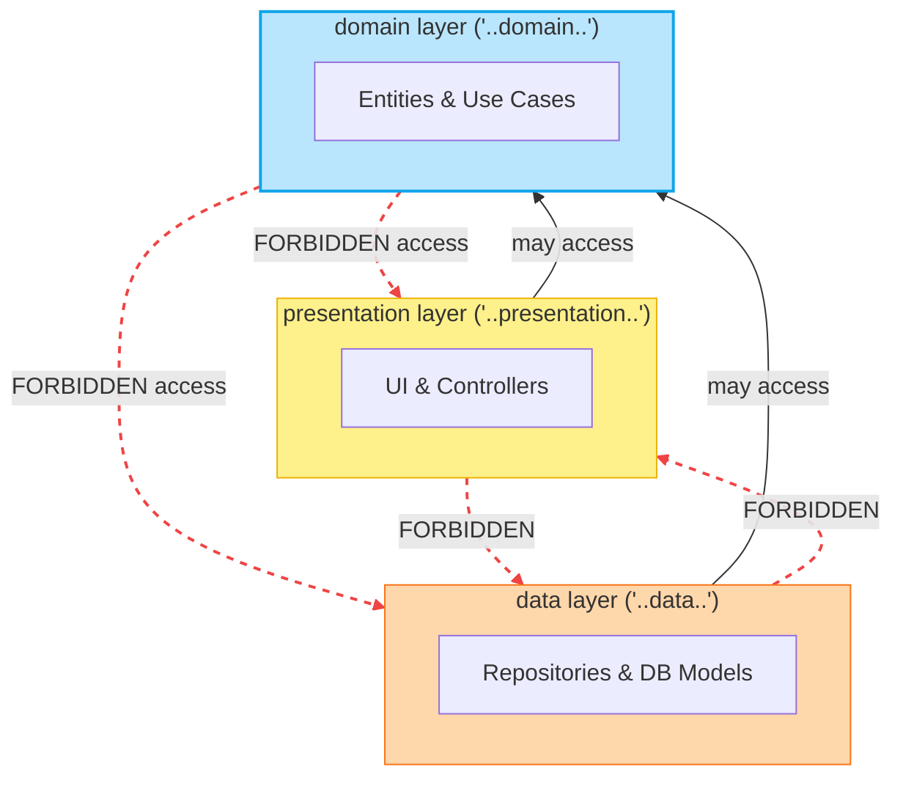

# Kotlin Architecture Tests with Konture: A Practical Guide

_Set up a dedicated architecture-test module, add Konture, and write guardrails that protect module boundaries, layer isolation, conventions, and public API shape._

The best first architecture test is not clever.

It is usually something obvious that the team already agrees on:

```text
The domain module must not depend on the data module.
```

That kind of rule is a good starting point because it is concrete, easy to explain, and painful when broken.

In this guide, we will set up Konture and build a small architecture test suite around rules like that.

The examples use Gradle Kotlin DSL and JUnit 5, but Konture itself is test-framework agnostic. You can run the same kinds of rules from Kotest, TestBalloon, JUnit 4, JUnit 6, or another Kotlin/JVM test runner.

## The Target Setup

Use a dedicated architecture-test module.


Keeping architecture tests in their own module has a few advantages:

- production modules do not need architecture-test dependencies;
- the architecture suite can depend on all modules it needs to inspect;
- CI can run architecture checks directly;
- the rules become a visible project-level quality gate.

In a real project, your modules may look more like this:

```text
:app
:core:domain
:core:data
:feature:checkout:api
:feature:checkout:impl
:feature:profile:api
:feature:profile:impl
:shared
:androidApp
:iosApp
```

The names do not matter. The policy does.

Konture should encode your actual architecture, not a generic example.

## Step 1: Add Konture to the Build

Declare the Konture version in your version catalog:

```toml
[versions]
konture = "0.6.6"

[plugins]
konture = { id = "io.github.baole.konture", version.ref = "konture" }

[libraries]
konture = { group = "io.github.baole", name = "konture", version.ref = "konture" }
```

Apply the plugin in the root build:

```kotlin
plugins {
    alias(libs.plugins.konture) apply true
}
```

The plugin generates the project layout metadata Konture needs for module-aware architecture rules.

## Step 2: Create a Dedicated `konture-test` Module

Register the module in `settings.gradle.kts`:

```kotlin
include(":konture-test")
```

Create `konture-test/build.gradle.kts`:

```kotlin
plugins {
    kotlin("jvm")
    alias(libs.plugins.konture)
}

dependencies {
    testImplementation(libs.konture)

    testImplementation("org.junit.jupiter:junit-jupiter-api:5.11.0")
    testRuntimeOnly("org.junit.jupiter:junit-jupiter-engine:5.11.0")

    testImplementation(project(":domain"))
    testImplementation(project(":data"))
    testImplementation(project(":app"))
}

tasks.test {
    useJUnitPlatform()
}
```

In a larger project, replace `:domain`, `:data`, and `:app` with the real modules your architecture tests need to inspect.

For example:

```kotlin
dependencies {
    testImplementation(libs.konture)

    testImplementation(project(":core:domain"))
    testImplementation(project(":core:data"))
    testImplementation(project(":feature:checkout:api"))
    testImplementation(project(":feature:checkout:impl"))
    testImplementation(project(":feature:profile:api"))
    testImplementation(project(":feature:profile:impl"))
}
```

The architecture-test module should see the code it checks.

## Step 3: Write the First Module Boundary Rule

Create `konture-test/src/test/kotlin/com/acme/ArchitectureGuardrailsTest.kt`.

```kotlin
package com.acme

import io.github.baole.konture.Konture
import org.junit.jupiter.api.Test

class ArchitectureGuardrailsTest {

    @Test
    fun `domain must not depend on data or app modules`() {
        Konture.modules {
            that().haveNamePath(":domain")
            should().notDependOnModule(":data")
            should().notDependOnModule(":app")
        }
    }
}
```

This is a build-graph rule.

If someone adds `implementation(project(":data"))` to the `:domain` module, the architecture test fails.

In a `:core:domain` layout, the same rule would use the real module path:

```kotlin
Konture.modules {
    that().haveNamePath(":core:domain")
    should().notDependOnModule(":core:data")
    should().notDependOnModule(":app")
}
```

Module paths should match your Gradle project names exactly.

## Step 4: Add a Cycle Check

Circular module dependencies make builds slower and boundaries weaker.

Add a simple whole-graph rule:

```kotlin
@Test
fun `module graph must not contain cycles`() {
    Konture.assertNoCycles()
}
```

This is a good default rule for multi-module projects.

## Step 5: Protect Domain Source Code

Module rules are necessary, but not always sufficient.

Add a source-level package rule:

```kotlin
@Test
fun `domain classes must only depend on domain and standard library types`() {
    Konture.classes {
        that().resideInAPackage("..domain..")
        should().onlyDependOnClassesInAnyPackage(
            "..domain..",
            "kotlin..",
            "java..",
        )
    }
}
```

This rule checks dependencies between parsed project classes.

If your domain layer is allowed to depend on another project package, add it deliberately:

```kotlin
Konture.classes {
    that().resideInAPackage("..domain..")
    should().onlyDependOnClassesInAnyPackage(
        "..domain..",
        "..shared..",
        "kotlin..",
        "java..",
    )
}
```

Architecture tests should reflect the real design, not an idealized design no one agreed to.

## Step 6: Ban Framework Imports from Domain

Some dependencies are external frameworks rather than project classes.

For those, use a custom predicate over imports:

```kotlin
@Test
fun `domain must not import framework or persistence APIs`() {
    Konture.scopeFromPackage("com.acme.domain")
        .assertTrue("Domain must not import framework or persistence APIs") { cls ->
            cls.imports.none { fqName ->
                fqName.startsWith("org.springframework.") ||
                    fqName.startsWith("io.ktor.") ||
                    fqName.startsWith("android.") ||
                    fqName.startsWith("androidx.compose.") ||
                    fqName.startsWith("jakarta.persistence.") ||
                    fqName.startsWith("javax.persistence.")
            }
        }
}
```

This protects the domain layer from framework concepts.

Adjust the forbidden prefixes for your project. A backend project may ban Spring or persistence annotations. An Android project may ban Android and Compose APIs. A KMP project may ban platform APIs from shared packages.

## Step 7: Enforce Repository Contracts

A common Clean Architecture rule is that repositories in the domain layer are interfaces.

```kotlin
@Test
fun `repositories inside domain must be interfaces`() {
    Konture.classes {
        that().resideInAPackage("..domain..")
        that().haveNameEndingWith("Repository")
        should().beInterfaces()
    }
}
```

This catches a common shortcut:

```kotlin
class UserRepository {
    // concrete persistence behavior in domain
}
```

If your project uses a different naming convention, encode that convention instead.

## Step 8: Keep Implementation Packages Internal

Kotlin classes are public by default, so implementation details can become public accidentally.

```kotlin
@Test
fun `implementation classes must remain internal`() {
    Konture.classes {
        that().resideInAPackage("..impl..")
        should().beInternal()
    }
}
```

This is especially useful for library modules and feature modules with API/implementation splits.

For example:

```text
:feature:checkout:api
:feature:checkout:impl
```

The API module should expose contracts. The implementation module should not become a convenient grab bag for other features.

## Step 9: Protect Feature Module Isolation

In a modular Android or KMP project, sibling feature implementations should usually not depend on each other.

```kotlin
@Test
fun `feature implementations must not depend on sibling feature implementations`() {
    Konture.modules {
        that().haveNameMatching(":feature:**:impl")
        should().onlyDependOnModules(
            ":feature:**:api",
            ":core:**",
            ":shared",
        )
    }
}
```

This rule says feature implementation modules may depend on feature API modules, core modules, and shared modules.

They may not depend on another feature's implementation module.

If your app has a different modularization strategy, change the allowed list. The point is to make the intended dependency graph executable.

## Step 10: Use the Layered DSL When the Rule Is Visual

For package-based layer rules, the layered DSL can be more readable:



```kotlin
@Test
fun `layers must follow inward dependency direction`() {
    Konture.layered {
        val presentation = layer("presentation") definedBy "..presentation.."
        val domain = layer("domain") definedBy "..domain.."
        val data = layer("data") definedBy "..data.."
 
        where(presentation) {
            mayOnlyAccessLayers(domain)
        }
 
        where(data) {
            mayOnlyAccessLayers(domain)
        }
 
        where(domain) {
            mayOnlyAccessLayers()
        }
    }
}
```

This says:

- presentation can access domain;
- data can access domain;
- domain cannot access presentation or data.

For ports and adapters, you might write:

```kotlin
Konture.layered {
    val domain = layer("domain") definedBy "..domain.."
    val application = layer("application") definedBy "..application.."
    val adapter = layer("adapter") definedBy "..adapter.."

    where(domain) {
        mayOnlyAccessLayers()
    }

    where(application) {
        mayOnlyAccessLayers(domain)
    }

    where(adapter) {
        mayOnlyAccessLayers(application, domain)
    }
}
```

Use the model your team actually uses.

## Step 11: Add File-Level Hygiene Rules

Some rules are not deep architecture, but they keep the codebase predictable.

```kotlin
@Test
fun `source files should stay simple and explicit`() {
    Konture.files {
        should().notHaveWildcardImports()
        should().haveOnlyOneClassPerFile()
        should().haveNameMatchingClassName()
    }
}
```

These rules can remove repeated code review comments.

Be careful not to overdo this category. If a linter already handles the rule well, prefer the linter.

## Step 12: Run the Architecture Tests

Run the dedicated test task:

```bash
./gradlew :konture-test:test
```

Or include it in the normal build:

```bash
./gradlew check
```

When a rule fails, treat it like any other test failure:

1. Read the violation.
2. Decide whether the rule is correct.
3. Fix the code if the code violated the architecture.
4. Fix the rule if the rule encoded the wrong policy.
5. Add an explicit exception only when the exception is intentional.

Do not silently weaken architecture tests until they pass. That defeats the point.

## A Starter Suite

Here is a compact starting point for a small layered project:

```kotlin
package com.acme

import io.github.baole.konture.Konture
import org.junit.jupiter.api.Test

class ArchitectureGuardrailsTest {

    @Test
    fun `module graph must not contain cycles`() {
        Konture.assertNoCycles()
    }

    @Test
    fun `domain must not depend on data or app modules`() {
        Konture.modules {
            that().haveNamePath(":domain")
            should().notDependOnModule(":data")
            should().notDependOnModule(":app")
        }
    }

    @Test
    fun `domain classes must only depend on domain and standard library types`() {
        Konture.classes {
            that().resideInAPackage("..domain..")
            should().onlyDependOnClassesInAnyPackage(
                "..domain..",
                "kotlin..",
                "java..",
            )
        }
    }

    @Test
    fun `repositories inside domain must be interfaces`() {
        Konture.classes {
            that().resideInAPackage("..domain..")
            that().haveNameEndingWith("Repository")
            should().beInterfaces()
        }
    }

    @Test
    fun `implementation classes must remain internal`() {
        Konture.classes {
            that().resideInAPackage("..impl..")
            should().beInternal()
        }
    }
}
```

That suite is intentionally small.

Start with rules the team agrees on. Let the suite grow from real pain:

- a boundary violation found in review;
- a module dependency that slowed builds;
- a DTO leak that made refactoring expensive;
- an AI-generated shortcut that crossed layers;
- a public implementation class that became hard to remove.

Architecture tests are most effective when they protect decisions people already care about.

## Best Practices

### Use Real Module and Package Names

Do not ship placeholder rules.

Bad:

```kotlin
Konture.modules {
    that().haveNamePath(":some-module")
    should().notDependOnModule(":other-module")
}
```

Good:

```kotlin
Konture.modules {
    that().haveNamePath(":feature:checkout:impl")
    should().notDependOnModule(":feature:profile:impl")
}
```

Architecture tests are contracts. Contracts need real names.

### Keep One Policy per Test

This is easier to debug:

```kotlin
@Test
fun `domain must not depend on data`() {
    // one rule
}
```

This is harder to debug:

```kotlin
@Test
fun `architecture should be clean`() {
    // ten unrelated rules
}
```

A failing test name should tell the developer which decision was broken.

### Avoid Overbroad Wildcards

Banning `android..` from domain may be reasonable.

Banning `kotlinx..` from domain may be too broad if the domain legitimately uses `kotlinx.coroutines` or `kotlinx.serialization`.

Broad rules are powerful. Use them carefully.

### Make Exceptions Explicit

Legacy code exists. Generated code exists. Migration paths exist.

It is fine to exclude them deliberately:

```kotlin
konture {
    excludePackages("..generated..")
}
```

What matters is that the exception is visible. Avoid quiet exclusions that make the test look stronger than it is.

### Verify New Rules Against a Real Violation

Before trusting a rule, make sure it can fail.

Temporarily introduce a violation, run the test, confirm it fails, then remove the violation.

An architecture test that has never failed may not be checking what you think it is checking.

## Where to Go Next

After the first suite is running, add rules around the places your project actually hurts:

- feature module isolation;
- KMP source set portability;
- public API documentation;
- DTO and entity leakage;
- route or controller boundaries;
- dependency injection conventions;
- legacy package quarantine;
- naming conventions that reduce review noise.

Konture is not a prescription for one architecture style.

It is a way to make your architecture executable.

That is the real value: not another document, not another checklist, not another review habit someone has to remember.

A test.

Run it locally. Run it in CI. Let humans and AI agents get the same feedback.

When structure matters, make it part of the build.
