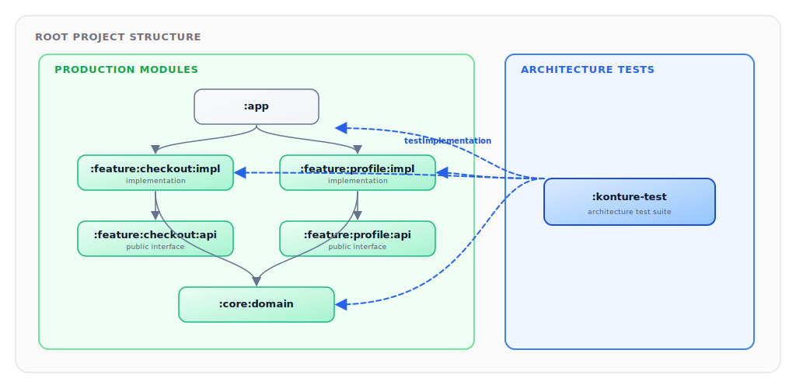
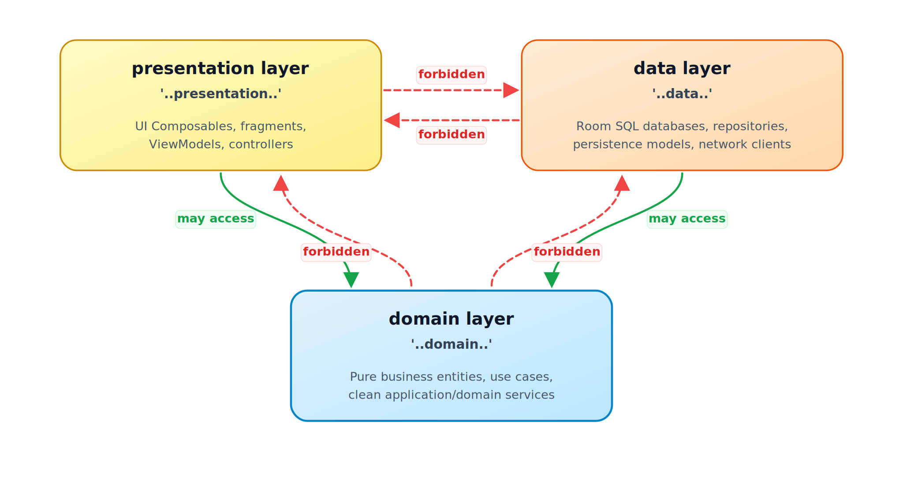

# Kotlin Architecture Tests with Konture: A Practical Guide

_Set up a dedicated architecture-test module, add Konture, and grow a small suite of structural rules that protects the boundaries your Kotlin project actually depends on._

The best first architecture test is usually not clever.

It is a rule the team already believes:

```text
Feature implementation modules must not depend on sibling feature implementation modules.
```

That rule is concrete. It is easy to explain. It is painful when broken. It also exercises the right habit: encode a real architectural decision, not an idealized diagram.

This guide uses Gradle Kotlin DSL and JUnit 5. Konture itself is test-runner agnostic, so the same rules can run from JUnit, Kotest, TestBalloon, or another Kotlin/JVM runner.

## Target Setup

Use a dedicated architecture-test module.



A separate module gives the architecture suite a project-level view without adding architecture-test dependencies to production modules. It also makes CI wiring straightforward: run one task when you want structural checks.

In a larger project, the inspected modules may look like this:

```text
:app
:core:domain
:core:data
:feature:checkout:api
:feature:checkout:impl
:feature:profile:api
:feature:profile:impl
:shared
:androidApp
:iosApp
```

The names do not matter. The policy does. Use your real modules and packages in every rule.

## Step 1: Add Konture

Declare the version in your version catalog:

```toml
[versions]
konture = "0.6.8"

[plugins]
konture = { id = "io.github.baole.konture", version.ref = "konture" }

[libraries]
konture = { group = "io.github.baole", name = "konture", version.ref = "konture" }
```

Apply the plugin in the root build:

```kotlin
plugins {
    alias(libs.plugins.konture) apply true
}
```

The plugin generates the layout metadata Konture needs for module-aware rules.

## Step 2: Create the Architecture-Test Module

Register the module in `settings.gradle.kts`:

```kotlin
include(":konture-test")
```

Create `konture-test/build.gradle.kts`:

```kotlin
plugins {
    kotlin("jvm")
    alias(libs.plugins.konture)
}

dependencies {
    testImplementation(libs.konture)

    testImplementation("org.junit.jupiter:junit-jupiter-api:5.11.0")
    testRuntimeOnly("org.junit.jupiter:junit-jupiter-engine:5.11.0")

    testImplementation(project(":app"))
    testImplementation(project(":core:domain"))
    testImplementation(project(":feature:checkout:api"))
    testImplementation(project(":feature:checkout:impl"))
    testImplementation(project(":feature:profile:api"))
    testImplementation(project(":feature:profile:impl"))
}

tasks.test {
    useJUnitPlatform()
}
```

Replace the sample dependency list with the modules your rules inspect. The architecture-test module should see the code and build metadata it checks.

## Step 3: Start With One Build-Graph Rule

Create `konture-test/src/test/kotlin/com/acme/ArchitectureGuardrailsTest.kt`.

```kotlin
package com.acme

import io.github.baole.konture.Konture
import org.junit.jupiter.api.Test

class ArchitectureGuardrailsTest {

    @Test
    fun `feature implementations must not depend on sibling feature implementations`() {
        Konture.modules {
            that().haveNameMatching(":feature:**:impl")
            should().onlyDependOnModules(
                ":feature:**:api",
                ":core:**",
                ":shared",
            )
        }
    }
}
```

This rule checks the Gradle project graph. If `:feature:checkout:impl` adds `implementation(project(":feature:profile:impl"))`, the architecture test fails.

For a simpler layered project, use the real paths:

```kotlin
Konture.modules {
    that().haveNamePath(":core:domain")
    should().notDependOnModule(":core:data")
    should().notDependOnModule(":app")
}
```

Do not ship placeholder names. Architecture tests are contracts; contracts need concrete targets.

## Step 4: Add a Cycle Check

Circular module dependencies slow builds and weaken ownership boundaries.

```kotlin
@Test
fun `module graph must not contain cycles`() {
    Konture.assertNoCycles()
}
```

This is a useful default for multi-module projects because cycles tend to make every future boundary decision harder.

## Step 5: Protect Domain Source Code

A clean module graph does not guarantee clean source references. Add a source-level package rule:

```kotlin
@Test
fun `domain classes must only depend on domain and standard library types`() {
    Konture.classes {
        that().resideInAPackage("..domain..")
        should().onlyDependOnClassesInAnyPackage(
            "..domain..",
            "kotlin..",
            "java..",
        )
    }
}
```

If your domain layer deliberately depends on shared project code, say so explicitly:

```kotlin
Konture.classes {
    that().resideInAPackage("..domain..")
    should().onlyDependOnClassesInAnyPackage(
        "..domain..",
        "..shared..",
        "kotlin..",
        "java..",
    )
}
```

The rule should match the architecture the team has chosen, not an architecture borrowed from an example.

## Step 6: Ban Framework Imports Where They Do Not Belong

External frameworks are often easier to detect through imports than through project class dependencies.

```kotlin
@Test
fun `domain must not import framework or persistence APIs`() {
    Konture.scopeFromPackage("com.acme.domain")
        .assertTrue("Domain must not import framework or persistence APIs") { cls ->
            cls.imports.none { fqName ->
                fqName.startsWith("org.springframework.") ||
                    fqName.startsWith("io.ktor.") ||
                    fqName.startsWith("android.") ||
                    fqName.startsWith("androidx.compose.") ||
                    fqName.startsWith("jakarta.persistence.") ||
                    fqName.startsWith("javax.persistence.")
            }
        }
}
```

`scopeFromPackage("com.acme.domain")` selects a concrete package prefix for custom assertions. By contrast, `resideInAPackage("..domain..")` uses Konture's wildcard package matching inside fluent class rules.

Tune the prefixes for the project. A backend may ban persistence annotations from domain. An Android app may ban Android and Compose APIs from shared or domain packages. A KMP project may apply different policies to `commonMain`, `androidMain`, and `iosMain`.

Avoid broad bans that catch legitimate dependencies. For example, banning all of `kotlinx..` may block valid use of coroutines.

## Step 7: Enforce Repository Contracts

If your architecture treats repositories in the domain layer as contracts, encode that rule:

```kotlin
@Test
fun `repositories inside domain must be interfaces`() {
    Konture.classes {
        that().resideInAPackage("..domain..")
        that().haveNameEndingWith("Repository")
        should().beInterfaces()
    }
}
```

This catches a common shortcut:

```kotlin
class UserRepository {
    // concrete persistence behavior in domain
}
```

If your project uses abstract classes, ports, or a different naming convention, encode that instead. The rule should enforce your contract model, not the word `Repository` itself.

## Step 8: Keep Implementation Packages Internal

Kotlin classes and members are public by default. In multi-module projects, accidental public visibility becomes accidental API.

```kotlin
@Test
fun `implementation classes must remain internal`() {
    Konture.classes {
        that().resideInAPackage("..impl..")
        should().beInternal()
    }
}
```

This is especially useful for feature or library modules that split API and implementation:

```text
:feature:checkout:api
:feature:checkout:impl
```

The API module exposes contracts. The implementation module should not become a grab bag for other features.

## Step 9: Protect Feature Module Isolation

If you did not start with feature isolation, add it once the basic module rules are stable. Sibling feature implementations usually should not depend on each other directly.

```kotlin
@Test
fun `feature implementations must not depend on sibling feature implementations`() {
    Konture.modules {
        that().haveNameMatching(":feature:**:impl")
        should().onlyDependOnModules(
            ":feature:**:api",
            ":core:**",
            ":shared",
        )
    }
}
```

This allows feature implementations to depend on feature API modules, core modules, and shared modules. It blocks implementation-to-implementation coupling.

If the app has a different modularization strategy, change the allowed list. The value is not the pattern; the value is making the intended dependency graph executable.

## Step 10: Use the Layered DSL for Directional Rules

For package-based layer rules, a layered DSL can be easier to read than a long list of package predicates.



```kotlin
@Test
fun `layers must follow inward dependency direction`() {
    Konture.layered {
        val presentation = layer("presentation") definedBy "..presentation.."
        val domain = layer("domain") definedBy "..domain.."
        val data = layer("data") definedBy "..data.."

        where(presentation) {
            mayOnlyAccessLayers(domain)
        }

        where(data) {
            mayOnlyAccessLayers(domain)
        }

        where(domain) {
            mayOnlyAccessLayers()
        }
    }
}
```

For ports and adapters, the same idea might look like this:

```kotlin
Konture.layered {
    val domain = layer("domain") definedBy "..domain.."
    val application = layer("application") definedBy "..application.."
    val adapter = layer("adapter") definedBy "..adapter.."

    where(domain) {
        mayOnlyAccessLayers()
    }

    where(application) {
        mayOnlyAccessLayers(domain)
    }

    where(adapter) {
        mayOnlyAccessLayers(application, domain)
    }
}
```

Use the model your team actually uses. A layered rule that does not match the real codebase will become friction quickly.

## Step 11: Add File-Level Hygiene Sparingly

Some source conventions reduce navigation cost and review noise:

```kotlin
@Test
fun `source files should stay simple and explicit`() {
    Konture.files {
        should().notHaveWildcardImports()
        should().haveOnlyOneClassPerFile()
        should().haveNameMatchingClassName()
    }
}
```

Do not turn architecture tests into a second linter. If `detekt`, `ktlint`, or a formatter already enforces a rule well, use that tool.

## Step 12: Run the Suite

Run the dedicated task:

```bash
./gradlew :konture-test:test
```

Or include it in the normal verification path:

```bash
./gradlew check
```

The repository's sample Gradle showcase uses the same pattern:

```bash
./gradlew -p showcases/sample-gradle :konture-test:test
```

That command runs a dedicated architecture-test module against a small `:app`, `:domain`, and `:data` project. The suite covers module dependencies, class package boundaries, repository contracts, type leakage in use case signatures, and a negative assertion that proves a deliberately wrong module rule fails.

The negative assertion demonstrates the failure shape you should expect from a real violation:

```text
Architecture violation(s) detected:
Module :data depends on :domain, which is not allowed by pattern(s): :app
```

The fix is not to weaken the rule. The fix is to restore the intended graph, or to change the rule only if the architecture decision has genuinely changed. For the feature example above, that usually means moving the shared contract into `:feature:profile:api` and depending on that API module instead of `:feature:profile:impl`.

When a rule fails, handle it like any other test failure:

1. Read the violation.
2. Decide whether the encoded rule is still correct.
3. Fix the code if the code crossed the boundary.
4. Fix the rule if the architecture decision changed.
5. Add an explicit exception only when the exception is intentional.

Do not silently weaken rules until CI passes. That converts architecture tests from governance into decoration.

## Group Related Rules

The examples above use focused standalone assertions such as `Konture.modules { ... }` and `Konture.classes { ... }`. When several rules describe the same boundary, group them with `Konture.architecture { ... }` so the module-level and source-level checks read as one contract:

```kotlin
@Test
fun `shared code must stay platform independent`() {
    Konture.architecture {
        modules {
            that().haveNamePath(":shared")
            should().notDependOnModule(":androidApp")
        }

        classes {
            that().resideInAPackage("..shared..")
            should().onlyDependOnClassesInAnyPackage(
                "..shared..",
                "kotlin..",
                "java..",
            )
        }
    }
}
```

## Advanced Patterns

Once the starter suite is stable, add rules for the places where Kotlin projects usually leak architecture.

### KMP Source-Set Boundaries

KMP projects need source-set-specific policies. A `commonMain` rule is usually about portability; an `androidMain` rule may intentionally allow Android APIs.

```kotlin
@Test
fun `shared common source must not import Android APIs`() {
    val commonClasses =
        Konture.scopeFromModule(":shared").classes.filter { cls ->
            cls.filePath.contains("/commonMain/")
        }

    commonClasses.assertTrue("commonMain must stay platform independent") { cls ->
        cls.imports.none { import ->
            import.startsWith("android.") ||
                import.startsWith("androidx.")
        }
    }
}
```

You can pair that with a module rule:

```kotlin
Konture.modules {
    that().haveNamePath(":shared")
    should().notDependOnModule(":androidApp")
}
```

Use the source-set names your build actually uses: `commonMain`, `androidMain`, `iosMain`, `desktopMain`, `jvmMain`, or project-specific intermediate source sets.

### DI Graph Conventions

Konture should not replace a runtime DI integration test. It can still protect structural DI policy:

```kotlin
@Test
fun `hilt modules must stay in di packages`() {
    Konture.classes {
        that().haveAnnotationOf("dagger.Module")
        should().resideInAPackage("..di..")
    }
}
```

For Koin, a similar policy may live at the file or function level:

```kotlin
@Test
fun `production koin modules must not live in test packages`() {
    Konture.files {
        that().satisfy { file ->
            file.imports.any { it == "org.koin.dsl.module" }
        }
        should().resideInAPackage { packageName ->
            !packageName.contains(".test.") &&
                !packageName.contains(".fixtures.")
        }
    }
}
```

These rules do not prove the DI graph starts. They prevent wiring code from spreading into places where ownership becomes unclear.

### Generated Code

Generated code often violates authored-code conventions for good reasons. Treat it explicitly.

```kotlin
konture {
    excludePackages(
        "..generated..",
        "..buildconfig..",
        "..databinding..",
    )
}
```

Generated sources from Room, KSP, Compose resources, protobuf, serialization, or DI tools should not create false positives in rules about public API design or package ownership. If generated code is part of the public contract, test the public authored wrapper instead of the generated implementation detail.

### Legacy Quarantine

For legacy code, do not pretend the target architecture already exists. Quarantine it.

```kotlin
@Test
fun `new domain code must not depend on legacy persistence`() {
    val newDomain =
        Konture.scopeFromPackage("com.acme.domain").classes.filterNot { cls ->
            cls.packageName.startsWith("com.acme.domain.legacy")
        }

    newDomain.assertTrue("New domain code must not import legacy persistence") { cls ->
        cls.imports.none { it.startsWith("com.acme.legacy.persistence.") }
    }
}
```

The exception is visible, named, and removable. That is better than a broad rule that fails constantly or a silent exclusion nobody remembers.

### Public API Surface

Architecture tests are especially useful when accidental public API creates long-lived coupling.

```kotlin
@Test
fun `public feature api must not expose implementation or persistence types`() {
    val apiClasses = Konture.scopeFromModule(":feature:checkout:api").classes

    apiClasses.assertTrue("Public API must not leak implementation detail") { cls ->
        val publicFunctionTypes =
            cls.functions
                .filter { it.visibility == io.github.baole.konture.Visibility.PUBLIC }
                .flatMap { fn -> listOf(fn.returnType) + fn.parameters.map { it.type } }

        val publicPropertyTypes =
            cls.properties
                .filter { it.visibility == io.github.baole.konture.Visibility.PUBLIC }
                .map { it.type }

        (publicFunctionTypes + publicPropertyTypes).none { type ->
            type.contains(".impl.") ||
                type.contains(".data.") ||
                type.endsWith("Entity") ||
                type.endsWith("Dto")
        }
    }
}
```

For libraries, this is also a semantic versioning rule. If a public signature exposes a persistence entity today, removing that entity tomorrow becomes a breaking API change.

## Rule Design Principles

Add these principles before growing the suite:

- **One policy per test**: a failing test name should tell the developer which decision was broken.
- **Prove the rule can fail**: temporarily introduce a violation, run the test, confirm it fails, then remove the violation.
- **Use real names**: avoid placeholder modules and packages in committed rules.
- **Make exceptions visible**: generated code, migration packages, and legacy zones may need exclusions, but those exclusions should be deliberate.
- **Avoid broad wildcards**: a wide ban is useful only when the team understands what legitimate cases it excludes.
- **Separate structure from style**: architecture tests should protect boundaries and ownership, not formatting.

The showcase projects are useful calibration material. The Now in Android suite demonstrates feature decoupling, ViewModel framework-import checks, and `:api`/`:impl` separation. The KotlinConf KMP suite demonstrates shared-core purity, backend/frontend separation, and route-to-service boundaries. Use examples like those to design rules around real architectural pressure, not abstract neatness.

## Troubleshooting Failures

Most Konture failures fall into a few buckets.

| Failure shape | What it usually means | First repair to try |
| --- | --- | --- |
| `Module :a depends on :b, which is not allowed` | A Gradle project dependency crossed the module policy | Depend on an API module, move the contract, or remove the edge |
| `Circular dependency detected` | Two or more modules now form a dependency cycle | Extract a shared contract or move ownership to one side |
| `Class ... should only depend on classes in ...` | A source import, signature, or referenced type crossed a package boundary | Map to a boundary model, invert the dependency, or narrow the rule if the architecture changed |
| Generated or build files appear in violations | The suite is checking code the team does not author directly | Add explicit generated-code exclusions or scope the rule to production packages |
| A rule fails for many unrelated files | The rule may be too broad or too early for enforcement | Run it informationally, quarantine legacy zones, then tighten over time |

Read the first violation as a design question: is the rule still true? If yes, fix the code. If not, change the rule and leave a clear paper trail in the test name, ADR, or docs.

## What This Costs

Architecture tests are cheap compared with late structural repair, but they are not free:

- The first pass against an existing codebase often surfaces legacy violations and false positives that need triage before enforcement.
- The team has to learn enough of the DSL to express policy precisely instead of encoding broad, frustrating rules.
- Every durable rule becomes maintenance surface when the architecture changes; rule edits should be reviewed as design changes.

For one focused rule set, such as feature implementation isolation or domain purity, many teams can usually move from informational CI to required CI within a sprint or two. Treat that as a rough calibration, not a promise: older codebases and large migration zones need more time.

## Metrics and Observability

Treat the architecture suite like a product health signal, not just a pass/fail gate.

Useful metrics:

- number of architecture rules,
- architecture-test duration in CI,
- violation count by rule before enforcement,
- recurring violations by module or package,
- number of explicit exceptions and quarantined packages,
- module fan-in and fan-out for heavily changed areas,
- review comments that disappear after a rule becomes executable.

Do not overfit the numbers. A project with five strong rules can be healthier than a project with fifty ceremonial ones. The best metric is whether the suite catches expensive structural mistakes early and explains the repair clearly.

## Migration Playbook

Rollout is a social problem as much as a technical one.

1. Inventory the architecture decisions people already enforce in review.
2. Pick one rule with high agreement and a clear repair path.
3. Prove the rule fails by introducing and then removing a local violation.
4. Run the rule in CI as informational if there are existing violations.
5. Quarantine legacy zones explicitly instead of blocking all work.
6. Make the rule required once new violations are rare and the team understands the failure.
7. Add the next rule only after the previous one is boring.

Expect pushback when a test blocks a shortcut that used to be invisible. That is a useful conversation if the rule is specific. It is a waste of time if the rule is vague. Keep the first rules tied to pain the team already recognizes: cycles, feature implementation coupling, platform leakage, or public DTO/entity exposure.

## Maintenance and Evolution

Architecture tests should change when the architecture changes.

Version important rules like any other public contract: rename tests when the policy changes, remove exclusions when migration work lands, and keep old rules informational for a release window if teams need time to move. If a rule has accumulated many exceptions, schedule a rule review instead of adding one more `filterNot`.

Good rule deprecation looks like this:

- mark the old rule informational,
- add the new rule beside it,
- migrate modules incrementally,
- delete the old rule and its quarantine list once the graph matches the new policy.

The suite should describe the architecture you are choosing now, not the architecture you wished you had two years ago.

## A Starter Suite

Here is a compact starting point for a modular feature project:

```kotlin
package com.acme

import io.github.baole.konture.Konture
import org.junit.jupiter.api.Test

class ArchitectureGuardrailsTest {

    @Test
    fun `module graph must not contain cycles`() {
        Konture.assertNoCycles()
    }

    @Test
    fun `feature API modules must not depend on feature implementation modules`() {
        Konture.modules {
            that().haveNameMatching(":feature:**:api")
            should().notDependOnModule(":feature:**:impl")
        }
    }

    @Test
    fun `feature implementations must not depend on sibling feature implementations`() {
        Konture.modules {
            that().haveNameMatching(":feature:**:impl")
            should().onlyDependOnModules(
                ":feature:**:api",
                ":core:**",
                ":shared",
            )
        }
    }

    @Test
    fun `domain classes must only depend on domain and standard library types`() {
        Konture.classes {
            that().resideInAPackage("..domain..")
            should().onlyDependOnClassesInAnyPackage(
                "..domain..",
                "kotlin..",
                "java..",
            )
        }
    }

    @Test
    fun `implementation classes must remain internal`() {
        Konture.classes {
            that().resideInAPackage("..impl..")
            should().beInternal()
        }
    }
}
```

Keep the starter suite small. Let it grow from real pain:

- A boundary violation found in review.
- A module dependency that widened build impact.
- A DTO leak that made refactoring expensive.
- An AI-assisted patch that crossed layers.
- A public implementation class that became hard to remove.

Architecture tests work best when they protect decisions people already care about.

## A Mature Suite Shape

A mature suite is not necessarily large. It is layered by concern:

```kotlin
class ArchitectureSuiteTest {

    @Test
    fun `project graph must stay acyclic`() {
        Konture.assertNoCycles()
    }

    @Test
    fun `feature modules expose contracts through api modules`() {
        Konture.architecture {
            modules {
                that().haveNameMatching(":feature:**:api")
                should().notDependOnModule(":feature:**:impl")
            }

            modules {
                that().haveNameMatching(":feature:**:impl")
                should().onlyDependOnModules(
                    ":feature:**:api",
                    ":core:**",
                    ":shared",
                )
            }
        }
    }

    @Test
    fun `domain stays independent from frameworks and persistence`() {
        Konture.architecture {
            modules {
                that().haveNamePath(":core:domain")
                should().notDependOnModule(":core:data")
            }

            classes {
                that().resideInAPackage("..domain..")
                should().notDependOnClassesInAnyPackage(
                    "..data..",
                    "..database..",
                    "..network..",
                    "android..",
                    "androidx.compose..",
                    "org.springframework..",
                )
            }
        }
    }

    @Test
    fun `shared kmp code stays platform independent`() {
        val commonClasses =
            Konture.scopeFromModule(":shared").classes.filter { cls ->
                cls.filePath.contains("/commonMain/")
            }

        commonClasses.assertTrue("commonMain must not import platform APIs") { cls ->
            cls.imports.none { it.startsWith("android.") || it.startsWith("java.awt.") }
        }
    }
}
```

The suite has different jobs: graph health, feature ownership, domain purity, and platform portability. Each failure tells the developer which architectural decision was crossed.

## Rollout Guidance

For an existing project, introduce architecture tests in stages:

1. Start with non-controversial rules such as module cycles and domain-to-data dependencies.
2. Run the suite locally and in CI as informational if the first pass reveals many violations.
3. Fix or explicitly quarantine legacy violations.
4. Turn high-confidence rules into required CI checks.
5. Review rule changes like architecture changes, not like formatting tweaks.

For generated code, test fixtures, and legacy migration areas, prefer explicit exclusions:

```kotlin
konture {
    excludePackages("..generated..")
}
```

This lowercase `konture {}` block belongs in Gradle build configuration and configures the Konture plugin. It is separate from the capitalized `Konture.*` assertion APIs used in test files.

The exception should be visible enough that future maintainers understand the real boundary.

## Where to Go Next

After the first suite is stable, add rules around the areas where the project actually hurts:

- Feature module isolation.
- KMP source-set portability.
- Public API leakage.
- DTO and entity boundaries.
- Route or controller dependency direction.
- Dependency injection conventions.
- Legacy package quarantine.

Konture is not a prescription for one architecture style. It is a way to make your architecture executable.

Run it locally. Run it in CI. Let humans and AI-assisted changes get the same structural feedback.

When structure matters, make it part of the build.

---

## Continue the Series

- [Kotlin Architecture Tests: What They Are and Why They Matter](kotlin-architecture-tests-what-and-why.md)
- [Kotlin Architecture Tests: Why Konture Exists](kotlin-architecture-tests-why-konture-exists.md)
