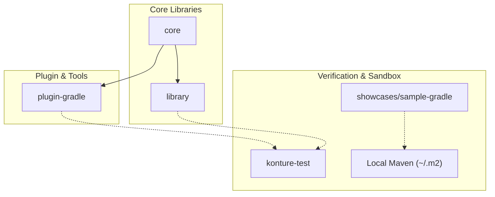

# Contributing to Konture

Thank you for your interest in making Konture better! This document provides a step-by-step guide to setting up your local development environment, importing the project into your IDE, running local tests, and publishing snapshot builds for local consumption.

---

## 💻 1. Prerequisites & Environment Setup

Before starting, ensure your machine has the following tools installed:

### Java Development Kit (JDK)
- **Required Version**: **JDK 21**
- The project's Gradle daemon and build configuration are optimized for JDK 21 (configured via `gradle-daemon-jvm.properties` and Gradle toolchains).
- We recommend using a distribution like **Eclipse Temurin**, **Amazon Corretto**, or **Azul Zulu**.

### IDE (Choose One)
- **Android Studio** (Koala or newer recommended)
- **IntelliJ IDEA** (2024.1 or newer recommended)

### Android SDK (Optional)
- While Konture is primarily a Kotlin JVM codebase, some submodules may interact with or adapt to Android structures. Having the Android SDK installed is recommended.

---

## 📂 2. Repository Layout & Modules

Understanding the layout of the repository will help you find where to make your changes:



- **`core`**: Common data models and JSON serialization schemas (`LayoutModel`) shared between the Gradle plugin and the test runner library.
- **`library`**: Primary public API library containing the ergonomic declarative assertion builders (fluent styles, scope checkers, and rule builders) as well as the core engine handling raw source parsing (PSI-tree AST analysis), project graph loading, and pattern matchers.
- **`plugin-gradle`**: Custom Gradle plugin that intercepts the configuration phase to construct the project module dependency graph and serialize it to `layout.json`.
- **`konture-test`**: An internal architecture testing module used to run self-verification tests using the local plugin and library sources.
- **`showcases/sample-gradle`**: A standalone sample showcase project designed to verify real-world multi-project integrations via local Maven publishing.

---

## 🛠️ 3. Importing and IDE Settings

### Importing into Android Studio / IntelliJ

1. **Launch your IDE** and select **Open** (or **File > Open...**).
2. Navigate to and select the root directory of this cloned repository (`konture`).
3. Click **OK** to open the project.
4. Wait for the IDE to import the project and finish the initial Gradle synchronization.

### Recommended Settings

#### Set the Gradle JDK:
- Go to **IDE Settings** (or **Preferences** on macOS) -> **Build, Execution, Deployment > Build Tools > Gradle**.
- Locate the **Gradle JDK** dropdown and select your **JDK 21** installation.

#### Set Kotlin Style Guide:
- Go to **Settings > Editor > Code Style > Kotlin**.
- Click **Set from...** in the top right and select **Kotlin style guide** to match the official standard.

---

## 🏃 4. Running Verification Tasks & Tests

Konture has comprehensive test suites that should be run before making any pull request.

### Running standard Unit Tests

To run the unit tests across all libraries and core modules, execute:

```bash
./gradlew test
```

### Running Self-Enforcing Architecture Tests

The project includes an internal module (`konture-test`) designed to run architecture checks against Konture itself. These tests run as part of the standard test task:

```bash
./gradlew test
```

### Aggregating Test Reports

To view a consolidated HTML report of all tests run across every submodule:

```bash
./gradlew testReport
```
The aggregated report will be available at:
`build/reports/all-tests/index.html`

---

## 📦 5. Local Publishing & Sandbox Verification

When editing the Gradle plugin or assertion libraries, the best way to verify your changes is to publish them locally and try consuming them in a test sandbox.

### Step 1: Publish SNAPSHOTs to Maven Local

To compile, package, and install your modified artifacts to your machine's local Maven repository (`~/.m2/repository`), run:

```bash
./gradlew publishToMavenLocal
```

This will publish the modules with version `0.6.10`:
- `io.github.baole:konture-core:0.6.10` (shared core data models)
- `io.github.baole:konture:0.6.10` (primary public API library)
- `io.github.baole.konture:plugin-gradle:0.6.10` (Gradle plugin)


### Step 2: Test Using the `sample` Sandbox

We have included a nested Gradle project under `/showcases/sample-gradle` that is preconfigured to resolve dependencies from your local Maven repository.

To test your published SNAPSHOTs inside this sandbox:

```bash
# Navigate to the sample directory and run its checks
./gradlew -p showcases/sample-gradle check
```

> If you make changes to the compiler plugin or Gradle tasks, you must run `./gradlew publishToMavenLocal` again so that the `sample` project picks up your latest modifications.
>
> To avoid daemon caching issues when iterating rapidly, you can run the sample tests with `--no-daemon` to ensure it loads the newly published JARs fresh:
> ```bash
> ./gradlew -p showcases/sample-gradle check --no-daemon
> ```
{: .tip }

---

## 🎨 6. Code Style & Standards

To keep the codebase maintainable and accessible:

- **Clean Kotlin**: Always follow official Kotlin formatting. Run `./gradlew lint` or run code formatting within Android Studio/IntelliJ (`Cmd+Option+L` on macOS) before submitting code.
- **KDocs & Documentation**: Maintain documentation integrity. Add clear KDoc comments to any newly public-facing classes or functions. If your changes modify existing APIs, update the appropriate markdown documents under the `/docs` folder.
- **No Placeholders**: Do not check in unfinished placeholders, dummy logs, or commented-out code blocks. Use TODO comments sparingly with issue or username references.
- **Write Tests**: Every bug fix, refactoring, or new feature should be accompanied by corresponding unit tests inside its module.

---

## 🤝 7. Submitting a Pull Request

1. **Fork the repo** and create a feature branch from `main`.
2. **Implement your changes** and add unit tests.
3. **Verify locally**:
   - Run `./gradlew test`.
   - Run `./gradlew publishToMavenLocal`.
   - Run `./gradlew -p showcases/sample-gradle check` to ensure integration remains unbroken.
4. **Commit with clear messages** (following standard/conventional commit rules).
5. **Open a Pull Request** explaining what the change does and referencing any active issues.
