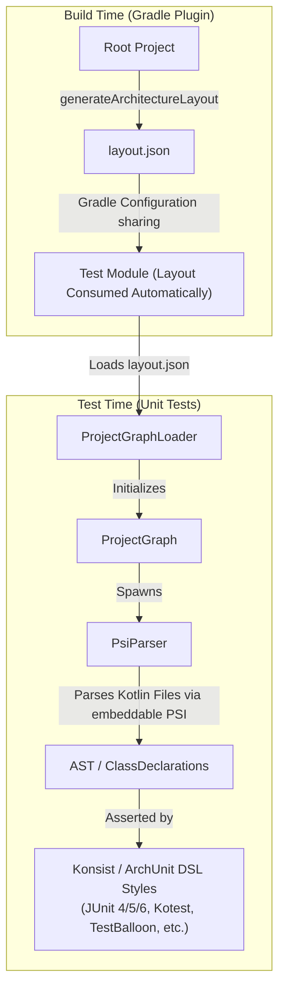
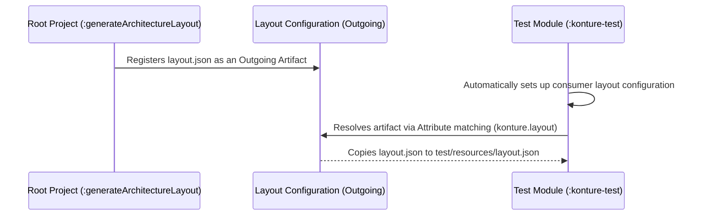

# How Konture Works

This page explains **Konture**'s internal design: how it extracts project topology at build time, shares it safely across Gradle modules, and parses Kotlin source without a full compiler pass. It's meant for readers evaluating build-tool safety (Configuration Cache, Project Isolation) or contributing to Konture itself. If you just want to know what Konture checks, see [Why Architecture Testing?](architecture_test.md).

---

## High-Level Architecture

Konture separates project topology extraction from assertion testing. This "offline contract" model decouples the build-time Gradle environment from the test-time JVM environment.



Layout extraction happens once at build time; tests only read the cached JSON and parse source files on demand.

### Key Advantages of This Architecture:
1. **Gradle Configuration Cache Safe**: The topology is extracted during Gradle configuration and execution, allowing the task `generateArchitectureLayout` to be fully cached.
2. **Project Isolation Compatible**: By sharing files via custom configurations and Gradle attributes rather than direct parent-to-child model access, Konture is fully compatible with Gradle's new **Project Isolation** requirement.
3. **No Classpath/ClassLoader Leaks**: The Kotlin compiler embeddable libraries are kept out of the production classpath, isolated inside the test runner process.
4. **Execution Speed**: Because the architecture tests run as ordinary, **test-framework agnostic** unit tests (loading pre-analyzed metadata and parsing source files on-demand without full Kotlin compiler compilation or codegen), they are extremely fast.

---

## 1. The Offline Layout Contract (`layout.json`)

At the heart of Konture is the `layout.json` file. It acts as the schema contract between the Gradle plugin and the test runner.

The structure of `LayoutModel` (defined in `core`) is serialized using `kotlinx-serialization`:

```json
{
  "schemaVersion": 1,
  "builds": [
    {
      "id": ":",
      "modules": [
        {
          "path": ":core:database",
          "projectDir": "/Users/user/project/core/database",
          "appliedPlugins": ["kotlin-jvm"],
          "sourceSets": [
            {
              "name": "main",
              "kind": "KOTLIN_JVM",
              "production": true,
              "srcDirs": ["src/main/kotlin"],
              "kotlinFiles": ["com/acme/database/Database.kt"]
            }
          ],
          "dependencies": [
            {
              "configuration": "implementation",
              "targetBuildId": ":",
              "targetPath": ":shared"
            }
          ]
        }
      ]
    }
  ]
}
```

- **`schemaVersion`**: Used to verify compatibility. If a developer upgrades the test library but forgets to upgrade the Gradle plugin, a mismatch is thrown at runtime rather than failing with silent, hard-to-debug deserialization errors.
- **`builds`**: Supports composite/included builds, mapping multiple separate Gradle builds inside a single layout.

---

## 2. Gradle Artifact & Sharing Architecture

Gradle prevents projects from accessing other projects' internal task and file configurations directly (e.g., `parent.subprojects` is deprecated and violates Project Isolation).

To share the generated `layout.json` safely, Konture uses Gradle's **Consuming/Publishing Artifacts API**:



The root project publishes `layout.json` as a Gradle artifact, and test modules consume it through attribute-matched configurations.

### The Sharing Mechanism:
1. **Producer (Root Project)**:
   - Registers the `generateArchitectureLayout` task.
   - Declares a custom consumable configuration named `kontureLayoutElements`.
   - Associates the configuration with a specific attribute: `ArtifactTypeDefinition.ARTIFACT_TYPE_ATTRIBUTE` set to `konture-layout-json`.
   - Registers the task output (`layout.json`) as an artifact of this configuration.
2. **Consumer (Test Module)**:
   - When the plugin is applied to a subproject, it automatically sets up a custom resolvable configuration named `archLayoutIncoming`.
   - Declares a dependency on the root project under this configuration.
   - Sets the matching attribute to `konture-layout-json`.
   - Registers a copy task that extracts `layout.json` from the resolved configuration and copies it directly into the test project's generated resources folder before the `test` task runs.

This pure artifact-sharing model allows Gradle to establish a secure task dependency: calling `./gradlew :konture-test:test` automatically triggers the root project's `:generateArchitectureLayout` first.

---

## 3. AST-Level Kotlin PSI Parser Strategy

When writing assertions about classes (e.g. interfaces, annotations, dependencies), Konture must analyze Kotlin source code. To do this without running a full compilation (which is slow and requires extensive classpath setup), Konture uses a standalone **IntelliJ PSI (Program Structure Interface)** environment.

The component responsible is `PsiParser` inside `library`.

### Under the Hood:
1. **Embeddable Environment**: `PsiParser` instantiates an IntelliJ core environment in-memory using `KotlinCoreEnvironment.createForProduction`.
2. **Virtual Files**: The AST loader creates lightweight `KtFile` representations of Kotlin source files from local files on disk.
3. **AST Traversal**: It traverses the AST using `KtVisitor` and extracts:
   - Package declarations (`packageName`)
   - Class and interface structures (`KtClassOrObject`)
   - Annotations (`KtAnnotationEntry`)
   - Import lists (`KtImportDirective`)
   - Type-name references inside class bodies (signatures, property types, generics, local variables)
4. **Disposal**: To avoid severe memory leaks across repeated test invocations or build daemon reuse, `PsiParser` implements a strict cleanup routine using a disposable parent context (`Disposer.dispose`).

---

## 4. Code-Level Class Dependency Heuristics

Traditional tools like ArchUnit run classloader-level bytecode analysis, which requires loading all compiled classfiles. Since Konture operates directly on source files, it uses a **Static Source-Level Reference Heuristic** to resolve code-level dependencies:

For any source class `A` and target class `B`:
- **Direct Import**: If class `A` imports the FQN of `B` (`import com.acme.B`), then `A` depends on `B`.
- **FQN Reference**: If class `A` references `B`'s fully qualified name inside its code, then `A` depends on `B`.
- **Simple Name Reference**: If `A` references `B`'s simple name (e.g., `val x: B`), Konture verifies:
  1. If `A` and `B` reside in the same package (implicitly visible).
  2. If `A` has a star-import of `B`'s package (`import com.acme.*`).
  3. If `A` has an explicit import matching `B`'s name.

This heuristic-based approach provides **99%+ accuracy** for architectural assertions while maintaining absolute independence from compiled classfiles and build-classpath states. The known boundary is ambiguous simple-name resolution: a dependency can be misattributed when two classes share the same simple name across different packages and the source file does not use an explicit import, star import, same-package reference, or fully qualified name to disambiguate it. In practice this is rare, since Kotlin style conventions and import organization make ambiguous simple-name references uncommon, but it is the trade-off that lets Konture remain source-only and classpath-independent.

These design choices, offline topology extraction, artifact-based sharing, and source-level parsing, let Konture run as an ordinary, fast unit test rather than a slow, classpath-dependent static analysis pass. See [Why Architecture Testing?](architecture_test.md) for what these tests actually check.
