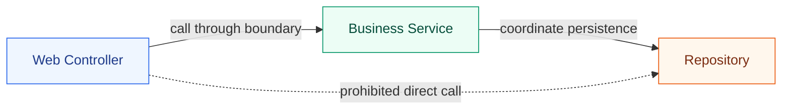

# Layer-Crossing Call Violations

A standard layered or clean architecture organizes application logic sequentially. Method calls should flow down in a structured hierarchy (e.g., controllers call use cases/services, and use cases/services call repositories). Skipping layers (such as letting UI/web controllers invoke low-level database repositories directly) creates shortcuts that bypass core validation rules, transactional envelopes, and business logic.



---

## 💡 The Rationale
* **Consistency of Business Flow**: Bypassing services risks running queries without essential validations, audit logging, authorization filters, or cache updates.
* **Transactional Integrity**: Databases usually expect transactional scopes (like `@Transactional`) to reside on your service-layer boundaries. Calling repositories directly from HTTP controller runtimes can result in database read anomalies, stale reads, or loose connections.
* **Refactoring Simplicity**: Maintaining a strict sequential chain guarantees that you can change the underlying repository implementation safely by modifying only the intermediate service layer.

---

## 🛠️ Implementation with Konture

The existing examples below are dependency/reference based: they identify structural coupling, not a compiler-resolved call graph. Use the source-call rule when you need to ban a specific Kotlin callable.

```kotlin
Konture.files(sourceSets = SourceSets.tests()) {
    should().notCall("io.mockk.spyk")
}
```

This detects calls written in Kotlin source (including aliases and wildcard imports), not runtime behavior. An unused `spyk` import is not a violation.

You can also detect skipped boundaries by setting up package import and class dependency blocks on your structural groups using the `classes()` DSL.

### 1. Banning Direct Repository Calls from Controllers

You can assert that any class ending with `Controller` or residing in the presentation layer must not reference classes inside your data/repository layer:

```kotlin
import io.github.baole.konture.*
import org.junit.jupiter.api.Test

class LayerCrossingTest {

    @Test
    fun `controllers must not bypass services to access repositories directly`() {
        Konture.classes {
            that().resideInAPackage("..presentation..")
                .should().notDependOnClassesInAnyPackage("..data.repository..")
        }
    }
}
```

### 2. Ensuring Repositories Are Only Accessed by Authorized Layers

Conversely, you can assert that your repository components are only depended on (or imported by) classes inside the service or domain package boundary:

```kotlin
import io.github.baole.konture.*
import org.junit.jupiter.api.Test

class RepositoryAccessControlTest {

    @Test
    fun `repositories must only be accessed by intermediate services`() {
        Konture.classes {
            that().resideInAPackage("..data.repository..")
                .should().onlyBeAccessedByAnyPackage(
                    "..data.repository..", // Self-access
                    "..service..",        // Intermediate services
                    "..di.."              // DI wiring modules
                )
        }
    }
}
```

---

## 🚨 Example Failure Output

If a controller `ProductController` bypasses validation and invokes `ProductRepository` directly:

```text
AssertionError: Architecture violation: Controllers must not bypass services to access repositories directly
Class 'io.github.baole.konture.sample.presentation.ProductController' has forbidden dependency on 'io.github.baole.konture.sample.data.repository.ProductRepository'
  (at /path/to/project/showcases/sample-gradle/presentation/src/main/kotlin/io/github.baole.konture/sample/presentation/ProductController.kt:8)
```

The error prints the exact line containing the bypassed import statement, allowing you to instantly correct the leak.
