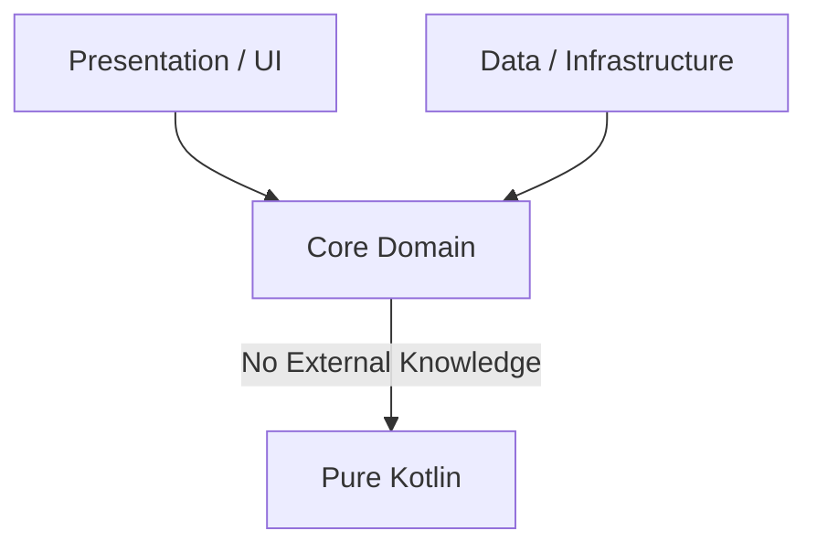

# Layer Isolation & Dependency Direction

In layered architectures or Clean Architecture, outer layers (such as UI/Presentation and Database/Infrastructure) must depend inward on the core. The business logic (Domain/Core layer) represents your product's pure business rules and must remain entirely decoupled from technical details. It should have zero knowledge of databases, network clients, or specific UI frameworks.



---

## 💡 The Rationale
* **Purity of Business Logic**: Changing database libraries, migrating databases, or switching UI frameworks should never force changes or recompilation of your core business use cases.
* **Testability**: Pure domain classes can be unit-tested rapidly and reliably without mocking complex framework behaviors like database configurations, HTTP runtimes, or UI view models.
* **Agility**: Offloads framework upgrades from your core features. Upgrading heavy tools like Spring Boot or Android Gradle Plugin doesn't risk breaking or modifying pure Kotlin rules.

---

## 🛠️ Implementation with Konture

Konture provides two clean methods to assert layer boundaries: the high-level **Type-Safe Layered DSL** and class-level **Declarative Package assertions**.

### 1. The High-Level Layered DSL

The `layered` DSL is the most visual and intuitive way to model your architecture and declare strict, multi-layer gateways in a single block.

```kotlin
import io.github.baole.konture.*
import org.junit.jupiter.api.Test

class LayerIsolationTest {

    @Test
    fun `enforce clean architecture layer isolation`() {
        Konture.layered {
            // 1. Define your layers using package wildcards
            val presentation = layer("presentation") definedBy "..presentation.."
            val domain = layer("domain") definedBy "..domain.."
            val data = layer("data") definedBy "..data.."

            // 2. Define structural access gates
            where(presentation) {
                mayOnlyAccessLayers(domain)
            }
            where(data) {
                mayOnlyAccessLayers(domain)
            }
            where(domain) {
                // Pure business logic domain cannot depend on outer layers
                mayOnlyAccessLayers()
            }
        }
    }
}
```

### 2. Class-Level Declarative Rules

For targeting specific package structures or fine-grained constraints, you can use the declarative `classes()` API:

```kotlin
import io.github.baole.konture.*
import org.junit.jupiter.api.Test

class DomainPurityTest {

    @Test
    fun `domain classes must remain completely pure`() {
        Konture.classes {
            that().resideInAPackage("..domain..")
                .should().onlyDependOnClassesInAnyPackage(
                    "..domain..",
                    "kotlin..",
                    "java.."
                )
        }
    }
}
```

---

## 🚨 Example Failure Output

If a business use case (e.g., `GetProductUseCase` in a domain package) mistakenly imports a concrete database implementation or database helper:

```text
AssertionError: Architecture violation in layered boundary check:
Layer 'domain' is accessed by forbidden layers:
  - Class 'io.github.baole.konture.sample.domain.GetProductUseCase' depends on forbidden class 'io.github.baole.konture.sample.data.ProductRepositoryImpl'
    (at /path/to/project/showcases/sample-gradle/domain/src/main/kotlin/io.github.baole.konture/sample/domain/GetProductUseCase.kt:12)
```

The assertion prints the exact file name and clickable absolute line path, letting you jump directly to the violation in your IDE.
