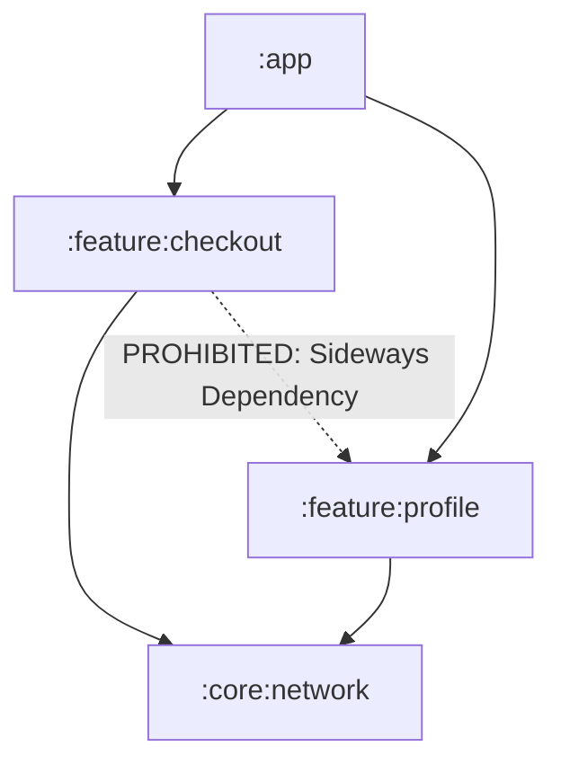

# Module Boundary Enforcement (Build-Graph Hygiene)

In multi-module Gradle or Maven projects, enforcing boundaries at the physical build unit level is vital for build efficiency, development parallelization, and clean software architecture. Feature modules must remain isolated from each other (no "sideways" dependencies), and core/shared common modules should never depend on platform-specific or heavy external implementation libraries.

Additionally, multi-project architectures must remain strictly acyclic (no circular loops).



---

## 💡 The Rationale
* **Compilation Speed**: Eliminating cycles and reducing unnecessary project coupling maximizes Gradle's incremental build speed and cache hit rates.
* **True Modularization**: Keeping feature modules isolated guarantees they can be developed, tested, and deployed independently without cascading rebuilds.
* **Portability (KMP)**: Ensuring that shared `commonMain` code doesn't accidentally depend on platform-specific libraries (like JVM-only or Android-only targets) preserves the multiplatform promise.

---

## 🛠️ Implementation with Konture

Konture accesses the processed `layout.json` module graph directly, making it extremely easy to run high-speed structural assertions on your Gradle/Maven graph.

### 1. No Circular Module Dependencies

Simply call `assertNoCycles()` in any JUnit test block to scan your entire multi-module graph instantly, catching complex split-configuration loops:

```kotlin
import io.github.baole.konture.*
import org.junit.jupiter.api.Test

class ModuleCycleTest {

    @Test
    fun `no circular dependencies allowed in the build graph`() {
        // Scans the entire project build hierarchy for circular dependency cycles
        Konture.assertNoCycles()
    }
}
```

### 2. Preventing Sideways Feature Coupling

Use the `modules()` DSL to assert that feature modules do not declare sideways dependencies on sibling features:

```kotlin
import io.github.baole.konture.*
import org.junit.jupiter.api.Test

class FeatureIsolationTest {

    @Test
    fun `feature modules must remain isolated from each other`() {
        Konture.modules {
            that().haveNameMatching(":feature:**")
                .should().satisfy { module, violations ->
                    val siblingDeps = module.dependencies.filter { dep ->
                        dep.targetPath.startsWith(":feature:") && dep.targetPath != module.path
                    }
                    if (siblingDeps.isNotEmpty()) {
                        violations.add(
                            "Feature module ${module.path} depends on sideways features: " +
                                    siblingDeps.joinToString { it.targetPath }
                        )
                    }
                }
        }
    }
}
```

### 3. Restricting Third-Party External Libraries

Keep your shared core layers lightweight by banning specific external libraries from being declared inside them:

```kotlin
import io.github.baole.konture.*
import org.junit.jupiter.api.Test

class ExternalLibraryGuardTest {

    @Test
    fun `domain core modules must not declare spring or android external libraries`() {
        Konture.modules {
            that().haveNameMatching(":core:domain")
                .should().notDependOnExternalLibraries(
                    "org.springframework..",
                    "com.google.android.."
                )
        }
    }
}
```

---

## 🚨 Example Failure Output

If a developer adds a circular dependency or sideways import, Konture prints clean, descriptive representations:

* **Circular Cycle Failure**:
  ```text
  AssertionError: Circular dependency detected in project graph:
    :feature:checkout -> :feature:profile -> :feature:checkout
  ```

* **Sideways Feature Coupling Failure**:
  ```text
  AssertionError: Architecture violation(s) detected:
  Feature module :feature:checkout depends on sideways features: :feature:profile
  ```
