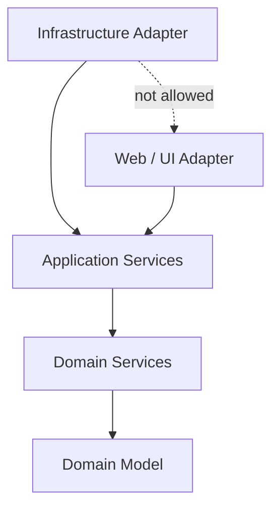

# Onion Architecture

Onion Architecture arranges the codebase as concentric rings. The **Domain Model** sits at the centre, wrapped by **Domain Services**, then **Application Services**, and finally the outer **Adapters** (infrastructure, persistence, web/UI). The single rule is that source-code dependencies point **inward only**: an outer ring may depend on any ring inside it, never the reverse — and the outermost adapters must not depend on each other.



---

## 💡 The Rationale

* **Inward-only dependencies**: The domain never references frameworks, databases, or transport concerns, so business rules stay pure and portable across technology changes.
* **Swappable adapters**: Persistence, messaging, and UI live in the outer ring. Because adapters cannot reference one another, replacing the database adapter can never ripple into the web adapter.
* **Testable core**: The inner rings depend on nothing external, so they can be unit-tested without mocking frameworks or I/O.

---

## 🛠️ Implementation with Konture

Konture stays architecture-agnostic and does not ship a dedicated `onionArchitecture()` API — Onion is a *composition* of the primitives the layered DSL already provides. Model each ring as a layer, and grant each ring access only to the rings inside it. The adapters naturally become mutually isolated because neither lists the other in `mayOnlyAccessLayers`.

```kotlin
import io.github.baole.konture.*
import org.junit.jupiter.api.Test

class OnionArchitectureTest {

    @Test
    fun `enforce onion dependency direction`() {
        Konture.layered {
            // Rings from the centre outward
            val domainModel = layer("domain model") definedBy "..domain.model.."
            val domainService = layer("domain service") definedBy "..domain.service.."
            val application = layer("application") definedBy "..application.."
            val infrastructure = layer("infrastructure") definedBy "..infrastructure.."
            val web = layer("web") definedBy "..web.."

            // Each ring may only reach the rings inside it
            where(domainModel) {
                mayOnlyAccessLayers() // the core depends on nothing
            }
            where(domainService) {
                mayOnlyAccessLayers(domainModel)
            }
            where(application) {
                mayOnlyAccessLayers(domainService, domainModel)
            }
            // Adapters may reach the inner rings, but not each other:
            // 'infrastructure' omits 'web' and vice versa, so cross-adapter access fails.
            where(infrastructure) {
                mayOnlyAccessLayers(application, domainService, domainModel)
            }
            where(web) {
                mayOnlyAccessLayers(application, domainService, domainModel)
            }
        }
    }
}
```

For the innermost ring you can add a stricter purity guard with the declarative `classes()` API, forbidding anything beyond the domain and the standard library:

```kotlin
import io.github.baole.konture.*
import org.junit.jupiter.api.Test

class DomainPurityTest {

    @Test
    fun `domain model stays free of framework dependencies`() {
        Konture.classes {
            that().resideInAPackage("..domain..")
                .should().onlyDependOnClassesInAnyPackage(
                    "..domain..",
                    "kotlin..",
                    "java..",
                )
        }
    }
}
```

> [!TIP]
> Adjust the package wildcards to match your project. The same shape scales to more adapters — add each one as a layer whose `mayOnlyAccessLayers` lists only the inner rings, and every adapter is automatically isolated from its siblings.

---

## 🚨 Example Failure Output

If a web controller reaches sideways into a persistence adapter instead of going through the application ring:

```text
AssertionError: Architecture violation in layered boundary check:
Layer 'web' may only access layers [application, domain service, domain model]:
  - Class 'io.github.baole.konture.sample.web.OrderController' depends on forbidden class 'io.github.baole.konture.sample.infrastructure.JpaOrderStore'
    (at :web, main source set, src/main/kotlin/io/github/baole/konture/sample/web/OrderController.kt:24)
```

The assertion prints the offending class, the forbidden target, and a clickable location so you can jump straight to the violation in your IDE.
