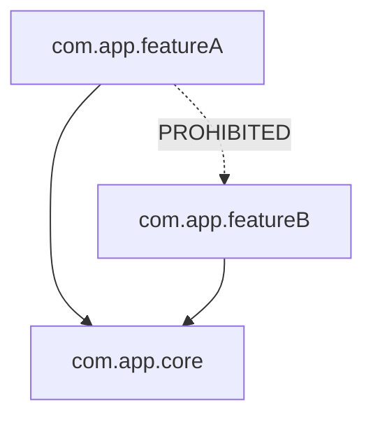

# Slices & Modularization Rules

Architectural slices represent logical horizontal or vertical boundaries across packages and modules in a Kotlin codebase. Enforcing slice isolation and module graph rules prevents package cycles, unwanted cross-feature dependencies, and monolithic coupling.



---

## 💡 The Rationale

* **Vertical Slice Isolation**: Slices allow grouping code logically (e.g. by feature or domain) regardless of whether code lives in a single module or multiple Gradle modules.
* **Acyclic Dependencies**: Cycles in package or module structures lead to tight coupling, memory leaks, and hard-to-test code.
* **Explicit Boundary Contracts**: Defining allowable dependencies between slices prevents feature leakage and architectural erosion over time.

---

## 🛠️ Implementation with Konture

### 1. Slice Isolation Rules

Verify that package slices only depend on allowed slices and do not introduce cross-slice leaks.

```kotlin
import io.github.baole.konture.*
import org.junit.jupiter.api.Test

class SliceArchitectureTest {

    @Test
    fun `feature slices must remain isolated`() {
        slices {
            matching("com.app.(*)..")
                .should().onlyDependOnSlices("core", "common")
                .andShould().notDependOnSlice("internal")
                .check()
        }
    }
}
```

### 2. Module Graph Cycle Detection

Ensure multi-module Gradle or Maven build graphs remain completely free of dependency cycles.

```kotlin
import io.github.baole.konture.*
import org.junit.jupiter.api.Test

class ModuleArchitectureTest {

    @Test
    fun `module dependency graph must be free of cycles`() {
        modules {
            that().haveNameStartingWith(":feature")
                .should().beFreeOfCycles()
                .check()
        }
    }
}
```

### 3. File & Type-Safe Package Seeding

Apply type-safe reified overloads across `files {}`, `classes {}`, `functions {}`, and `properties {}` DSLs.

```kotlin
import io.github.baole.konture.*
import org.junit.jupiter.api.Test

class DSLConsistencyTest {

    @Test
    fun `domain classes and functions reside in package of marker class`() {
        classes {
            that().resideInPackageOf<DomainMarker>()
                .and().areAssignableTo<BaseRepository>()
                .should().beDocumentedWithKDoc()
                .check()
        }

        functions {
            that().resideInPackageOf<DomainMarker>()
                .should().beSuspend()
                .andShould().beOperator()
                .check()
        }
    }
}
```
