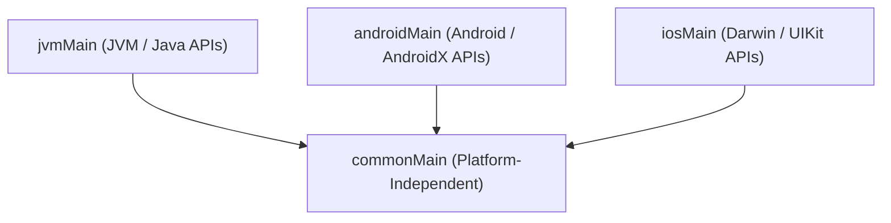

# Multiplatform Source-Set Architecture Policies

In Kotlin Multiplatform (KMP) and multi-variant Android projects, code is divided across source sets such as `commonMain`, `jvmMain`, `androidMain`, and `iosMain`. While the Kotlin compiler enforces basic type accessibility between source sets in the compilation hierarchy, it cannot prevent platform-specific leaks, forbidden framework dependencies, or unintended source set `dependsOn` declarations across custom configurations.



---

## 💡 The Rationale

* **Multiplatform Purity**: Shared business logic in `commonMain` must remain strictly platform-independent so it can compile and execute cleanly on all targets (JVM, iOS, Android, WASM, JS).
* **Target Isolation**: Platform source sets (such as `androidMain` or `iosMain`) should only interact with approved platform SDKs and not accidentally cross-pollinate with incompatible platform APIs.
* **Hierarchy Integrity**: Source-set `dependsOn` relationships in Gradle build files must respect architectural tiers, preventing reverse hierarchy coupling.

---

## 🛠️ Implementation with Konture

Konture provides a dedicated first-class `sourceSet { ... }` DSL within `architecture { ... }` blocks to define declarative multiplatform architecture policies.

### 1. Platform Independence Enforcement

Verify that `commonMain` contains only pure Kotlin and multiplatform libraries, blocking all JVM, Android, iOS, and POSIX symbols:

```kotlin
import io.github.baole.konture.*
import org.junit.jupiter.api.Test

class MultiplatformSourceSetTest {

    @Test
    fun `enforce multiplatform source set policies`() {
        architecture {
            sourceSet("commonMain") {
                // Fails if java.*, javax.*, android.*, platform.*, or windows.* types/imports appear
                mustBePlatformIndependent()
            }
        }
    }
}
```

### 2. Exceptions and Additional Banned Packages

If certain legacy utility imports (like `java.util.UUID`) are temporarily permitted via expect/actual bridges or baseline transitions, they can be explicitly excluded from platform bans:

```kotlin
architecture {
    sourceSet("commonMain") {
        mustBePlatformIndependent(
            additionalBanned = listOf("org.apache.commons.**"),
            excluding = listOf("java.util.UUID")
        )
    }
}
```

### 3. Restricting Allowed Platform APIs (`mayDependOn`)

Ensure target-specific source sets only consume authorized platform namespaces:

```kotlin
architecture {
    sourceSet("androidMain") {
        // androidMain may only consume Android/AndroidX packages among platform APIs
        mayDependOn("android.**", "androidx.**")
    }
    sourceSet("iosMain", "appleMain") {
        mayDependOn("platform.Foundation.**", "platform.UIKit.**")
    }
}
```

### 4. Denying Forbidden Packages & Source-Set Hierarchies

Forbid specific internal packages or illegal source-set `dependsOn` configurations:

```kotlin
architecture {
    sourceSet("commonMain") {
        // Deny legacy or outer modules
        mustNotDependOn("com.acme.legacy.**", "com.acme.backend.**")

        // Enforce hierarchy rules: commonMain must not depend on platform source sets
        mustNotDependOnSourceSets("jvmMain", "androidMain", "iosMain")
    }
}
```

---

## 🚨 Example Failure Output

If a shared common model inside `commonMain` inadvertently imports an Android or Java class:

```text
AssertionError: Architecture policy violation:
  - Source set 'commonMain' in module ':core:model' must be platform-independent, but class com.acme.model.UserProfile references platform-specific symbol: android.os.Bundle (at core/model/src/commonMain/kotlin/com/acme/model/UserProfile.kt:8)
```
