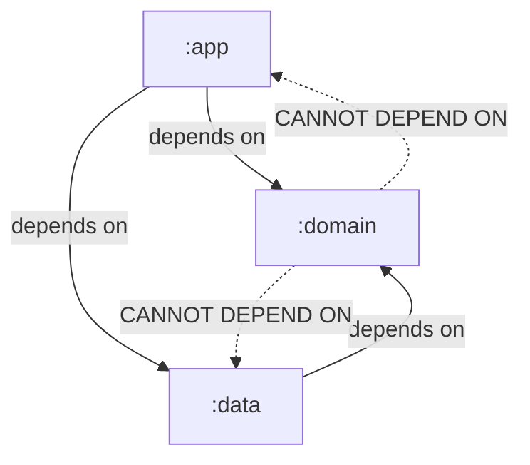

# Showcase Application Walkthroughs

The Konture repository includes fully functional showcase applications for both **Gradle** and **Maven** build systems designed under Clean Architecture principles. These showcases demonstrate how to set up, organize, and automate architectural testing.

### 🧭 Showcase Projects Navigator
To help you explore and navigate the available reference implementations, here is a quick overview of all 5 showcase projects:

*   **[🛠️ Showcase A: Multi-Module Gradle (`sample-gradle`)](#️-showcase-a-multi-module-gradle-sample-gradle)** - A standard Kotlin Multi-Project Gradle setup with a dedicated test execution module.
*   **[📦 Showcase B: Multi-Module Maven (`sample-maven`)](#-showcase-b-multi-module-maven-sample-maven)** - Setup in an Apache Maven ecosystem, utilizing the Maven compiler and custom multi-module configurations.
*   **[Now in Android (NiA)](#-external-real-world-showcases)** - Google's reference modular Android application using a dedicated `:konture-test` module.
*   **[KotlinConf Companion App](#-external-real-world-showcases)** - A full-stack Kotlin Multiplatform (KMP) client application.
*   **[Ktor-Arrow Backend Example](#-external-real-world-showcases)** - A production-grade backend demonstrating SQLDelight leakage-prevention and HTTP layer isolation rules.

---

## 🛠️ Showcase A: Multi-Module Gradle (`sample-gradle`)

The `:sample-gradle` showcase demonstrates a standard Kotlin Multi-Project Gradle setup with a dedicated test execution module.

### 📂 Directory Structure

```text
showcases/sample-gradle/
├── app/                  # Application composition root
├── domain/               # Pure Kotlin business rules and repository interfaces
├── data/                 # Repository implementations and data adapters
├── konture-test/         # Dedicated Konture assertion project (JUnit JVM unit tests)
├── build.gradle.kts      # Multi-project build configuration
└── settings.gradle.kts   # Project module inclusions
```

### 🏃 Running Gradle Tests Locally

You can run the architecture tests locally via Gradle:

```bash
# Run tests specifically in the architecture subproject
./gradlew -p showcases/sample-gradle :konture-test:test

# Run all checks across the entire multi-project build
./gradlew -p showcases/sample-gradle check
```

---

## 📦 Showcase B: Multi-Module Maven (`sample-maven`)

The `sample-maven` showcase demonstrates setup in an Apache Maven ecosystem, utilizing the Maven compiler and custom multi-module configurations.

### 📂 Directory Structure

```text
showcases/sample-maven/
├── app/                  # Application composition root
├── domain/               # Pure Kotlin business rules and repository interfaces
├── data/                 # Repository implementations and data adapters
├── konture-test/         # Dedicated Konture assertion project (JUnit JVM unit tests)
└── pom.xml               # Multi-module parent POM
```

### 🏃 Running Maven Tests Locally

You can run the architecture tests locally via Maven:

```bash
# Run tests for all Maven submodules
mvn -f showcases/sample-maven/pom.xml test
```

---

## 📐 Dependency Graph Boundaries

Both sample projects enforce strict Clean Architecture boundaries:



### Module Breakdown:

1. **`:domain`**:
   - Contains your use cases and entities (e.g., `GetProductUseCase`, `ProductRepository`).
   - Represents pure Kotlin code with **zero dependencies** on external frameworks, databases, or other modules.
2. **`:data`**:
   - Contains concrete data adapters (e.g., `ProductRepositoryImpl`).
   - Implements interfaces defined in `:domain`.
   - Depends only on `:domain` to retrieve entity definitions.
3. **`:app`**:
   - The composition root that wires up dependencies and runs the application.
   - Depends on both `:domain` and `:data`.

---

## 🧩 Architectural Tests in Action

The showcases include robust architectural assertions verifying:

### 1. Fluent Layered Architecture Rules

These rules verify that layers are isolated and do not cross physical boundaries illegally:

```kotlin
@Test
fun "visual layered architecture DSL check"() {
    Konture.layered {
        val domain = layer("domain") definedBy "..domain.."
        val data = layer("data") definedBy "..data.."
        val app = layer("app") definedBy "..app.."

        where(app) {
            mayNotBeAccessedByAnyLayer()
        }
        where(data) {
            mayOnlyBeAccessedByLayers(app)
        }
    }
}
```

### 2. Standard Coding Conventions & Cycles

These rules scan file structures for standard interfaces, naming conventions, and cycle-free module graph hygiene:

```kotlin
@Test
fun "no circular dependencies allowed in the module graph"() {
    Konture.assertNoCycles() // Instantly verifies entire build graph!
}

@Test
fun "repositories must reside in domain and be interfaces"() {
    Konture.classes()
        .that().resideInAPackage("..domain..")
        .that().haveNameEndingWith("Repository")
        .should().beInterfaces()
        .check()
}
```

When a rule is broken, the build fails immediately, displaying a descriptive trace listing the specific rule that was violated, the offending Kotlin files, and their clickable paths.

---

## 🏢 External Real-World Showcases

For massive, production-scale examples of Konture integration, visit the respective test suites in their original GitHub repositories:

*   **[Now in Android (NiA)](https://github.com/baole/nowinandroid/tree/main/konture-test)**: Google's reference modular Android application.
*   **[KotlinConf Companion App](https://github.com/baole/kotlinconf-app/tree/main/konture-test)**: A full-stack Kotlin Multiplatform (KMP) client application.
*   **[Ktor-Arrow Backend Example](https://github.com/baole/ktor-arrow-example/tree/main/konture-test)**: A production-grade backend demonstrating SQLDelight leakage-prevention and HTTP layer isolation rules.

---

> [!TIP]
> ### 📂 Explore the Showcase Code Directly
> The fully configured codebases can be viewed in our repository:
> *   **[showcases/sample-gradle](https://github.com/baole/konture/tree/main/showcases/sample-gradle)**
> *   **[showcases/sample-maven](https://github.com/baole/konture/tree/main/showcases/sample-maven)**
